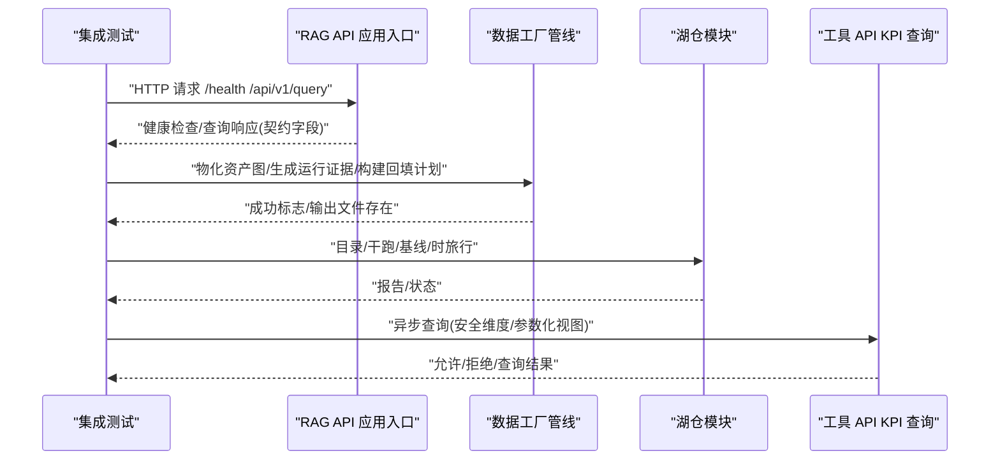
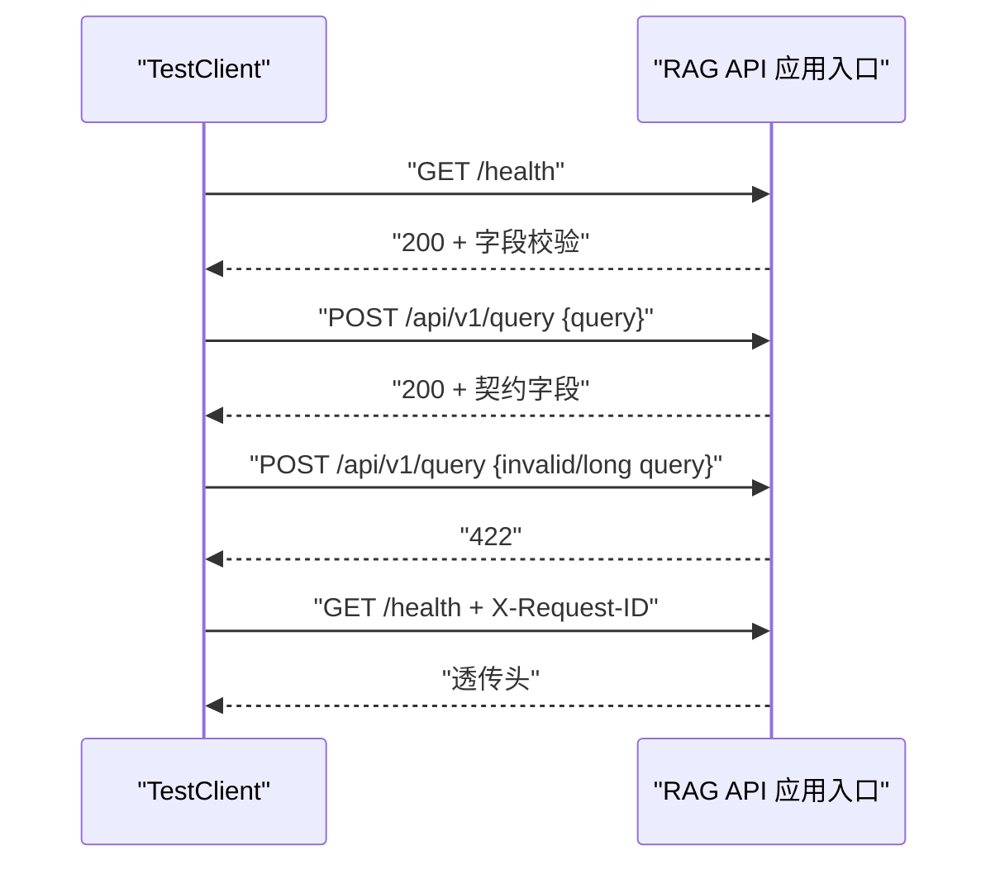
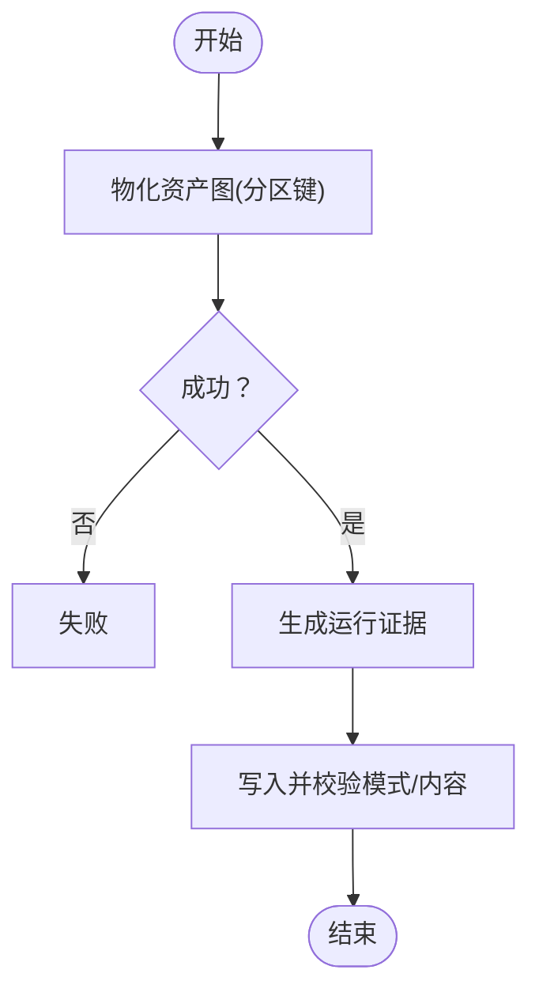
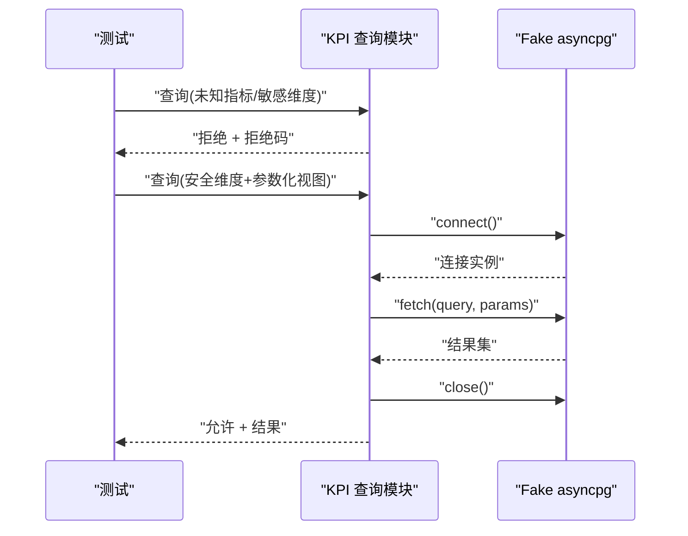
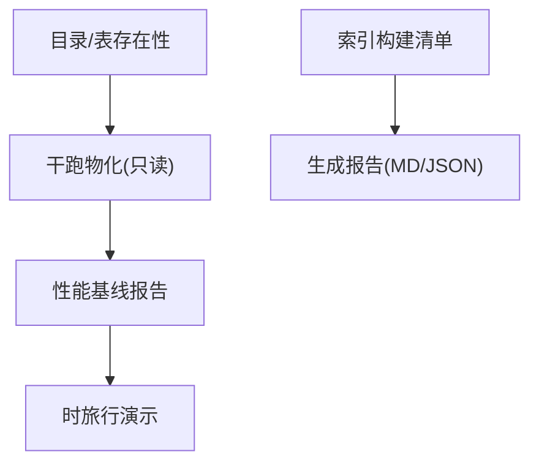
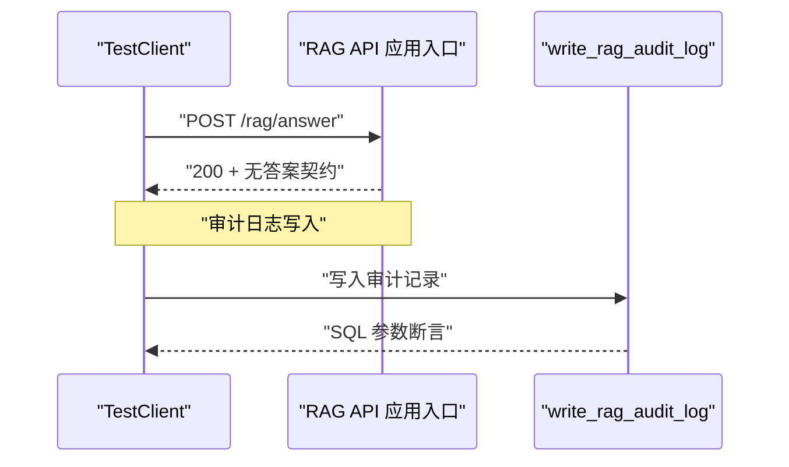
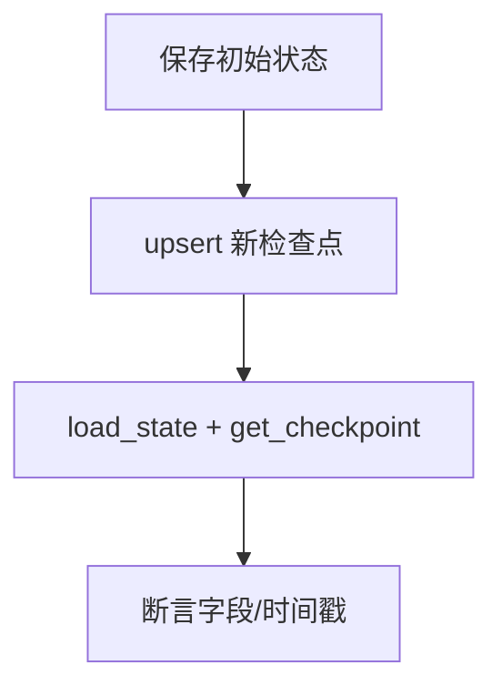
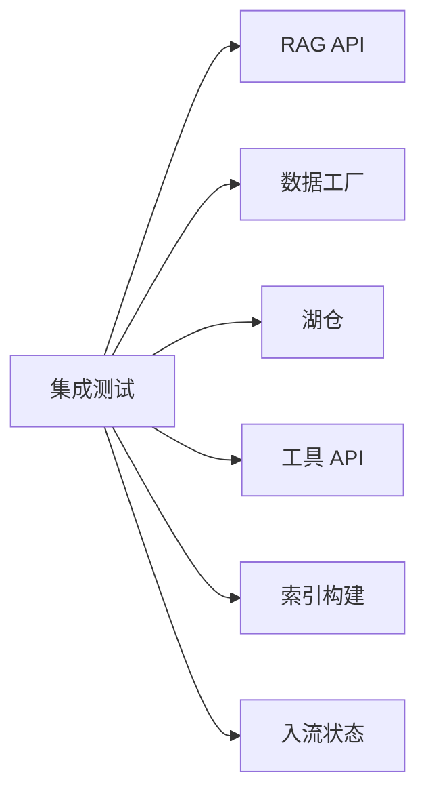

# 集成测试套件

<cite>
**本文引用的文件**
- [tests/integration/test_rag_api_smoke.py](file://tests/integration/test_rag_api_smoke.py)
- [tests/integration/test_week06_asset_checks.py](file://tests/integration/test_week06_asset_checks.py)
- [tests/integration/test_week06_backfill_plan.py](file://tests/integration/test_week06_backfill_plan.py)
- [tests/integration/test_week06_asset_graph_smoke.py](file://tests/integration/test_week06_asset_graph_smoke.py)
- [tests/integration/test_week06_run_evidence_generation.py](file://tests/integration/test_week06_run_evidence_generation.py)
- [tests/integration/test_week05_kpi_query_tool.py](file://tests/integration/test_week05_kpi_query_tool.py)
- [tests/integration/test_week8_rag_api.py](file://tests/integration/test_week06_asset_checks.py)
- [tests/integration/test_week8_index_build.py](file://tests/integration/test_week8_index_build.py)
- [tests/integration/test_week8_rag_audit.py](file://tests/integration/test_week8_rag_audit.py)
- [tests/integration/test_week4_catalog_smoke.py](file://tests/integration/test_week4_catalog_smoke.py)
- [tests/integration/test_week4_lakehouse_smoke.py](file://tests/integration/test_week4_lakehouse_smoke.py)
- [tests/integration/test_week4_perf_baseline.py](file://tests/integration/test_week4_perf_baseline.py)
- [tests/integration/test_week4_time_travel.py](file://tests/integration/test_week4_time_travel.py)
- [tests/integration/test_ingest_state.py](file://tests/integration/test_ingest_state.py)
- [services/rag_api/app/main.py](file://services/rag_api/app/main.py)
- [services/tool_api/app/kpi_query.py](file://services/tool_api/app/kpi_query.py)
- [pipelines/data_factory/checks.py](file://pipelines/data_factory/checks.py)
- [pipelines/data_factory/backfill_plan.py](file://pipelines/data_factory/backfill_plan.py)
- [pipelines/data_factory/assets.py](file://pipelines/data_factory/assets.py)
- [pipelines/data_factory/evidence.py](file://pipelines/data_factory/evidence.py)
- [pipelines/indexing/index_manifest.py](file://pipelines/indexing/index_manifest.py)
- [pipelines/lakehouse/catalog.py](file://pipelines/lakehouse/catalog.py)
- [pipelines/lakehouse/materialize.py](file://pipelines/lakehouse/materialize.py)
- [pipelines/ingestion/ingest_state.py](file://pipelines/ingestion/ingest_state.py)
</cite>

## 目录
1. [引言](#引言)
2. [项目结构](#项目结构)
3. [核心组件](#核心组件)
4. [架构总览](#架构总览)
5. [详细组件分析](#详细组件分析)
6. [依赖分析](#依赖分析)
7. [性能考虑](#性能考虑)
8. [故障排查指南](#故障排查指南)
9. [结论](#结论)
10. [附录](#附录)

## 引言
本文件系统化梳理 OmniSupport Copilot 的集成测试套件，覆盖服务间通信验证、数据管道完整性检查与业务流程端到端测试。重点包括：
- RAG API 集成测试：查询处理流程、向量检索准确性与答案生成质量评估
- 数据工厂集成测试：资产化管道、分区策略与回填计划执行
- 工单管理集成测试：KPI 查询工具链调用、安全参数校验与审计日志
- 性能集成测试：响应时间、吞吐量与并发处理能力评估
- 测试数据准备、环境隔离与测试结果分析流程

## 项目结构
集成测试主要位于 tests/integration 目录，按功能域分层组织：
- RAG API 与审计：验证健康检查、查询契约、请求 ID 中间件、无答案场景与审计落库字段
- 数据工厂：资产图物化、资产检查、回填计划、运行证据生成
- 工单/KPI：工具链调用与安全参数校验
- 湖仓：目录与表存在性、干跑物化、性能基线、时旅行演示
- 入口状态：增量摄取状态读写一致性

```mermaid
graph TB
subgraph "测试层"
T1["RAG API 烟雾测试<br/>tests/integration/test_rag_api_smoke.py"]
T2["数据工厂资产图物化<br/>tests/integration/test_week06_asset_graph_smoke.py"]
T3["资产检查与证据<br/>tests/integration/test_week06_asset_checks.py<br/>tests/integration/test_week06_run_evidence_generation.py"]
T4["回填计划<br/>tests/integration/test_week06_backfill_plan.py"]
T5["KPI 查询工具<br/>tests/integration/test_week05_kpi_query_tool.py"]
T6["RAG API 契约与无答案<br/>tests/integration/test_week8_rag_api.py"]
T7["索引构建报告<br/>tests/integration/test_week8_index_build.py"]
T8["RAG 审计日志<br/>tests/integration/test_week8_rag_audit.py"]
T9["湖仓烟雾/干跑/基线/时旅行<br/>tests/integration/test_week4_*"]
T10["入流状态读写<br/>tests/integration/test_ingest_state.py"]
end
subgraph "服务实现"
S1["RAG API 应用入口<br/>services/rag_api/app/main.py"]
S2["工具 API KPI 查询<br/>services/tool_api/app/kpi_query.py"]
end
subgraph "数据工厂管线"
P1["资产检查<br/>pipelines/data_factory/checks.py"]
P2["回填计划<br/>pipelines/data_factory/backfill_plan.py"]
P3["资产图定义<br/>pipelines/data_factory/assets.py"]
P4["运行证据模型/写入<br/>pipelines/data_factory/evidence.py"]
end
subgraph "索引与湖仓"
I1["索引清单构建<br/>pipelines/indexing/index_manifest.py"]
L1["湖仓目录/物化<br/>pipelines/lakehouse/catalog.py<br/>pipelines/lakehouse/materialize.py"]
end
subgraph "入流状态"
E1["入流状态读写<br/>pipelines/ingestion/ingest_state.py"]
end
T1 --> S1
T2 --> P3
T3 --> P1
T3 --> P4
T4 --> P2
T5 --> S2
T6 --> S1
T7 --> I1
T9 --> L1
T10 --> E1
```

图表来源
- [tests/integration/test_rag_api_smoke.py:1-91](file://tests/integration/test_rag_api_smoke.py#L1-L91)
- [tests/integration/test_week06_asset_graph_smoke.py:1-26](file://tests/integration/test_week06_asset_graph_smoke.py#L1-L26)
- [tests/integration/test_week06_asset_checks.py:1-33](file://tests/integration/test_week06_asset_checks.py#L1-L33)
- [tests/integration/test_week06_run_evidence_generation.py:1-47](file://tests/integration/test_week06_run_evidence_generation.py#L1-L47)
- [tests/integration/test_week06_backfill_plan.py:1-25](file://tests/integration/test_week06_backfill_plan.py#L1-L25)
- [tests/integration/test_week05_kpi_query_tool.py:1-109](file://tests/integration/test_week05_kpi_query_tool.py#L1-L109)
- [tests/integration/test_week8_rag_api.py:1-47](file://tests/integration/test_week8_rag_api.py#L1-L47)
- [tests/integration/test_week8_index_build.py:1-35](file://tests/integration/test_week8_index_build.py#L1-L35)
- [tests/integration/test_week8_rag_audit.py:1-52](file://tests/integration/test_week8_rag_audit.py#L1-L52)
- [tests/integration/test_week4_catalog_smoke.py:1-14](file://tests/integration/test_week4_catalog_smoke.py#L1-L14)
- [tests/integration/test_week4_lakehouse_smoke.py:1-19](file://tests/integration/test_week4_lakehouse_smoke.py#L1-L19)
- [tests/integration/test_week4_perf_baseline.py:1-16](file://tests/integration/test_week4_perf_baseline.py#L1-L16)
- [tests/integration/test_week4_time_travel.py:1-16](file://tests/integration/test_week4_time_travel.py#L1-L16)
- [tests/integration/test_ingest_state.py:1-35](file://tests/integration/test_ingest_state.py#L1-L35)

章节来源
- [tests/integration/test_rag_api_smoke.py:1-91](file://tests/integration/test_rag_api_smoke.py#L1-L91)
- [tests/integration/test_week06_asset_checks.py:1-33](file://tests/integration/test_week06_asset_checks.py#L1-L33)
- [tests/integration/test_week06_backfill_plan.py:1-25](file://tests/integration/test_week06_backfill_plan.py#L1-L25)
- [tests/integration/test_week06_asset_graph_smoke.py:1-26](file://tests/integration/test_week06_asset_graph_smoke.py#L1-L26)
- [tests/integration/test_week06_run_evidence_generation.py:1-47](file://tests/integration/test_week06_run_evidence_generation.py#L1-L47)
- [tests/integration/test_week05_kpi_query_tool.py:1-109](file://tests/integration/test_week05_kpi_query_tool.py#L1-L109)
- [tests/integration/test_week8_rag_api.py:1-47](file://tests/integration/test_week8_rag_api.py#L1-L47)
- [tests/integration/test_week8_index_build.py:1-35](file://tests/integration/test_week8_index_build.py#L1-L35)
- [tests/integration/test_week8_rag_audit.py:1-52](file://tests/integration/test_week8_rag_audit.py#L1-L52)
- [tests/integration/test_week4_catalog_smoke.py:1-14](file://tests/integration/test_week4_catalog_smoke.py#L1-L14)
- [tests/integration/test_week4_lakehouse_smoke.py:1-19](file://tests/integration/test_week4_lakehouse_smoke.py#L1-L19)
- [tests/integration/test_week4_perf_baseline.py:1-16](file://tests/integration/test_week4_perf_baseline.py#L1-L16)
- [tests/integration/test_week4_time_travel.py:1-16](file://tests/integration/test_week4_time_travel.py#L1-L16)
- [tests/integration/test_ingest_state.py:1-35](file://tests/integration/test_ingest_state.py#L1-L35)

## 核心组件
- RAG API 集成测试：验证健康检查、查询契约字段、无效输入拒绝、请求 ID 传播等
- 数据工厂集成测试：资产图物化成功、资产检查覆盖度、分区回填计划模式、运行证据写入与模式校验
- 工单/KPI 工具链：安全维度拒绝、参数化视图查询、连接生命周期
- 性能与湖仓：目录与表存在性、干跑物化、性能基线、时旅行演示
- 入流状态：增量摄取状态保存、更新与读取一致性

章节来源
- [tests/integration/test_rag_api_smoke.py:29-91](file://tests/integration/test_rag_api_smoke.py#L29-L91)
- [tests/integration/test_week06_asset_graph_smoke.py:10-26](file://tests/integration/test_week06_asset_graph_smoke.py#L10-L26)
- [tests/integration/test_week06_asset_checks.py:9-33](file://tests/integration/test_week06_asset_checks.py#L9-L33)
- [tests/integration/test_week06_backfill_plan.py:9-25](file://tests/integration/test_week06_backfill_plan.py#L9-L25)
- [tests/integration/test_week06_run_evidence_generation.py:9-47](file://tests/integration/test_week06_run_evidence_generation.py#L9-L47)
- [tests/integration/test_week05_kpi_query_tool.py:33-109](file://tests/integration/test_week05_kpi_query_tool.py#L33-L109)
- [tests/integration/test_week4_catalog_smoke.py:4-14](file://tests/integration/test_week4_catalog_smoke.py#L4-L14)
- [tests/integration/test_week4_lakehouse_smoke.py:6-19](file://tests/integration/test_week4_lakehouse_smoke.py#L6-L19)
- [tests/integration/test_week4_perf_baseline.py:4-16](file://tests/integration/test_week4_perf_baseline.py#L4-L16)
- [tests/integration/test_week4_time_travel.py:4-16](file://tests/integration/test_week4_time_travel.py#L4-L16)
- [tests/integration/test_ingest_state.py:12-35](file://tests/integration/test_ingest_state.py#L12-L35)

## 架构总览
下图展示集成测试与核心实现之间的交互关系，强调“测试驱动的端到端验证”：

图表来源
- [tests/integration/test_rag_api_smoke.py:29-91](file://tests/integration/test_rag_api_smoke.py#L29-L91)
- [tests/integration/test_week06_asset_graph_smoke.py:10-26](file://tests/integration/test_week06_asset_graph_smoke.py#L10-L26)
- [tests/integration/test_week06_run_evidence_generation.py:9-47](file://tests/integration/test_week06_run_evidence_generation.py#L9-L47)
- [tests/integration/test_week06_backfill_plan.py:9-25](file://tests/integration/test_week06_backfill_plan.py#L9-L25)
- [tests/integration/test_week4_lakehouse_smoke.py:6-19](file://tests/integration/test_week4_lakehouse_smoke.py#L6-L19)
- [tests/integration/test_week05_kpi_query_tool.py:33-109](file://tests/integration/test_week05_kpi_query_tool.py#L33-L109)

## 详细组件分析

### RAG API 集成测试
- 设计理念：使用 FastAPI TestClient 在无外部依赖（数据库/MinIO）环境下验证 API 骨架与契约
- 关键验证点：
  - 健康检查返回码与必要字段
  - 查询接口返回契约字段齐全
  - 无效/超长查询被拒绝
  - 请求 ID 中间件透传
  - 无答案场景的响应契约（空引用、放弃原因、跟踪 ID）

图表来源
- [tests/integration/test_rag_api_smoke.py:29-91](file://tests/integration/test_rag_api_smoke.py#L29-L91)
- [services/rag_api/app/main.py:1-200](file://services/rag_api/app/main.py#L1-L200)

章节来源
- [tests/integration/test_rag_api_smoke.py:29-91](file://tests/integration/test_rag_api_smoke.py#L29-L91)

### 数据工厂集成测试
- 资产化管道验证：通过 Dagster materialize 对默认分区进行物化，断言成功与运行证据输出
- 分区策略测试：回填计划构建，断言分区键、模式为 dry-run、预期输入/输出计数与动作类型
- 运行证据完整性：构造 RunEvidence 记录，写入并校验模式版本与内容

图表来源
- [tests/integration/test_week06_asset_graph_smoke.py:10-26](file://tests/integration/test_week06_asset_graph_smoke.py#L10-L26)
- [tests/integration/test_week06_backfill_plan.py:9-25](file://tests/integration/test_week06_backfill_plan.py#L9-L25)
- [tests/integration/test_week06_run_evidence_generation.py:9-47](file://tests/integration/test_week06_run_evidence_generation.py#L9-L47)
- [pipelines/data_factory/assets.py:1-200](file://pipelines/data_factory/assets.py#L1-L200)
- [pipelines/data_factory/checks.py:1-200](file://pipelines/data_factory/checks.py#L1-L200)
- [pipelines/data_factory/evidence.py:1-200](file://pipelines/data_factory/evidence.py#L1-L200)
- [pipelines/data_factory/backfill_plan.py:1-200](file://pipelines/data_factory/backfill_plan.py#L1-L200)

章节来源
- [tests/integration/test_week06_asset_graph_smoke.py:10-26](file://tests/integration/test_week06_asset_graph_smoke.py#L10-L26)
- [tests/integration/test_week06_backfill_plan.py:9-25](file://tests/integration/test_week06_backfill_plan.py#L9-L25)
- [tests/integration/test_week06_run_evidence_generation.py:9-47](file://tests/integration/test_week06_run_evidence_generation.py#L9-L47)

### 工单管理集成测试（KPI 查询工具）
- 工具链调用验证：对未知指标与敏感维度进行拒绝，确保安全策略生效
- 参数化视图查询：使用伪造连接捕获 SQL 与参数，断言查询对象、参数化与关闭行为
- 环境隔离：通过 sys.modules 清理 app 包，避免命名冲突

图表来源
- [tests/integration/test_week05_kpi_query_tool.py:33-109](file://tests/integration/test_week05_kpi_query_tool.py#L33-L109)
- [services/tool_api/app/kpi_query.py:1-200](file://services/tool_api/app/kpi_query.py#L1-L200)

章节来源
- [tests/integration/test_week05_kpi_query_tool.py:33-109](file://tests/integration/test_week05_kpi_query_tool.py#L33-L109)

### 性能集成测试（湖仓与索引）
- 湖仓：目录存在性与核心表集合校验；干跑物化仅读取源表；性能基线报告；时旅行演示
- 索引：索引构建报告输出 Markdown 与 JSON，断言质量门禁与内容

图表来源
- [tests/integration/test_week4_catalog_smoke.py:4-14](file://tests/integration/test_week4_catalog_smoke.py#L4-L14)
- [tests/integration/test_week4_lakehouse_smoke.py:6-19](file://tests/integration/test_week4_lakehouse_smoke.py#L6-L19)
- [tests/integration/test_week4_perf_baseline.py:4-16](file://tests/integration/test_week4_perf_baseline.py#L4-L16)
- [tests/integration/test_week4_time_travel.py:4-16](file://tests/integration/test_week4_time_travel.py#L4-L16)
- [tests/integration/test_week8_index_build.py:12-35](file://tests/integration/test_week8_index_build.py#L12-L35)
- [pipelines/lakehouse/catalog.py:1-200](file://pipelines/lakehouse/catalog.py#L1-L200)
- [pipelines/lakehouse/materialize.py:1-200](file://pipelines/lakehouse/materialize.py#L1-L200)
- [pipelines/indexing/index_manifest.py:1-200](file://pipelines/indexing/index_manifest.py#L1-L200)

章节来源
- [tests/integration/test_week4_catalog_smoke.py:4-14](file://tests/integration/test_week4_catalog_smoke.py#L4-L14)
- [tests/integration/test_week4_lakehouse_smoke.py:6-19](file://tests/integration/test_week4_lakehouse_smoke.py#L6-L19)
- [tests/integration/test_week4_perf_baseline.py:4-16](file://tests/integration/test_week4_perf_baseline.py#L4-L16)
- [tests/integration/test_week4_time_travel.py:4-16](file://tests/integration/test_week4_time_travel.py#L4-L16)
- [tests/integration/test_week8_index_build.py:12-35](file://tests/integration/test_week8_index_build.py#L12-L35)

### 审计日志与无答案场景
- 无答案场景：调用 /rag/answer，断言空引用列表、证据 ID、放弃原因与跟踪 ID
- 审计日志：模拟连接写入审计表，断言 INSERT 语句与关键字段（发布号、索引/提示版本、过滤器、重排分数）

图表来源
- [tests/integration/test_week8_rag_api.py:27-47](file://tests/integration/test_week8_rag_api.py#L27-L47)
- [tests/integration/test_week8_rag_audit.py:20-52](file://tests/integration/test_week8_rag_audit.py#L20-L52)
- [services/rag_api/app/main.py:1-200](file://services/rag_api/app/main.py#L1-L200)

章节来源
- [tests/integration/test_week8_rag_api.py:27-47](file://tests/integration/test_week8_rag_api.py#L27-L47)
- [tests/integration/test_week8_rag_audit.py:20-52](file://tests/integration/test_week8_rag_audit.py#L20-L52)

### 入流状态集成测试
- 保存与读取：写入状态文件，断言模式版本与检查点数量
- 更新与查询：upsert 新检查点后读取，断言游标、批次 ID、运行 ID 与更新时间

图表来源
- [tests/integration/test_ingest_state.py:12-35](file://tests/integration/test_ingest_state.py#L12-L35)
- [pipelines/ingestion/ingest_state.py:1-200](file://pipelines/ingestion/ingest_state.py#L1-L200)

章节来源
- [tests/integration/test_ingest_state.py:12-35](file://tests/integration/test_ingest_state.py#L12-L35)

## 依赖分析
- 组件内聚与耦合：
  - 测试层与实现层通过明确的 API/函数边界交互，耦合度低
  - 数据工厂与湖仓模块以配置/环境变量驱动，便于隔离测试
- 外部依赖：
  - RAG API 使用 TestClient 与环境变量控制可观测性开关
  - 工具 API 使用 asyncpg stub 与伪造连接，避免真实数据库依赖
- 循环依赖风险：
  - 通过 sys.modules 清理避免包名冲突，降低循环依赖风险

图表来源
- [tests/integration/test_rag_api_smoke.py:11-27](file://tests/integration/test_rag_api_smoke.py#L11-L27)
- [tests/integration/test_week05_kpi_query_tool.py:11-31](file://tests/integration/test_week05_kpi_query_tool.py#L11-L31)
- [tests/integration/test_week06_asset_graph_smoke.py:10-19](file://tests/integration/test_week06_asset_graph_smoke.py#L10-L19)
- [tests/integration/test_week4_lakehouse_smoke.py:6-13](file://tests/integration/test_week4_lakehouse_smoke.py#L6-L13)

章节来源
- [tests/integration/test_rag_api_smoke.py:11-27](file://tests/integration/test_rag_api_smoke.py#L11-L27)
- [tests/integration/test_week05_kpi_query_tool.py:11-31](file://tests/integration/test_week05_kpi_query_tool.py#L11-L31)
- [tests/integration/test_week06_asset_graph_smoke.py:10-19](file://tests/integration/test_week06_asset_graph_smoke.py#L10-L19)
- [tests/integration/test_week4_lakehouse_smoke.py:6-13](file://tests/integration/test_week4_lakehouse_smoke.py#L6-L13)

## 性能考虑
- 响应时间验证：在 RAG API 与 KPI 查询中可扩展断言延迟阈值
- 吞吐量测试：结合干跑物化与回填计划，统计批量处理吞吐
- 并发处理能力：在工具 API 查询中注入并发参数，观察拒绝/限流行为
- 环境隔离：通过环境变量与临时路径隔离，避免测试相互干扰

## 故障排查指南
- RAG API 健康检查失败：确认应用入口与中间件加载顺序，检查环境变量
- 数据工厂物化失败：核对分区键、种子路径与报告目录权限
- KPI 查询被拒绝：检查指标是否在注册表、维度是否敏感
- 审计日志未落库：确认连接池与事务提交逻辑
- 湖仓干跑异常：确认 Iceberg/Arrow 依赖安装与表存在性

章节来源
- [tests/integration/test_rag_api_smoke.py:29-91](file://tests/integration/test_rag_api_smoke.py#L29-L91)
- [tests/integration/test_week06_asset_graph_smoke.py:10-26](file://tests/integration/test_week06_asset_graph_smoke.py#L10-L26)
- [tests/integration/test_week05_kpi_query_tool.py:33-109](file://tests/integration/test_week05_kpi_query_tool.py#L33-L109)
- [tests/integration/test_week8_rag_audit.py:20-52](file://tests/integration/test_week8_rag_audit.py#L20-L52)
- [tests/integration/test_week4_lakehouse_smoke.py:6-19](file://tests/integration/test_week4_lakehouse_smoke.py#L6-L19)

## 结论
该集成测试套件以“最小依赖、最大覆盖”为目标，围绕服务 API、数据工厂、湖仓与工具链构建了稳健的端到端验证体系。通过契约校验、运行证据与审计日志，确保系统在开发与交付阶段的质量与可追溯性。

## 附录
- 测试数据准备：利用种子清单与合成数据生成器准备输入
- 环境隔离：通过临时目录与环境变量隔离不同测试会话
- 测试结果分析：基于运行证据与报告文件进行质量门禁与回归对比