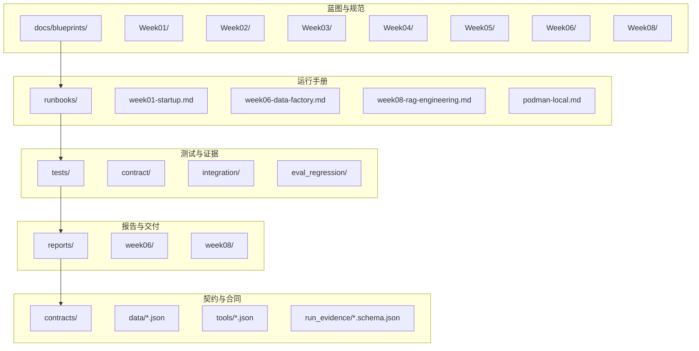
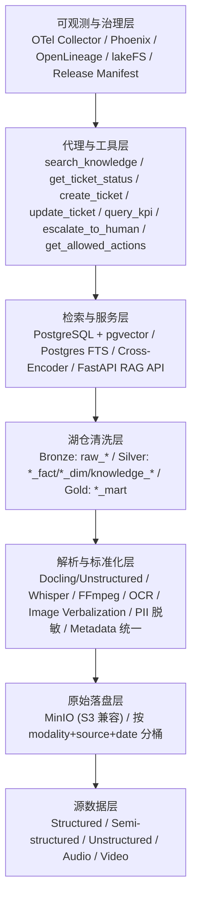
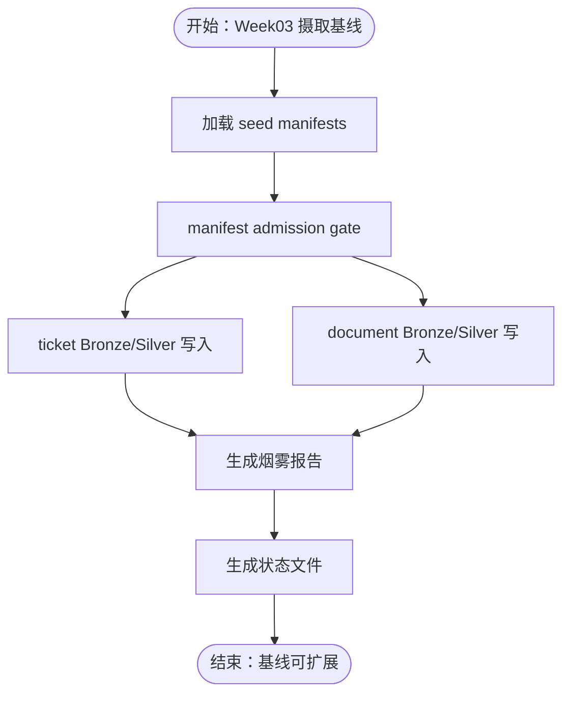
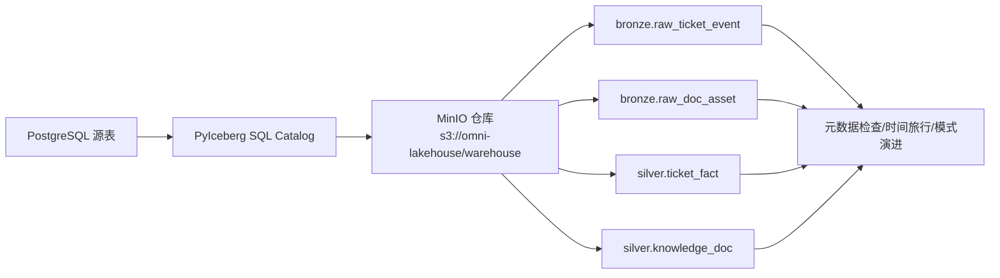
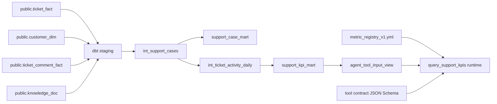
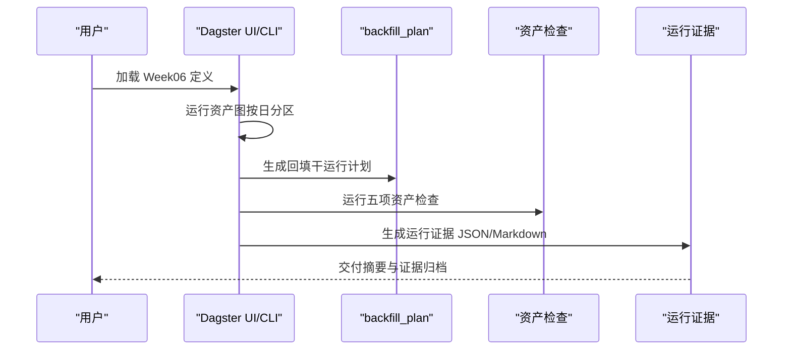
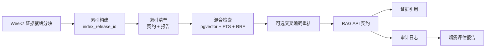
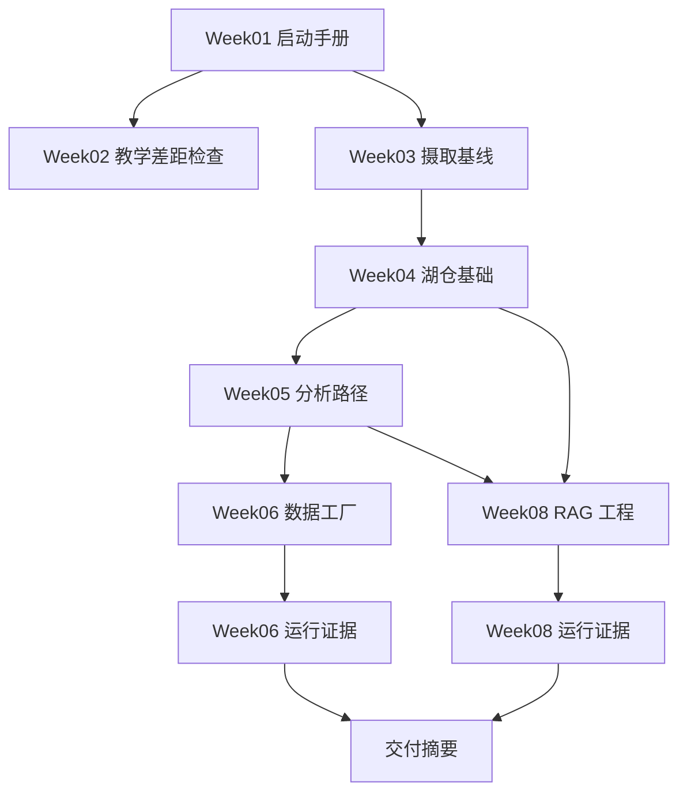

# 周报管理与进度跟踪

<cite>
**本文引用的文件**
- [项目蓝图 v1.0](file://docs/blueprints/project-blueprint.md)
- [Week06 数据工厂运行手册](file://runbooks/week06-data-factory.md)
- [Week08 RAG 工程运行手册](file://runbooks/week08-rag-engineering.md)
- [Week06 运行证据规范](file://docs/blueprints/week06/week06-run-evidence-spec.md)
- [Week02 教学差距检查](file://docs/blueprints/week02/week02-teaching-gap-check.md)
- [Week03 数据摄取基线](file://docs/blueprints/week03/ingestion_baseline_v1.md)
- [Week04 湖仓架构基础](file://docs/blueprints/week04/lakehouse_foundation_v1.md)
- [Week05 分析路径](file://docs/blueprints/week05/analytics_path_v1.md)
- [Week08 RAG 工程蓝图](file://docs/blueprints/week08/week08-rag-blueprint.md)
- [Week06 交付摘要](file://reports/week06/week06_delivery_summary.md)
- [Week01 启动手册](file://runbooks/week01-startup.md)
- [Podman 本地兼容性手册](file://runbooks/podman-local.md)
</cite>

## 目录
1. [简介](#简介)
2. [项目结构](#项目结构)
3. [核心组件](#核心组件)
4. [架构总览](#架构总览)
5. [详细组件分析](#详细组件分析)
6. [依赖关系分析](#依赖关系分析)
7. [性能考虑](#性能考虑)
8. [故障排除指南](#故障排除指南)
9. [结论](#结论)
10. [附录](#附录)

## 简介
本文件围绕“周报管理与进度跟踪”主题，系统梳理项目从 Week01 到 Week08 的阶段性目标、里程碑与交付物，给出可操作的周报模板设计、进度评估标准、里程碑达成检查方法，以及教学差距检查流程（知识点掌握、技能测试、学习效果分析）。同时，结合数据摄取基线、湖仓架构基础、分析路径设计、数据工厂蓝图与 RAG 蓝图，提供蓝图设计与执行要点、进度跟踪工具使用指南、问题识别与解决流程、风险评估与应对策略，并总结团队协作机制、知识分享平台与经验总结方法。

## 项目结构
项目采用“周为主线”的工程化组织方式，每周末有蓝图、运行手册、测试与报告，形成“蓝图—执行—验证—归档”的闭环。核心结构如下：
- 蓝图与规范：docs/blueprints 下按周组织，包含技术蓝图、设计规范与验收标准
- 运行手册：runbooks 下按周组织，包含可执行的操作步骤与验证清单
- 测试与证据：tests 下按周组织，包含契约测试、集成测试与运行证据生成
- 报告与交付：reports 下按周组织，包含运行证据、交付摘要与评估报告
- 契约与合同：contracts 下按域组织，包含数据契约、工具契约与运行证据契约

图表来源
- [项目蓝图 v1.0:1-175](file://docs/blueprints/project-blueprint.md#L1-L175)
- [Week06 数据工厂运行手册:1-190](file://runbooks/week06-data-factory.md#L1-L190)
- [Week08 RAG 工程运行手册:1-110](file://runbooks/week08-rag-engineering.md#L1-L110)
- [Week06 交付摘要:1-14](file://reports/week06/week06_delivery_summary.md#L1-L14)

章节来源
- [项目蓝图 v1.0:1-175](file://docs/blueprints/project-blueprint.md#L1-L175)

## 核心组件
- 周报模板设计
  - 模板要素：周目标、关键任务、里程碑、风险与应对、问题与改进、下周计划、评估与反思
  - 周报提交与归档：按周在 reports/weekXX/ 下生成运行证据与总结
- 进度评估标准
  - 里程碑达成：以蓝图与运行手册为对照，逐项核对“是否完成、是否可演示、是否可交付”
  - 质量门禁：契约测试、集成测试、证据生成三道关卡
- 里程碑达成检查
  - Week01：工程基线启动与健康检查
  - Week03：数据摄取基线与状态对象
  - Week04：湖仓架构基础与时间旅行
  - Week05：分析路径与工具安全层
  - Week06：数据工厂资产化与运行证据
  - Week08：RAG 工程闭环与混合检索
- 教学差距检查流程
  - 知识点掌握：对照 Week02 教学差距检查，确认课程站、项目规格与仓库落点的逐课时对齐
  - 技能水平测试：通过契约测试、集成测试与运行手册验证
  - 学习效果分析：以报告与证据为依据，形成可复盘的交付物清单

章节来源
- [Week02 教学差距检查:1-85](file://docs/blueprints/week02/week02-teaching-gap-check.md#L1-L85)
- [Week03 数据摄取基线:1-59](file://docs/blueprints/week03/ingestion_baseline_v1.md#L1-L59)
- [Week04 湖仓架构基础:1-58](file://docs/blueprints/week04/lakehouse_foundation_v1.md#L1-L58)
- [Week05 分析路径:1-51](file://docs/blueprints/week05/analytics_path_v1.md#L1-L51)
- [Week06 数据工厂运行手册:1-190](file://runbooks/week06-data-factory.md#L1-L190)
- [Week08 RAG 工程运行手册:1-110](file://runbooks/week08-rag-engineering.md#L1-L110)

## 架构总览
项目采用“七层架构”：可观测与治理层、代理与工具层、检索与服务层、湖仓清洗层、解析与标准化层、原始落盘层、源数据层。周报管理与进度跟踪贯穿各层，确保“数据—工作流—服务—观测”闭环。

图表来源
- [项目蓝图 v1.0:37-67](file://docs/blueprints/project-blueprint.md#L37-L67)

## 详细组件分析

### 周报模板设计与使用指南
- 模板要素
  - 周目标与关键任务：对照当周蓝图与运行手册，列出可验证的目标
  - 里程碑与交付物：以 reports/weekXX/ 下的证据与报告为准
  - 风险与应对：基于恢复决策树与常见问题，提出预防与处置方案
  - 问题与改进：记录本周未达预期的任务与改进措施
  - 下周计划：基于周报评估，制定可执行的下周计划
  - 评估与反思：总结可复用的经验与可优化的流程
- 提交与归档
  - 每周末在 reports/weekXX/ 生成运行证据与总结报告
  - 将周报与证据归档至 Git，形成可追溯的进度档案

章节来源
- [Week06 数据工厂运行手册:142-155](file://runbooks/week06-data-factory.md#L142-L155)
- [Week06 交付摘要:1-14](file://reports/week06/week06_delivery_summary.md#L1-L14)

### 进度评估标准与里程碑达成检查
- 评估维度
  - 是否完成：对照蓝图与运行手册，逐项核对“是否完成”
  - 是否可演示：通过健康检查与冒烟测试验证
  - 是否可交付：通过契约测试与集成测试验证
- 里程碑检查清单
  - Week01：工程基线启动、健康检查、种子数据生成、契约测试
  - Week03：数据摄取基线、状态对象、回放/回填干运行、报告落盘
  - Week04：湖仓基础、时间旅行、模式演进、基准报告
  - Week05：分析路径、工具安全层、指标注册与查询
  - Week06：数据工厂资产化、回填干运行计划、检查与运行证据
  - Week08：RAG 工程闭环、混合检索、审计日志与烟雾评估

章节来源
- [Week01 启动手册:1-148](file://runbooks/week01-startup.md#L1-L148)
- [Week03 数据摄取基线:1-59](file://docs/blueprints/week03/ingestion_baseline_v1.md#L1-L59)
- [Week04 湖仓架构基础:1-58](file://docs/blueprints/week04/lakehouse_foundation_v1.md#L1-L58)
- [Week05 分析路径:1-51](file://docs/blueprints/week05/analytics_path_v1.md#L1-L51)
- [Week06 数据工厂运行手册:1-190](file://runbooks/week06-data-factory.md#L1-L190)
- [Week08 RAG 工程运行手册:1-110](file://runbooks/week08-rag-engineering.md#L1-L110)

### 教学差距检查流程
- 知识点掌握评估
  - 对照 Week02 教学差距检查，逐课时核对课程站、项目规格与仓库落点
  - 关注边界说明：YAML vs JSON 的差异、parse-stage 字段的延迟产出
- 技能水平测试
  - 通过契约测试、manifest gate、seed loader 与集成测试验证
- 学习效果分析
  - 以 Week02 教学差距检查的完成度判断为基础，形成最小教学闭环

章节来源
- [Week02 教学差距检查:1-85](file://docs/blueprints/week02/week02-teaching-gap-check.md#L1-L85)

### 数据摄取基线（Week03）
- 设计要点
  - 复用现有组件：seed_loader、ticket_ingest、doc_ingest
  - 保持 Student Core Pack Docker + CLI 可跑
  - 新增最小 checkpoint/state 对象、烟雾报告、回放/回填干运行决策脚手架
- 执行流程
  - 生成烟雾报告
  - 执行回放/回填干运行
  - 生成状态文件与报告目录

图表来源
- [Week03 数据摄取基线:1-59](file://docs/blueprints/week03/ingestion_baseline_v1.md#L1-L59)

章节来源
- [Week03 数据摄取基线:1-59](file://docs/blueprints/week03/ingestion_baseline_v1.md#L1-L59)

### 湖仓架构基础（Week04）
- 设计要点
  - PyIceberg + PostgreSQL SQL Catalog + MinIO
  - 四张核心表：bronze.raw_ticket_event、bronze.raw_doc_asset、silver.ticket_fact、silver.knowledge_doc
  - 元数据检查、时间旅行、模式演进与基准报告
- 写入策略
  - 保守写入：去重全量刷新，避免盲追加

图表来源
- [Week04 湖仓架构基础:1-58](file://docs/blueprints/week04/lakehouse_foundation_v1.md#L1-L58)

章节来源
- [Week04 湖仓架构基础:1-58](file://docs/blueprints/week04/lakehouse_foundation_v1.md#L1-L58)

### 分析路径设计（Week05）
- 设计边界
  - 输入：public.* 源表
  - 转换：analytics/dbt 项目，目标 schema 为 analytics
  - 输出：support_case_mart、support_kpi_mart、agent_tool_input_view
  - 控制点：禁止 Agent 直查原始表、不暴露 PII 字段、使用白名单指标
- 数据链路

图表来源
- [Week05 分析路径:29-42](file://docs/blueprints/week05/analytics_path_v1.md#L29-L42)

章节来源
- [Week05 分析路径:1-51](file://docs/blueprints/week05/analytics_path_v1.md#L1-L51)

### 数据工厂蓝图（Week06）
- 蓝图目标
  - 在 Week03-Week05 基线之上添加数据工厂层
  - 资产化编排、回填干运行计划、检查与运行证据
- 关键流程
  - 加载 Week06 定义
  - 运行数据工厂资产图（按日分区）
  - 生成回填干运行计划
  - 运行五项资产检查
  - 生成运行证据 JSON 与 Markdown 总结
  - 验证 Docker/Podman 兼容性

图表来源
- [Week06 数据工厂运行手册:63-98](file://runbooks/week06-data-factory.md#L63-L98)
- [Week06 运行证据规范:1-62](file://docs/blueprints/week06/week06-run-evidence-spec.md#L1-L62)

章节来源
- [Week06 数据工厂运行手册:1-190](file://runbooks/week06-data-factory.md#L1-L190)
- [Week06 运行证据规范:1-62](file://docs/blueprints/week06/week06-run-evidence-spec.md#L1-L62)
- [Week06 交付摘要:1-14](file://reports/week06/week06_delivery_summary.md#L1-L14)

### RAG 蓝图（Week08）
- 蓝图目标
  - 将 Week07 的可引用文档资产升级为：可版本化索引资产、混合检索接口、metadata filter 与权限边界、optional rerank 门禁、结构化 RAG response、Prompt as Code、audit log、smoke eval
- 架构闭环

图表来源
- [Week08 RAG 工程蓝图:20-30](file://docs/blueprints/week08/week08-rag-blueprint.md#L20-L30)

章节来源
- [Week08 RAG 工程蓝图:1-81](file://docs/blueprints/week08/week08-rag-blueprint.md#L1-L81)
- [Week08 RAG 工程运行手册:1-110](file://runbooks/week08-rag-engineering.md#L1-L110)

## 依赖关系分析
- 蓝图与手册的依赖
  - Week01 启动手册为 Week02-Week08 的基础
  - Week03-Week05 的基线为 Week06 数据工厂与 Week08 RAG 提供输入
- 测试与证据的依赖
  - 契约测试驱动功能正确性
  - 集成测试验证端到端链路
  - 运行证据为下游决策提供依据
- 报告与交付的依赖
  - 每周末生成证据与总结，形成可追溯的进度档案

图表来源
- [Week01 启动手册:1-148](file://runbooks/week01-startup.md#L1-L148)
- [Week06 数据工厂运行手册:1-190](file://runbooks/week06-data-factory.md#L1-L190)
- [Week08 RAG 工程运行手册:1-110](file://runbooks/week08-rag-engineering.md#L1-L110)
- [Week06 交付摘要:1-14](file://reports/week06/week06_delivery_summary.md#L1-L14)

章节来源
- [Week01 启动手册:1-148](file://runbooks/week01-startup.md#L1-L148)
- [Week06 数据工厂运行手册:1-190](file://runbooks/week06-data-factory.md#L1-L190)
- [Week08 RAG 工程运行手册:1-110](file://runbooks/week08-rag-engineering.md#L1-L110)
- [Week06 交付摘要:1-14](file://reports/week06/week06_delivery_summary.md#L1-L14)

## 性能考虑
- 写入模式保守化：Week04 对核心表采用去重全量刷新，降低复杂度与维护成本
- 干运行优先：Week06 回填与 Week08 索引构建均支持干运行，降低风险
- 检索策略平衡：Week08 混合检索（向量 + FTS + RRF），在准确性与性能间取得平衡
- 环境兼容性：Week06/Week08 均提供 Docker/Podman 兼容性验证，保障本地可重复性

## 故障排除指南
- Week06 常见症状与处理
  - 合同模式测试失败：修正 contracts/run_evidence/week06_run_evidence.schema.json 或生成负载
  - 定义无法加载：检查 devbox 是否安装 dagster，pipelines/definitions.py 导入是否有效
  - DAG 工厂 UI 无法看到 Week06 文档/契约：检查 compose 挂载路径
  - 回填计划零输入：使用种子数据中存在的分区（如 2026-04-17）
  - 证据显示 dry_run_no_db_write：默认行为；仅在教师演示中设置 WEEK06_INGEST_DRY_RUN=false
  - Week04/Week05 状态不可用：先运行 Week04/Week05 的材料化或保持可选
- Week08 常见症状与处理
  - 维度不匹配：提供程序输出维度与 pgvector 列不一致，需使用配置的嵌入模型或谨慎迁移向量维度
  - 检索为空：索引未构建、过滤器过严或 Week07 分块不可用，需重建索引、检查 index_release_id 或使用合成夹具回退
  - 重排器不可用：交叉编码器依赖/模型不可用，保持 RRF 回退，API 不应失败
  - 引用缺失：检索结果缺少证据元数据，修复检索投影，LLM 不应凭空生成引用
  - 无 LLM 密钥：Anthropic/OpenAI 密钥缺失，返回结构化“无答案”或携带引用的回退

章节来源
- [Week06 数据工厂运行手册:157-189](file://runbooks/week06-data-factory.md#L157-L189)
- [Week08 RAG 工程运行手册:91-100](file://runbooks/week08-rag-engineering.md#L91-L100)

## 结论
通过周报模板与里程碑检查，结合蓝图与运行手册，项目实现了从 Week01 到 Week08 的渐进式交付闭环。数据摄取基线、湖仓架构基础、分析路径设计、数据工厂蓝图与 RAG 蓝图层层递进，既保证了工程可重复性，也提供了可审计、可复盘的运行证据。建议持续完善周报模板、强化契约测试与集成测试、沉淀团队协作与知识分享机制，以提升整体交付质量与效率。

## 附录
- 团队协作机制
  - 每周末进行周报评审与证据归档，形成可追溯的进度档案
  - 通过 Podman/Docker 兼容性手册保障不同环境下的可重复性
- 知识分享平台
  - 将蓝图、运行手册、测试与报告集中于 docs/、runbooks/、tests/、reports/，便于查阅与复用
- 经验总结方法
  - 基于运行证据与烟雾评估报告，定期回顾“做得好/可优化/可复用”的经验清单

章节来源
- [Podman 本地兼容性手册:1-335](file://runbooks/podman-local.md#L1-L335)
- [Week06 数据工厂运行手册:1-190](file://runbooks/week06-data-factory.md#L1-L190)
- [Week08 RAG 工程运行手册:1-110](file://runbooks/week08-rag-engineering.md#L1-L110)