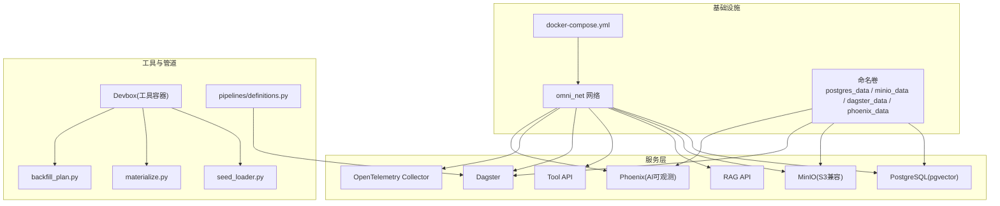
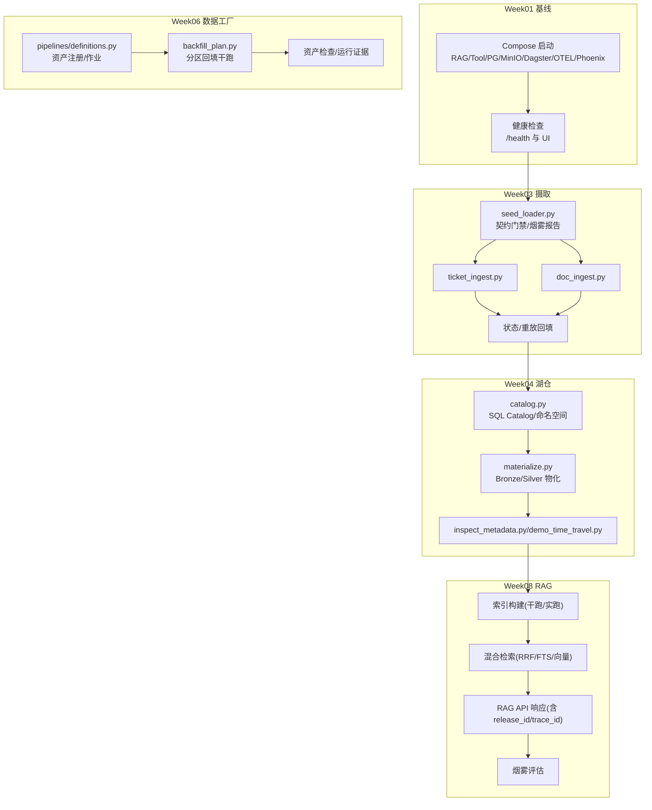
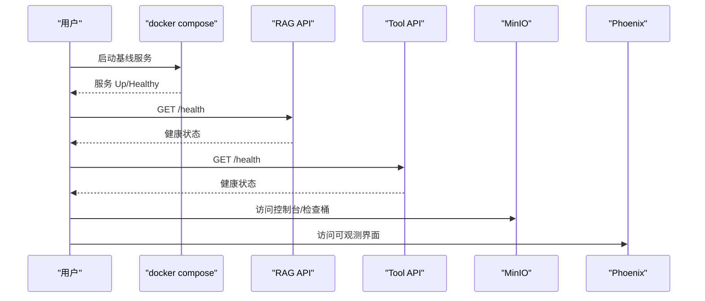
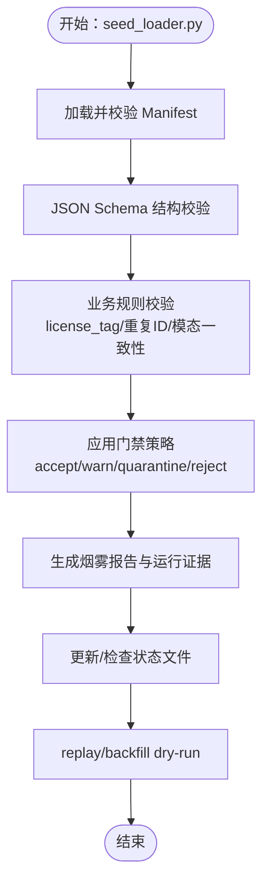
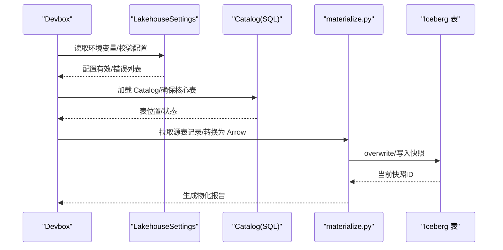
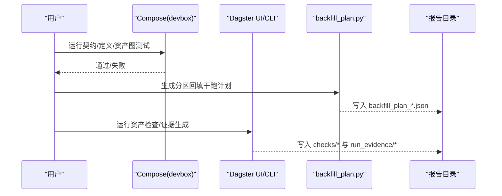
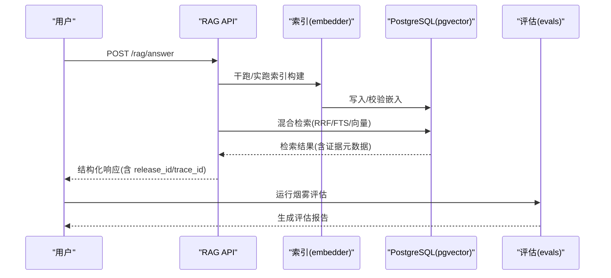
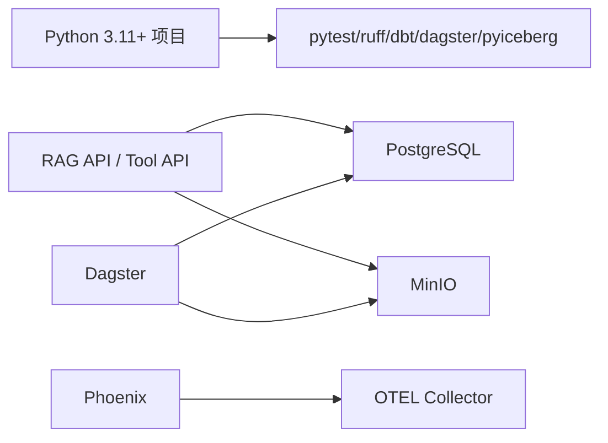

# 操作手册与最佳实践

<cite>
**本文引用的文件**   
- [runbooks/week01-startup.md](file://runbooks/week01-startup.md)
- [runbooks/ingestion_runbook_v1.md](file://runbooks/ingestion_runbook_v1.md)
- [runbooks/lakehouse_runbook.md](file://runbooks/lakehouse_runbook.md)
- [runbooks/podman-local.md](file://runbooks/podman-local.md)
- [runbooks/week06-data-factory.md](file://runbooks/week06-data-factory.md)
- [runbooks/week08-rag-engineering.md](file://runbooks/week08-rag-engineering.md)
- [infra/docker-compose.yml](file://infra/docker-compose.yml)
- [pyproject.toml](file://pyproject.toml)
- [services/rag_api/Dockerfile](file://services/rag_api/Dockerfile)
- [services/tool_api/Dockerfile](file://services/tool_api/Dockerfile)
- [pipelines/definitions.py](file://pipelines/definitions.py)
- [pipelines/lakehouse/settings.py](file://pipelines/lakehouse/settings.py)
- [pipelines/lakehouse/materialize.py](file://pipelines/lakehouse/materialize.py)
- [pipelines/ingestion/seed_loader.py](file://pipelines/ingestion/seed_loader.py)
- [pipelines/data_factory/backfill_plan.py](file://pipelines/data_factory/backfill_plan.py)
- [services/rag_api/app/main.py](file://services/rag_api/app/main.py)
- [services/tool_api/app/main.py](file://services/tool_api/app/main.py)
- [analytics/dbt_project.yml](file://analytics/dbt_project.yml)
</cite>

## 目录
1. [引言](#引言)
2. [项目结构](#项目结构)
3. [核心组件](#核心组件)
4. [架构总览](#架构总览)
5. [详细组件分析](#详细组件分析)
6. [依赖分析](#依赖分析)
7. [性能考虑](#性能考虑)
8. [故障排除指南](#故障排除指南)
9. [结论](#结论)
10. [附录](#附录)

## 引言
本操作手册与最佳实践面向工程基线启动、数据摄取、湖仓落地、Podman 本地运行、数据工厂与 RAG 工程等阶段，提供从环境准备、服务启动、健康检查、初始配置，到数据加载、质量控制、错误处理、性能优化、常见问题排查、安全最佳实践与效率提升方法的全流程指导。读者可据此快速搭建可复现、可观测、可回滚的数据工程基线，并在 Week04+ 阶段推进到 Lakehouse、Week06 数据工厂与 Week08 RAG 工程。

## 项目结构
项目采用多模块分层组织：服务层（RAG API、Tool API）、管道层（摄取、解析归一、湖仓、索引、数据工厂）、分析层（dbt）、基础设施（Docker Compose）、运行手册与蓝图文档。Compose 将 PostgreSQL、MinIO、RAG/Tool API、Dagster、OpenTelemetry Collector、Phoenix 等服务以网络隔离方式编排，Devbox 作为无本地依赖的工具容器，贯穿契约测试、冒烟测试与 CLI 演示。

图表来源
- [infra/docker-compose.yml:1-340](file://infra/docker-compose.yml#L1-L340)
- [pipelines/definitions.py:1-38](file://pipelines/definitions.py#L1-L38)

章节来源
- [infra/docker-compose.yml:1-340](file://infra/docker-compose.yml#L1-L340)
- [pyproject.toml:1-49](file://pyproject.toml#L1-L49)

## 核心组件
- 工程基线与健康检查：通过 Compose 启动并验证 RAG API、Tool API、MinIO、Dagster、Phoenix、OpenTelemetry；支持 Docker 与 Podman。
- 数据摄取：Manifest 驱动的契约门禁、烟雾报告、状态与重放回填、集成测试。
- 湖仓：Bronze/Silver 表物化、快照与时间旅行、模式演进与元数据检查。
- 数据工厂：资产化编排、分区回填干跑计划、五项核心检查与运行证据。
- RAG 工程：索引构建（干跑/实跑）、混合检索、结构化响应与烟雾评估。
- 分析层：dbt 项目配置与目标环境变量。

章节来源
- [runbooks/week01-startup.md:1-148](file://runbooks/week01-startup.md#L1-L148)
- [runbooks/ingestion_runbook_v1.md:1-111](file://runbooks/ingestion_runbook_v1.md#L1-L111)
- [runbooks/lakehouse_runbook.md:1-82](file://runbooks/lakehouse_runbook.md#L1-L82)
- [runbooks/week06-data-factory.md:1-190](file://runbooks/week06-data-factory.md#L1-L190)
- [runbooks/week08-rag-engineering.md:1-110](file://runbooks/week08-rag-engineering.md#L1-L110)

## 架构总览
下图展示 Week01-08 的端到端工程路径：Compose 启动基线服务，Devbox 执行契约与冒烟测试，Week03 摄取与状态，Week04 湖仓物化与时间旅行，Week06 数据工厂资产与回填计划，Week08 RAG 检索与生成闭环。

图表来源
- [infra/docker-compose.yml:1-340](file://infra/docker-compose.yml#L1-L340)
- [pipelines/definitions.py:1-38](file://pipelines/definitions.py#L1-L38)
- [pipelines/lakehouse/materialize.py:1-200](file://pipelines/lakehouse/materialize.py#L1-L200)
- [pipelines/data_factory/backfill_plan.py:1-147](file://pipelines/data_factory/backfill_plan.py#L1-L147)
- [runbooks/week08-rag-engineering.md:1-110](file://runbooks/week08-rag-engineering.md#L1-L110)

## 详细组件分析

### 工程基线启动手册（Week01）
- 环境准备：安装 Docker/Docker Compose，准备 .env.local，可选设置 LLM 密钥。
- 启动服务：使用 Compose 指定 env-file 与 docker-compose.yml，按 profile 启动工具栈。
- 健康检查：访问 RAG/Tool API /health，MinIO 控制台，Dagster UI，Phoenix。
- 种子数据与契约：生成工单种子、dry-run seed loader、契约测试、冒烟查询、Release Manifest 校验。
- 常见问题：minio_init 退出码、数据库初始化、首次构建 devbox、契约测试失败等。

图表来源
- [runbooks/week01-startup.md:33-65](file://runbooks/week01-startup.md#L33-L65)
- [infra/docker-compose.yml:90-153](file://infra/docker-compose.yml#L90-L153)

章节来源
- [runbooks/week01-startup.md:1-148](file://runbooks/week01-startup.md#L1-L148)
- [infra/docker-compose.yml:1-340](file://infra/docker-compose.yml#L1-L340)

### 数据摄取操作手册（Week03）
- 目标：演示契约门禁、烟雾报告、checkpoint/state、replay/backfill dry-run。
- 关键步骤：契约测试、seed loader 烟雾报告、ticket/doc 摄取 dry-run、检查状态文件、replay dry-run、集成测试。
- 质量控制：Manifest 结构与业务规则校验、门禁策略（接受/警告/隔离/拒绝）、PII 与许可证合规。
- 错误处理：schema 违规、重复 source_id、模态与 source_type 不一致、未知合同引用等。
- 性能优化：Dry-run 优先、批量大小与并发、避免重复处理、基于指纹的幂等写入。

图表来源
- [pipelines/ingestion/seed_loader.py:129-200](file://pipelines/ingestion/seed_loader.py#L129-L200)
- [runbooks/ingestion_runbook_v1.md:34-110](file://runbooks/ingestion_runbook_v1.md#L34-L110)

章节来源
- [runbooks/ingestion_runbook_v1.md:1-111](file://runbooks/ingestion_runbook_v1.md#L1-L111)
- [pipelines/ingestion/seed_loader.py:1-200](file://pipelines/ingestion/seed_loader.py#L1-L200)

### 湖仓操作手册（Week04）
- 目标：将 Week03 摄取结果推进到可复现、可回滚、可追溯的 Lakehouse 层。
- 关键步骤：Catalog 自检、物化 Bronze/Silver、快照与时间旅行演示、模式演进演示、性能基线。
- 表结构与分区：Bronze 保真 append-first，Silver 规范化可查询；命名空间与对象存储位置。
- 模式演进：通过 Iceberg schema 版本与快照记录，确保历史可追溯与下游兼容。
- 数据治理：PII 级别、许可证标签、质量门禁、数据发布标识与摄取批次标识。

图表来源
- [pipelines/lakehouse/settings.py:1-149](file://pipelines/lakehouse/settings.py#L1-L149)
- [pipelines/lakehouse/materialize.py:1-200](file://pipelines/lakehouse/materialize.py#L1-L200)
- [runbooks/lakehouse_runbook.md:59-75](file://runbooks/lakehouse_runbook.md#L59-L75)

章节来源
- [runbooks/lakehouse_runbook.md:1-82](file://runbooks/lakehouse_runbook.md#L1-L82)
- [pipelines/lakehouse/settings.py:1-149](file://pipelines/lakehouse/settings.py#L1-L149)
- [pipelines/lakehouse/materialize.py:1-200](file://pipelines/lakehouse/materialize.py#L1-L200)

### 数据工厂操作手册（Week06）
- 范围：资产化编排、分区回填干跑、五项资产检查、运行证据生成与校验。
- 操作路径：UI（Dagster）与 CLI（pytest + backfill_plan），Dry-run 为主，不执行破坏性重写。
- 回填决策树：根据合同、定义加载、输入行数、证据状态进行决策。
- 证据归档：backfill/checks/run_evidence 的 JSON/Markdown 输出。

图表来源
- [runbooks/week06-data-factory.md:63-100](file://runbooks/week06-data-factory.md#L63-L100)
- [pipelines/data_factory/backfill_plan.py:1-147](file://pipelines/data_factory/backfill_plan.py#L1-L147)

章节来源
- [runbooks/week06-data-factory.md:1-190](file://runbooks/week06-data-factory.md#L1-L190)
- [pipelines/data_factory/backfill_plan.py:1-147](file://pipelines/data_factory/backfill_plan.py#L1-L147)

### RAG 工程操作手册（Week08）
- 范围：请求/响应/引用/索引清单契约测试、索引干跑/实跑、混合检索、结构化响应、烟雾评估。
- 索引构建：指定 index_release_id，批大小，维度匹配校验，干跑不写入。
- 检索与生成：pgvector、FTS、RRF、元数据过滤、可选重排序；响应包含 release_id、trace_id 等。
- 常见失败：维度不匹配、检索为空、重排序器不可用、引用缺失、LLM 密钥缺失。

图表来源
- [runbooks/week08-rag-engineering.md:17-90](file://runbooks/week08-rag-engineering.md#L17-L90)
- [services/rag_api/app/main.py:1-73](file://services/rag_api/app/main.py#L1-L73)

章节来源
- [runbooks/week08-rag-engineering.md:1-110](file://runbooks/week08-rag-engineering.md#L1-L110)
- [services/rag_api/app/main.py:1-73](file://services/rag_api/app/main.py#L1-L73)

### Podman 本地运行指南
- 兼容性：Compose 特性风险评估（命名卷、桥接网络、healthcheck、depends_on.condition、profiles、固定容器名、重启策略）。
- 路径 A（Podman Desktop）与路径 B（Podman CLI）；首次拉取镜像与网络受限场景。
- 项目冒烟测试：Compose 配置校验、基础服务健康、Devbox 构建、契约与门禁、dbt 解析/构建、Week06 数据工厂冒烟、全栈健康检查。
- 故障排除：命令未找到、Compose provider 未找到、镜像仓库超时、PyPI 超时、端口占用、容器名冲突、依赖健康等待、绑定挂载空、权限拒绝、dbt 连接错误等。

章节来源
- [runbooks/podman-local.md:1-335](file://runbooks/podman-local.md#L1-L335)

## 依赖分析
- 语言与包管理：Python 3.11+，setuptools，pytest、ruff、mypy、pyiceberg、dbt、dagster 等可选依赖。
- 服务依赖：RAG/Tool API 依赖 PostgreSQL 与 MinIO；Dagster 依赖 PostgreSQL 与 MinIO；Phoenix 依赖 OTEL Collector。
- 环境变量：Lakehouse 设置通过环境变量注入 Catalog/Warehouse/S3 端点与认证信息；Week04/05/06/08 的 release_id 与报告目录通过环境变量统一管理。

图表来源
- [pyproject.toml:1-49](file://pyproject.toml#L1-L49)
- [infra/docker-compose.yml:1-340](file://infra/docker-compose.yml#L1-L340)

章节来源
- [pyproject.toml:1-49](file://pyproject.toml#L1-L49)
- [infra/docker-compose.yml:1-340](file://infra/docker-compose.yml#L1-L340)

## 性能考虑
- 摄取阶段：优先 Dry-run，合理设置批大小与并发；利用指纹幂等避免重复写入；对大文件/流式数据采用分片与断点续传策略。
- 湖仓阶段：Bronze 采用 append-first 降低写放大；Silver 建立必要索引与统计信息；快照粒度适中，避免过度频繁提交。
- 数据工厂：分区窗口明确，回填仅针对缺失分区；资产检查尽量轻量化，避免对生产库造成压力。
- RAG 阶段：索引维度与数据库向量维度一致；检索参数（top_k、过滤器）权衡召回与延迟；重排序器降级为 RRF；缓存热点查询与引用元数据。
- 观测与调优：通过 Phoenix 与 OTEL Collector 收集 trace/metrics/logs，定位慢查询与异常路径。

## 故障排除指南
- Week01 基线
  - minio_init 非 0 退出：等待 30s 后重启初始化容器。
  - RAG/Tool API health 显示数据库 down：等待初始化 SQL 完成。
  - devbox 首次构建失败：先执行 build devbox。
  - 契约测试失败：检查 contracts 目录结构与 schema 文件。
- Week03 摄取
  - Manifest 校验失败：检查结构与业务规则（重复 source_id、模态与 source_type 不一致、未知合同引用）。
  - 门禁策略触发：根据策略调整资产或修复元数据。
- Week04 湖仓
  - Catalog/仓库配置错误：核对环境变量与 URI 格式。
  - 物化空表：确认源表是否为空或分区未覆盖。
- Week06 数据工厂
  - 合同/定义加载失败：检查 devbox 中 dagster 安装与导入路径。
  - 回填计划零输入：选择包含种子数据的分区。
  - 运行证据校验失败：修正 schema 或生成负载。
- Week08 RAG
  - 维度不匹配：使用与数据库向量维度一致的模型。
  - 检索为空：检查索引构建、filters 与数据可用性。
  - 引用缺失：确保检索投影包含证据元数据。
  - LLM 密钥缺失：返回结构化 no-answer 或带引用的回退。
- Podman
  - 命令未找到/Provider 未找到：安装/启用 Podman Compose 并设置 PROVIDER。
  - 网络超时：使用镜像加速或预加载课程镜像。
  - 端口占用/容器名冲突：停止冲突运行并清理旧容器。
  - 权限/绑定挂载问题：保持仓库在用户家目录并重启机器。

章节来源
- [runbooks/week01-startup.md:128-147](file://runbooks/week01-startup.md#L128-L147)
- [runbooks/ingestion_runbook_v1.md:106-111](file://runbooks/ingestion_runbook_v1.md#L106-L111)
- [runbooks/lakehouse_runbook.md:76-82](file://runbooks/lakehouse_runbook.md#L76-L82)
- [runbooks/week06-data-factory.md:157-167](file://runbooks/week06-data-factory.md#L157-L167)
- [runbooks/week08-rag-engineering.md:91-100](file://runbooks/week08-rag-engineering.md#L91-L100)
- [runbooks/podman-local.md:298-323](file://runbooks/podman-local.md#L298-L323)

## 结论
本手册提供了从 Week01 基线到 Week08 RAG 的完整工程路径与最佳实践。通过 Compose 一键启动、Devbox 无依赖验证、Manifest 驱动的契约门禁、Lakehouse 的快照与时间旅行、数据工厂的资产化与回填计划，以及 RAG 的混合检索与结构化响应，团队可以建立可复现、可观测、可治理的数据工程基线，并持续迭代到更复杂的湖仓与检索增强生成场景。

## 附录
- 环境变量与配置要点
  - Lakehouse：Catalog 名称/类型/URI、Warehouse S3 地址与桶名、S3 端点与凭据、数据发布标识、摄取批次标识、报告目录。
  - Week04/05/06/08：各阶段 release_id 与报告目录通过环境变量统一管理。
- dbt 项目配置：模型路径、目标路径、标签与变量，结合环境变量实现跨阶段数据发布。
- 安全最佳实践
  - 最小权限原则：服务账户仅授予必要权限；敏感密钥通过环境变量注入。
  - 网络隔离：服务间通过内部网络通信；对外暴露端口最小化。
  - 数据治理：PII 级别标注、许可证标签、质量门禁、审计日志与追踪 ID。
- 工具使用技巧与效率提升
  - Dry-run 优先：在执行任何写入前先进行干跑与回填计划。
  - 分区策略：按天/周分区，明确回填窗口与幂等键。
  - 观测先行：开启 Phoenix 与 OTEL，建立关键指标与告警。
  - 自动化：将冒烟测试与契约测试纳入 CI，确保每次变更可验证。

章节来源
- [pipelines/lakehouse/settings.py:1-149](file://pipelines/lakehouse/settings.py#L1-L149)
- [analytics/dbt_project.yml:1-32](file://analytics/dbt_project.yml#L1-L32)
- [infra/docker-compose.yml:1-340](file://infra/docker-compose.yml#L1-L340)