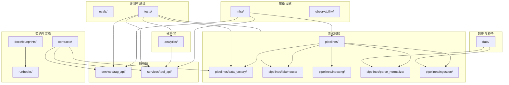
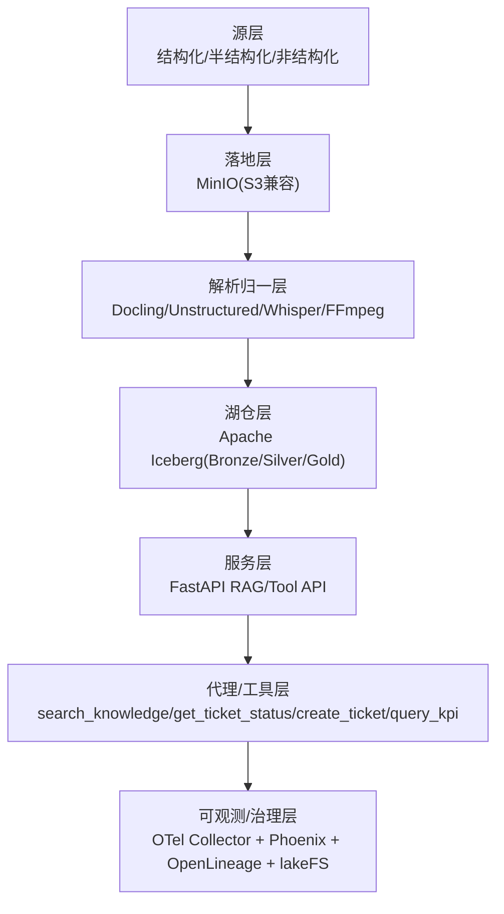
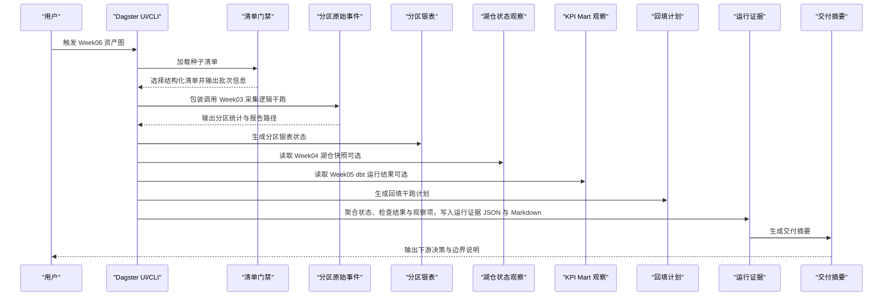
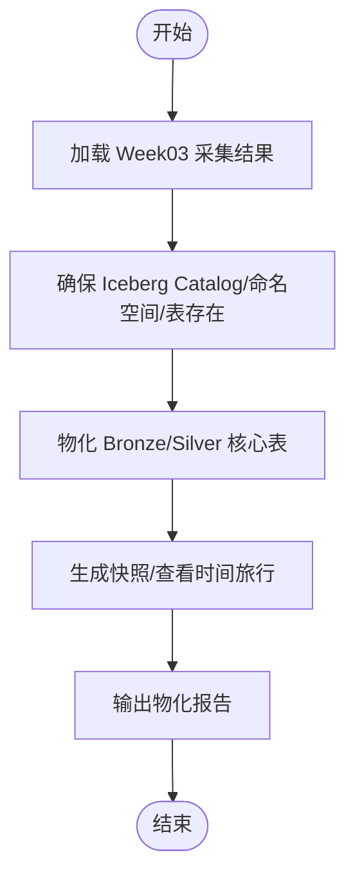
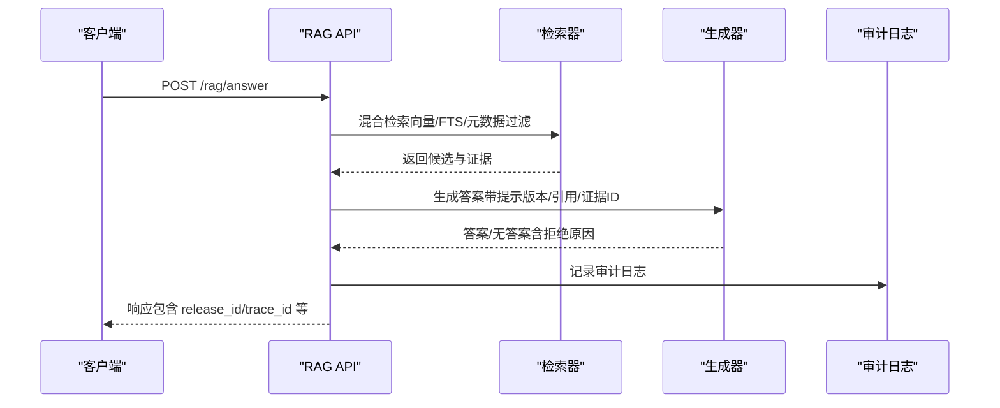
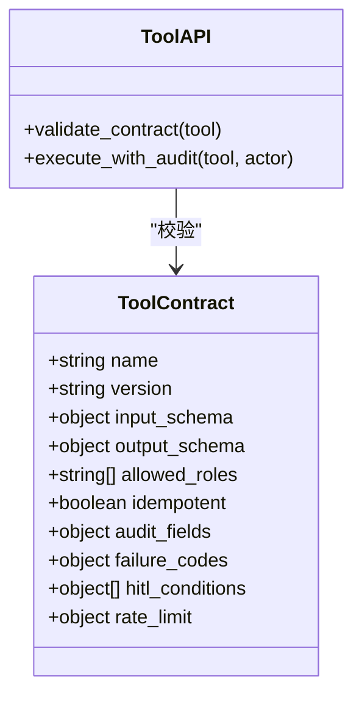
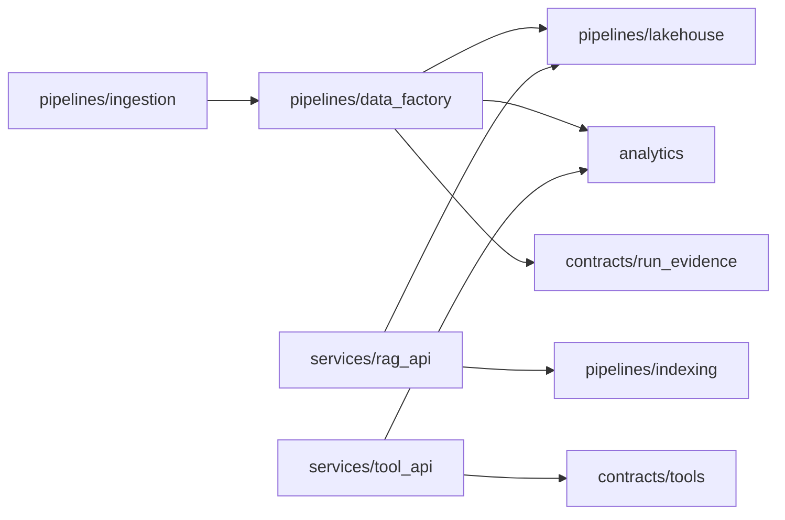

# 运行手册与操作指南

<cite>
**本文引用的文件**
- [README.md](file://README.md)
- [runbooks/week01-startup.md](file://runbooks/week01-startup.md)
- [runbooks/ingestion_runbook_v1.md](file://runbooks/ingestion_runbook_v1.md)
- [runbooks/lakehouse_runbook.md](file://runbooks/lakehouse_runbook.md)
- [runbooks/week06-data-factory.md](file://runbooks/week06-data-factory.md)
- [runbooks/week08-rag-engineering.md](file://runbooks/week08-rag-engineering.md)
- [runbooks/podman-local.md](file://runbooks/podman-local.md)
- [docs/blueprints/project-blueprint.md](file://docs/blueprints/project-blueprint.md)
- [contracts/run_evidence/week06_run_evidence.schema.json](file://contracts/run_evidence/week06_run_evidence.schema.json)
- [contracts/tools/tool_contract_schema.json](file://contracts/tools/tool_contract_schema.json)
- [analytics/dbt_project.yml](file://analytics/dbt_project.yml)
- [pyproject.toml](file://pyproject.toml)
- [services/rag_api/app/main.py](file://services/rag_api/app/main.py)
- [services/tool_api/app/main.py](file://services/tool_api/app/main.py)
- [pipelines/definitions.py](file://pipelines/definitions.py)
- [pipelines/data_factory/assets.py](file://pipelines/data_factory/assets.py)
- [pipelines/lakehouse/assets.py](file://pipelines/lakehouse/assets.py)
- [pipelines/indexing/assets.py](file://pipelines/indexing/assets.py)
</cite>

## 目录
1. [简介](#简介)
2. [项目结构](#项目结构)
3. [核心组件](#核心组件)
4. [架构总览](#架构总览)
5. [详细组件分析](#详细组件分析)
6. [依赖分析](#依赖分析)
7. [性能考虑](#性能考虑)
8. [故障排除指南](#故障排除指南)
9. [结论](#结论)
10. [附录](#附录)

## 简介
本文件为 OmniSupport Copilot 的运行手册与操作指南，面向课程学员与项目维护者，系统化梳理每周进度跟踪与里程碑达成的管理方法，涵盖周报模板、进度评估与问题解决流程；同时提供操作手册内容，包括常见问题解决、性能优化、故障排除与最佳实践；阐述项目报告与证据管理，包括阶段性成果展示、性能基准报告与合规审计；并给出团队协作、知识传承与经验总结的方法，以及工具使用指南、工作流程优化与效率提升建议。

## 项目结构
仓库采用“单仓多模块”的组织方式，围绕“数据工程—湖仓—解析—检索—服务—评测—治理”主线展开，主要目录与职责如下：
- infra：容器编排、数据库迁移与环境变量
- services：RAG API 与 Tool API 服务
- pipelines：Dagster 资产化流水线（采集、解析归一、湖仓、索引、数据工厂）
- analytics：dbt Core 项目与 KPI Mart
- contracts：数据契约、工具契约、发布契约与运行证据契约
- data：种子清单、合成生成器与规范化资产
- observability：OTel 配置与 Phoenix 可观测
- evals：评测集与回归评测
- tests：契约测试、集成测试与回归评测
- docs/blueprints：项目蓝图与周报模板
- runbooks：每周运行手册与 Podman 兼容路径

**图表来源**
- [README.md:183-216](file://README.md#L183-L216)
- [runbooks/week01-startup.md:34-65](file://runbooks/week01-startup.md#L34-L65)
- [runbooks/lakehouse_runbook.md:35-57](file://runbooks/lakehouse_runbook.md#L35-L57)
- [runbooks/week06-data-factory.md:33-59](file://runbooks/week06-data-factory.md#L33-L59)
- [runbooks/week08-rag-engineering.md:17-27](file://runbooks/week08-rag-engineering.md#L17-L27)

**章节来源**
- [README.md:183-216](file://README.md#L183-L216)
- [docs/blueprints/project-blueprint.md:35-68](file://docs/blueprints/project-blueprint.md#L35-L68)

## 核心组件
- 服务组件
  - RAG API：提供健康检查与检索增强生成接口，内置请求 ID 与全局异常处理，支持 OpenTelemetry 与 Phoenix 可观测
  - Tool API：提供工单工具、KPI 查询与审计日志，遵循工具契约规范
- 流水线组件
  - 数据工厂（Week06）：基于 Dagster 的资产化编排，支持分区、回填干跑、资产检查与运行证据
  - 湖仓（Week04）：PyIceberg Bronze/Silver 表物化、快照与时间旅行演示
  - 索引（Week08）：嵌入索引构建与混合检索，支持干跑模式与性能报告
- 契约与证据
  - 运行证据契约（Week06）：标准化运行证据 JSON 与 Markdown 摘要
  - 工具契约规范：约束工具输入/输出、角色授权、幂等键、审计字段与失败码
- 分析与评测
  - dbt Core：KPI Mart 与度量注册表，支持受控查询
  - 评测与回归门禁：Smoke 评测与回归测试

**章节来源**
- [services/rag_api/app/main.py:26-73](file://services/rag_api/app/main.py#L26-L73)
- [services/tool_api/app/main.py:24-64](file://services/tool_api/app/main.py#L24-L64)
- [pipelines/data_factory/assets.py:116-177](file://pipelines/data_factory/assets.py#L116-L177)
- [pipelines/lakehouse/assets.py:10-84](file://pipelines/lakehouse/assets.py#L10-L84)
- [pipelines/indexing/assets.py:17-55](file://pipelines/indexing/assets.py#L17-L55)
- [contracts/run_evidence/week06_run_evidence.schema.json:1-137](file://contracts/run_evidence/week06_run_evidence.schema.json#L1-L137)
- [contracts/tools/tool_contract_schema.json:1-93](file://contracts/tools/tool_contract_schema.json#L1-L93)
- [analytics/dbt_project.yml:18-32](file://analytics/dbt_project.yml#L18-L32)

## 架构总览
系统采用七层架构，从源数据到可观测治理贯穿全链路，强调“数据优先、工作流优先、证据优先、发布感知”。

**图表来源**
- [docs/blueprints/project-blueprint.md:35-68](file://docs/blueprints/project-blueprint.md#L35-L68)
- [README.md:106-131](file://README.md#L106-L131)

## 详细组件分析

### 组件A：数据工厂（Week06）运行证据与资产检查
数据工厂以 Dagster 资产为核心，串联“清单门禁—分区采集—资产检查—运行证据—交付摘要”，默认干跑模式，不写入数据库，确保可重复与可回滚。

**图表来源**
- [pipelines/data_factory/assets.py:116-177](file://pipelines/data_factory/assets.py#L116-L177)
- [pipelines/data_factory/assets.py:354-475](file://pipelines/data_factory/assets.py#L354-L475)
- [runbooks/week06-data-factory.md:63-99](file://runbooks/week06-data-factory.md#L63-L99)

**章节来源**
- [pipelines/data_factory/assets.py:116-475](file://pipelines/data_factory/assets.py#L116-L475)
- [runbooks/week06-data-factory.md:1-190](file://runbooks/week06-data-factory.md#L1-L190)
- [contracts/run_evidence/week06_run_evidence.schema.json:1-137](file://contracts/run_evidence/week06_run_evidence.schema.json#L1-L137)

### 组件B：湖仓（Week04）物化与时间旅行
Week04 以 PyIceberg 为核心，将 Week03 采集结果物化为 Bronze/Silver 表，演示快照、时间旅行与模式演进，强调“可复现、可回滚、可追溯”。

**图表来源**
- [runbooks/lakehouse_runbook.md:59-75](file://runbooks/lakehouse_runbook.md#L59-L75)
- [pipelines/lakehouse/assets.py:10-84](file://pipelines/lakehouse/assets.py#L10-L84)

**章节来源**
- [runbooks/lakehouse_runbook.md:1-82](file://runbooks/lakehouse_runbook.md#L1-L82)
- [pipelines/lakehouse/assets.py:109-125](file://pipelines/lakehouse/assets.py#L109-L125)

### 组件C：RAG 工程（Week08）检索与生成
Week08 将检索与生成一体化，支持混合检索（pgvector + PostgreSQL FTS + RRF + 可选重排）、结构化响应与审计日志，提供干跑索引构建与 Smoke 评测。

**图表来源**
- [runbooks/week08-rag-engineering.md:61-81](file://runbooks/week08-rag-engineering.md#L61-L81)
- [services/rag_api/app/main.py:44-66](file://services/rag_api/app/main.py#L44-L66)

**章节来源**
- [runbooks/week08-rag-engineering.md:1-110](file://runbooks/week08-rag-engineering.md#L1-L110)
- [services/rag_api/app/main.py:19-73](file://services/rag_api/app/main.py#L19-L73)

### 组件D：工具契约与安全边界
工具契约规范约束工具的输入输出、角色授权、幂等键、审计字段与失败码，确保代理调用的安全与可审计。

**图表来源**
- [contracts/tools/tool_contract_schema.json:1-93](file://contracts/tools/tool_contract_schema.json#L1-L93)
- [services/tool_api/app/main.py:61-64](file://services/tool_api/app/main.py#L61-L64)

**章节来源**
- [contracts/tools/tool_contract_schema.json:1-93](file://contracts/tools/tool_contract_schema.json#L1-L93)
- [services/tool_api/app/main.py:1-64](file://services/tool_api/app/main.py#L1-L64)

## 依赖分析
- 组件耦合与内聚
  - 数据工厂依赖采集（复用 Week03）、湖仓（观察性依赖）、分析（观察性依赖），通过运行证据聚合状态
  - RAG API 依赖索引（向量/文本检索）、服务层中间件（请求 ID、异常处理）、可观测（OTel/Phoenix）
  - Tool API 依赖 dbt 生成的语义层视图与工具契约
- 外部依赖与集成点
  - 容器编排：Docker/Podman Compose
  - 对象存储：MinIO（S3 兼容）
  - 结构化与向量：PostgreSQL + pgvector
  - 湖仓：Apache Iceberg（PyIceberg）
  - 编排：Dagster
  - 可观测：OpenTelemetry + Phoenix
  - 分析：dbt Core
- 循环依赖
  - 通过资产化与运行证据解耦上游依赖，避免循环导入

**图表来源**
- [pipelines/definitions.py:7-37](file://pipelines/definitions.py#L7-L37)
- [pipelines/data_factory/assets.py:116-177](file://pipelines/data_factory/assets.py#L116-L177)
- [services/rag_api/app/main.py:14-16](file://services/rag_api/app/main.py#L14-L16)
- [services/tool_api/app/main.py:15-16](file://services/tool_api/app/main.py#L15-L16)

**章节来源**
- [pipelines/definitions.py:1-38](file://pipelines/definitions.py#L1-L38)
- [pyproject.toml:17-31](file://pyproject.toml#L17-L31)

## 性能考虑
- 索引构建批大小与干跑策略：通过环境变量控制批大小与干跑，降低资源占用与风险
- 检索策略：混合检索（RRF）与元数据过滤，平衡召回与相关性
- 数据分区与回填：分区驱动的增量处理与回填干跑，减少全量重算
- 可观测与回滚：trace_id 与 release_id 便于定位性能瓶颈与回滚
- 建议
  - 在开发环境使用干跑模式验证索引维度与检索路径
  - 逐步扩大批大小与 top_k，结合 Smoke 评测与回归门禁
  - 利用 Phoenix 与 OTel 追踪关键 Span，定位延迟热点

[本节为通用指导，无需特定文件引用]

## 故障排除指南
- Week01 基线
  - minio_init 退出非 0：等待后重试初始化容器
  - rag_api 健康检查报数据库 down：等待初始化脚本执行完成
  - devbox 首次构建失败：先构建 devbox 镜像
  - 契约测试失败：检查 contracts 目录结构与 schema 文件
- Week06 数据工厂
  - 合同/定义加载失败：检查 devbox 中 dagster 安装与导入路径
  - Dagster UI 无法看到文档/契约：检查 compose 挂载路径
  - 回填计划输入行数为 0：使用种子数据中存在的分区日期
  - 运行证据显示 dry_run_no_db_write：默认行为，仅在教师演示时关闭干跑
  - Week04/Week05 状态为 not_available：先运行对应路径或保持为观察项
- Week08 RAG 工程
  - 维度不匹配：使用与数据库向量维度一致的嵌入模型
  - 检索为空：确认索引已构建、过滤条件合理或使用合成数据回退
  - 重排器不可用：保留 RRF 回退，API 不应失败
  - 引用缺失：修复检索投影，禁止生成凭空引用
  - 无 LLM 密钥：返回结构化无答案或带引用的回退
- Podman 兼容
  - 无法找到 compose provider：安装/启用 Podman Compose 或设置环境变量
  - 端口占用：停止冲突的 Docker/Podman 服务
  - 网络超时：使用镜像加速或预加载课程镜像

**章节来源**
- [runbooks/week01-startup.md:128-148](file://runbooks/week01-startup.md#L128-L148)
- [runbooks/week06-data-factory.md:157-168](file://runbooks/week06-data-factory.md#L157-L168)
- [runbooks/week08-rag-engineering.md:91-100](file://runbooks/week08-rag-engineering.md#L91-L100)
- [runbooks/podman-local.md:298-324](file://runbooks/podman-local.md#L298-L324)

## 结论
本运行手册与操作指南围绕“数据工程—湖仓—解析—检索—服务—评测—治理”的主线，提供了可重复、可观测、可回滚、可审计的工程实践路径。通过数据工厂的资产化编排、湖仓的时间旅行与模式演进、RAG 的混合检索与生成闭环，以及严格的契约与证据体系，确保项目在课程与实战中稳步前进。建议团队在每周迭代中坚持“证据优先、工作流优先、发布感知”的原则，持续优化流程与工具，保障质量与效率。

[本节为总结性内容，无需特定文件引用]

## 附录

### 周报模板与进度评估
- 周报模板建议
  - 周次与日期范围
  - 本周目标与完成情况
  - 关键产出（报告/证据/测试）
  - 风险与问题（含根因与处置）
  - 下周计划与依赖
  - 证据链接（报告/运行证据/契约测试）
- 进度评估
  - 里程碑达成率：按 DoD（可交付）标准评估
  - 契约测试通过率：contracts 与 integration 测试
  - 运行证据完整性：状态、reason_codes、下游决策
  - 性能基准：索引构建耗时、检索命中率、生成稳定性

[本节为通用模板与流程说明，无需特定文件引用]

### 项目报告与证据管理
- 运行证据（Week06）
  - JSON 结构：包含证据版本、运行 ID、资产键、分区键、状态、起止时间、报告路径、reason_codes、下游决策、检查项等
  - 生成与归档：按分区生成 JSON 与 Markdown 摘要，Git 忽略运行时产物
- 性能基准报告（Week08）
  - 索引构建报告：提供批大小、维度、警告与耗时
  - 检索与 Smoke 评测：命中、无答案、引用完整性与 trace_id
- 合规审计
  - 工具调用审计字段：输入/输出/执行者日志与保留期
  - 失败码映射与人工介入条件（HITL）

**章节来源**
- [contracts/run_evidence/week06_run_evidence.schema.json:1-137](file://contracts/run_evidence/week06_run_evidence.schema.json#L1-L137)
- [runbooks/week06-data-factory.md:142-156](file://runbooks/week06-data-factory.md#L142-L156)
- [runbooks/week08-rag-engineering.md:82-89](file://runbooks/week08-rag-engineering.md#L82-L89)
- [contracts/tools/tool_contract_schema.json:53-82](file://contracts/tools/tool_contract_schema.json#L53-L82)

### 团队协作、知识传承与经验总结
- 协作机制
  - 每周站会与评审：对齐目标、同步风险、验收证据
  - 角色分工：数据工程师、分析工程师、平台工程师、测试工程师
- 知识传承
  - runbooks 与蓝图：固化流程与边界
  - 证据与报告：可复用的评估与审计材料
- 经验总结
  - 每阶段复盘：技术债、流程优化、工具改进
  - 变更控制：通过运行证据与回归门禁控制变更影响

[本节为通用方法论，无需特定文件引用]

### 工具使用指南与效率提升
- 容器与编排
  - Docker/Podman Compose：统一命令与端口映射
  - devbox：隔离依赖与可重复构建
- 契约与测试
  - pytest：契约测试与集成测试
  - dbt：模型构建与度量注册表校验
- 可观测
  - curl + 健康检查：快速验证服务可用性
  - Phoenix：查看 trace_id 与关键 Span
- 效率提升建议
  - 干跑先行：索引与回填优先干跑验证
  - 分区驱动：按天分区增量处理
  - 自动化报告：将报告生成纳入流水线

**章节来源**
- [runbooks/week01-startup.md:5-65](file://runbooks/week01-startup.md#L5-L65)
- [runbooks/podman-local.md:118-147](file://runbooks/podman-local.md#L118-L147)
- [analytics/dbt_project.yml:18-32](file://analytics/dbt_project.yml#L18-L32)
- [pyproject.toml:43-49](file://pyproject.toml#L43-L49)

### 维护项目文档、更新操作流程与培训新成员
- 文档维护
  - 蓝图与 runbooks：随课程推进同步更新
  - 证据与报告：作为交付物归档，便于复盘
- 流程更新
  - 变更控制：通过运行证据与回归门禁
  - 版本与回滚：release_id 与 trace_id 支撑可追溯
- 新成员培训
  - Week01 基线：健康检查与种子数据生成
  - Week06 数据工厂：资产化编排与运行证据
  - Week08 RAG 工程：检索与生成闭环

**章节来源**
- [README.md:220-231](file://README.md#L220-L231)
- [runbooks/week01-startup.md:1-148](file://runbooks/week01-startup.md#L1-L148)
- [runbooks/week06-data-factory.md:1-190](file://runbooks/week06-data-factory.md#L1-L190)
- [runbooks/week08-rag-engineering.md:1-110](file://runbooks/week08-rag-engineering.md#L1-L110)