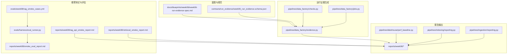
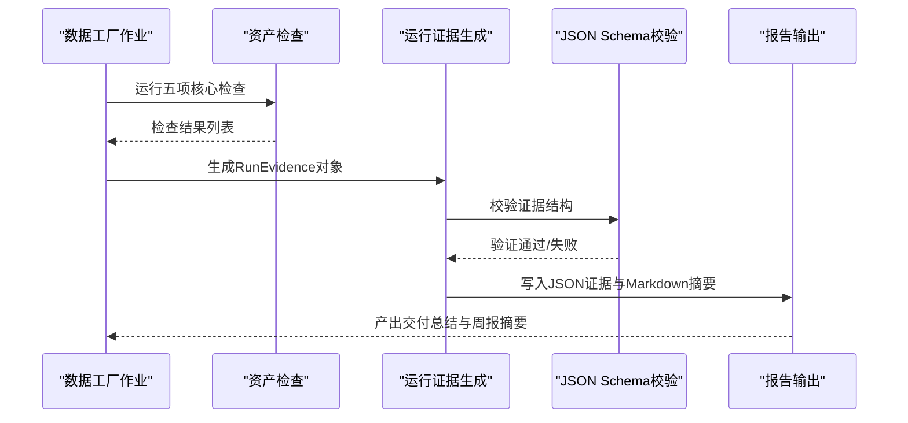
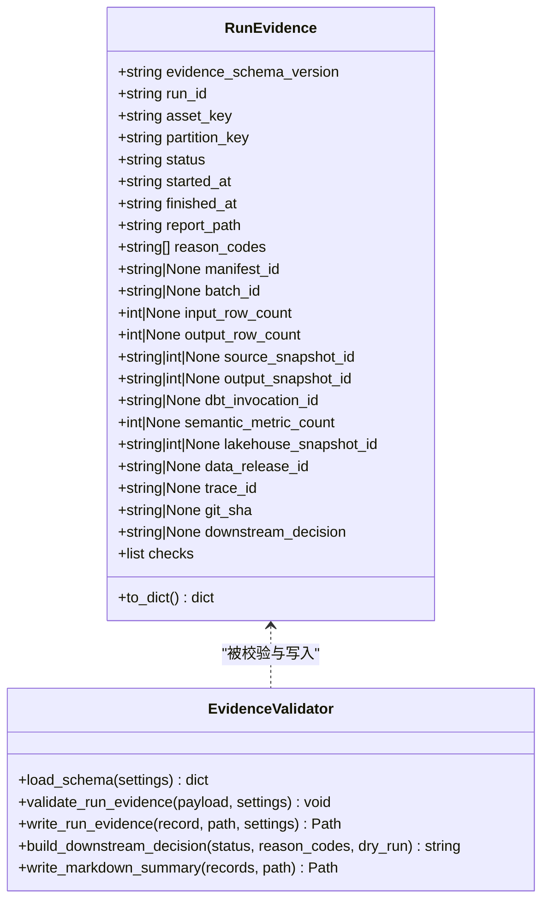
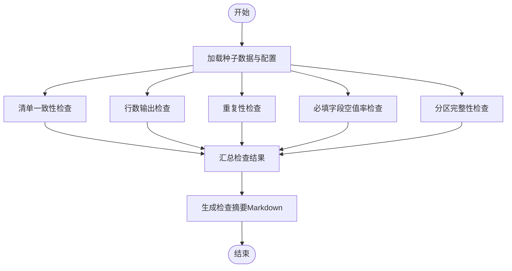
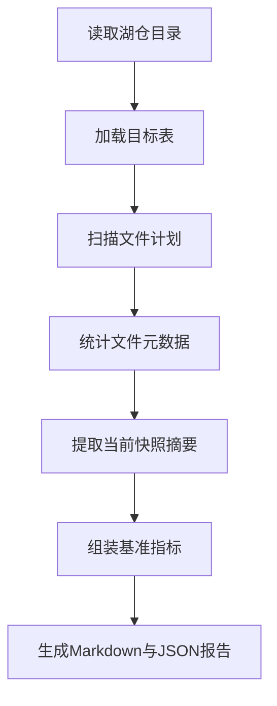
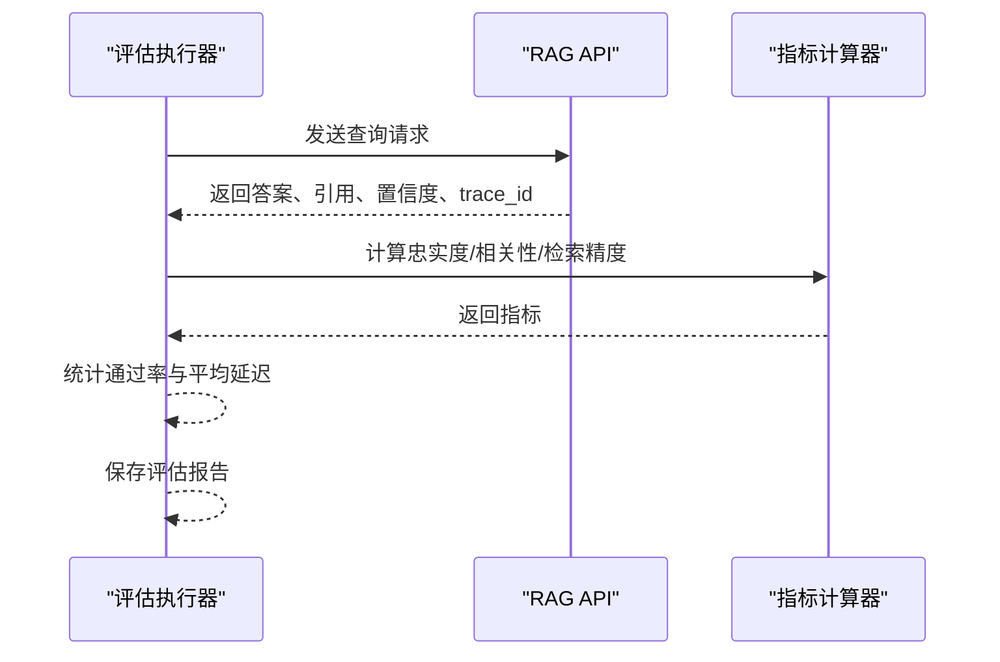
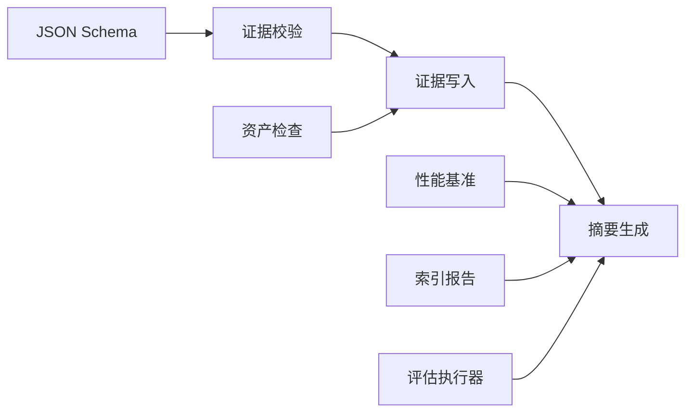

# 项目报告与证据管理

<cite>
**本文档引用的文件**
- [week06-run-evidence-spec.md](file://docs/blueprints/week06/week06-run-evidence-spec.md)
- [week06_run_evidence.schema.json](file://contracts/run_evidence/week06_run_evidence.schema.json)
- [evidence.py](file://pipelines/data_factory/evidence.py)
- [checks.py](file://pipelines/data_factory/checks.py)
- [jobs.py](file://pipelines/data_factory/jobs.py)
- [week06-data-factory.md](file://runbooks/week06-data-factory.md)
- [week06_delivery_summary.md](file://reports/week06/week06_delivery_summary.md)
- [test_week06_run_evidence_schema.py](file://tests/contract/test_week06_run_evidence_schema.py)
- [perf_baseline.py](file://pipelines/lakehouse/perf_baseline.py)
- [reporting.py](file://pipelines/indexing/reporting.py)
- [ingestion_reporting.py](file://pipelines/ingestion/reporting.py)
- [eval_runner.py](file://evals/harness/eval_runner.py)
- [rag_smoke_cases.yml](file://evals/week08/rag_smoke_cases.yml)
- [smoke_eval_report.md](file://reports/week08/smoke_eval_report.md)
- [rag_api_smoke_report.md](file://reports/week08/rag_api_smoke_report.md)
- [retrieval_smoke_report.md](file://reports/week08/retrieval_smoke_report.md)
</cite>

## 目录
1. [引言](#引言)
2. [项目结构](#项目结构)
3. [核心组件](#核心组件)
4. [架构总览](#架构总览)
5. [详细组件分析](#详细组件分析)
6. [依赖关系分析](#依赖关系分析)
7. [性能考虑](#性能考虑)
8. [故障排除指南](#故障排除指南)
9. [结论](#结论)
10. [附录](#附录)

## 引言
本文件系统化梳理项目在报告与证据管理方面的规范与实践，覆盖阶段性成果报告（如周报摘要）、里程碑达成证明、质量评估报告的格式与内容要求；运行证据的收集标准、验证流程与归档管理；性能基准报告的生成方法（测试用例设计、指标定义与结果分析）；烟雾测试报告的解读与应用（API测试、功能验证、性能监控）；合规审计报告的准备与提交流程以及数据治理证据的整理与展示方法；最后阐述证据链管理、版本控制与追溯机制的实施要点。

## 项目结构
项目围绕多周交付蓝图组织，报告与证据主要分布在以下路径：
- 蓝图与规范：docs/blueprints/week*/ 与 contracts/run_evidence/
- 运行证据生成：pipelines/data_factory/evidence.py、pipelines/data_factory/checks.py
- 报告输出：reports/week*/ 与各子模块的 reporting.py
- 合规与契约：contracts/ 下的各类 schema 与 runbooks/week06-data-factory.md
- 性能基准：pipelines/lakehouse/perf_baseline.py
- 烟雾测试与评估：evals/week08/* 与 evals/harness/eval_runner.py

图表来源
- [week06-run-evidence-spec.md:1-62](file://docs/blueprints/week06/week06-run-evidence-spec.md#L1-L62)
- [week06_run_evidence.schema.json:1-137](file://contracts/run_evidence/week06_run_evidence.schema.json#L1-L137)
- [evidence.py:1-107](file://pipelines/data_factory/evidence.py#L1-L107)
- [checks.py:1-186](file://pipelines/data_factory/checks.py#L1-L186)
- [jobs.py:1-12](file://pipelines/data_factory/jobs.py#L1-L12)
- [perf_baseline.py:1-126](file://pipelines/lakehouse/perf_baseline.py#L1-L126)
- [reporting.py:1-53](file://pipelines/indexing/reporting.py#L1-L53)
- [ingestion_reporting.py:1-63](file://pipelines/ingestion/reporting.py#L1-L63)
- [eval_runner.py:1-338](file://evals/harness/eval_runner.py#L1-L338)
- [rag_smoke_cases.yml:1-36](file://evals/week08/rag_smoke_cases.yml#L1-L36)
- [smoke_eval_report.md:1-23](file://reports/week08/smoke_eval_report.md#L1-L23)
- [rag_api_smoke_report.md:1-25](file://reports/week08/rag_api_smoke_report.md#L1-L25)
- [retrieval_smoke_report.md:1-22](file://reports/week08/retrieval_smoke_report.md#L1-L22)

章节来源
- [week06-run-evidence-spec.md:1-62](file://docs/blueprints/week06/week06-run-evidence-spec.md#L1-L62)
- [week06-data-factory.md:1-190](file://runbooks/week06-data-factory.md#L1-L190)

## 核心组件
- 运行证据模型与验证：定义 RunEvidence 数据结构、JSON Schema 校验、证据写入与下游决策推导逻辑。
- 资产检查集：提供五项核心检查（清单一致性、行数、重复性、必填字段空值率、分区完整性），并生成检查摘要。
- 周报与交付总结：以 Markdown 形式输出周报摘要与交付总结，记录承诺产物与运行证据生成策略。
- 性能基准报告：统计表级快照、文件数量与大小等指标，形成可比对的基准报告。
- 索引构建报告：输出索引构建过程的关键指标与警告信息。
- 烟雾测试与回归评估：提供简化指标（忠实度、相关性、检索精度@K）与回归通过率，支持并发执行与报告落盘。

章节来源
- [evidence.py:1-107](file://pipelines/data_factory/evidence.py#L1-L107)
- [checks.py:1-186](file://pipelines/data_factory/checks.py#L1-L186)
- [week06_delivery_summary.md:1-14](file://reports/week06/week06_delivery_summary.md#L1-L14)
- [perf_baseline.py:1-126](file://pipelines/lakehouse/perf_baseline.py#L1-L126)
- [reporting.py:1-53](file://pipelines/indexing/reporting.py#L1-L53)
- [ingestion_reporting.py:1-63](file://pipelines/ingestion/reporting.py#L1-L63)
- [eval_runner.py:1-338](file://evals/harness/eval_runner.py#L1-L338)

## 架构总览
下图展示了从数据工厂资产到运行证据、再到报告输出的整体流程，以及与性能基准、索引构建、烟雾测试的衔接。

图表来源
- [checks.py:119-132](file://pipelines/data_factory/checks.py#L119-L132)
- [evidence.py:58-75](file://pipelines/data_factory/evidence.py#L58-L75)
- [week06_run_evidence.schema.json:1-137](file://contracts/run_evidence/week06_run_evidence.schema.json#L1-L137)
- [week06_delivery_summary.md:1-14](file://reports/week06/week06_delivery_summary.md#L1-L14)

## 详细组件分析

### 运行证据规范与生成
- 规范定义：运行证据是连接 Dagster 资产、分区、检查、下游状态与决策的审计工件。规范由 JSON Schema 定义，包含必需字段与可选字段，并给出状态语义与下游决策含义。
- 证据模型：RunEvidence 数据类包含证据版本、运行ID、资产键、分区键、状态、起止时间、报告路径、原因码等；支持选择性字段与检查数组。
- 校验与落盘：加载 Schema 并进行结构校验，通过后写入 JSON 文件；同时生成 Markdown 摘要表格，便于快速审阅。
- 下游决策：根据状态与原因码推导下游决策，Dry-run 默认为“仅干跑”，警告需人工复核，失败则阻断。

图表来源
- [evidence.py:18-46](file://pipelines/data_factory/evidence.py#L18-L46)
- [evidence.py:53-75](file://pipelines/data_factory/evidence.py#L53-L75)
- [week06_run_evidence.schema.json:18-134](file://contracts/run_evidence/week06_run_evidence.schema.json#L18-L134)

章节来源
- [week06-run-evidence-spec.md:1-62](file://docs/blueprints/week06/week06-run-evidence-spec.md#L1-L62)
- [week06_run_evidence.schema.json:1-137](file://contracts/run_evidence/week06_run_evidence.schema.json#L1-L137)
- [evidence.py:1-107](file://pipelines/data_factory/evidence.py#L1-L107)
- [test_week06_run_evidence_schema.py:1-75](file://tests/contract/test_week06_run_evidence_schema.py#L1-L75)

### 资产检查与质量评估
- 检查清单：清单一致性、行数输出、重复性（幂等）、必填字段空值率、分区完整性。
- 输出形式：每项检查返回状态与原因码，并汇总为 Markdown 表格，便于快速定位问题。
- 与证据联动：检查结果作为 RunEvidence 的 checks 字段，支撑下游决策。

图表来源
- [checks.py:34-132](file://pipelines/data_factory/checks.py#L34-L132)
- [checks.py:135-149](file://pipelines/data_factory/checks.py#L135-L149)

章节来源
- [checks.py:1-186](file://pipelines/data_factory/checks.py#L1-L186)
- [week06-data-factory.md:128-141](file://runbooks/week06-data-factory.md#L128-L141)

### 周报摘要与里程碑证明
- 周报摘要：以 Markdown 记录当周承诺产物与运行证据生成策略，强调本地生成且被 Git 忽略。
- 里程碑证明：交付总结列出已承诺的蓝图、契约、模块与测试，作为里程碑验收依据。

章节来源
- [week06_delivery_summary.md:1-14](file://reports/week06/week06_delivery_summary.md#L1-L14)
- [week06-data-factory.md:142-155](file://runbooks/week06-data-factory.md#L142-L155)

### 性能基准报告
- 生成方法：遍历核心表，统计行数、快照数、文件数、平均/最小/最大文件大小，提取最新快照操作类型。
- 报告格式：输出 Markdown 与 JSON，包含“已知限制”与“下一步建议”，用于前后对比与容量规划。

图表来源
- [perf_baseline.py:13-73](file://pipelines/lakehouse/perf_baseline.py#L13-L73)
- [perf_baseline.py:76-105](file://pipelines/lakehouse/perf_baseline.py#L76-L105)

章节来源
- [perf_baseline.py:1-126](file://pipelines/lakehouse/perf_baseline.py#L1-L126)

### 索引构建报告
- 输出内容：索引发布ID、数据发布ID、分块策略版本、提供商、嵌入模型与维度、源表、总块数、嵌入块数、跳过块数、错误计数、质量门禁、耗时等。
- 警告与备注：输出警告清单与注意事项，便于复盘与优化。

章节来源
- [reporting.py:1-53](file://pipelines/indexing/reporting.py#L1-L53)

### 烟雾测试报告与解读
- 简化评估：基于检索精度@K、答案忠实度、答案相关性与回归通过率，支持并发执行。
- 报告格式：包含运行ID、释放ID、用例集、总数、通过/失败/错误数、各项指标均值、平均延迟等。
- API烟雾：RAG API 端点与契约字段、本地烟雾行为（无DB时结构化拒答、引用来自检索元数据）。
- 检索烟雾：面向混合检索的预期行为（向量/FTS/RRF融合、回退标记、产品线过滤、索引发布ID过滤）。

图表来源
- [eval_runner.py:137-237](file://evals/harness/eval_runner.py#L137-L237)
- [eval_runner.py:239-284](file://evals/harness/eval_runner.py#L239-L284)
- [rag_smoke_cases.yml:1-36](file://evals/week08/rag_smoke_cases.yml#L1-L36)
- [smoke_eval_report.md:1-23](file://reports/week08/smoke_eval_report.md#L1-L23)
- [rag_api_smoke_report.md:1-25](file://reports/week08/rag_api_smoke_report.md#L1-L25)
- [retrieval_smoke_report.md:1-22](file://reports/week08/retrieval_smoke_report.md#L1-L22)

章节来源
- [eval_runner.py:1-338](file://evals/harness/eval_runner.py#L1-L338)
- [rag_smoke_cases.yml:1-36](file://evals/week08/rag_smoke_cases.yml#L1-L36)
- [smoke_eval_report.md:1-23](file://reports/week08/smoke_eval_report.md#L1-L23)
- [rag_api_smoke_report.md:1-25](file://reports/week08/rag_api_smoke_report.md#L1-L25)
- [retrieval_smoke_report.md:1-22](file://reports/week08/retrieval_smoke_report.md#L1-L22)

### 合规审计与数据治理证据
- 合规入口：运行证据 JSON Schema 与契约文件构成合规审计的基础证据链。
- 数据治理：索引构建报告中的“警告”与“注意事项”体现数据质量与治理实践；性能基准报告提供表健康度与维护建议。
- 证据链管理：通过 trace_id、release_id、data_release_id、index_release_id 等标识符串联调用链与发布版本。

章节来源
- [week06_run_evidence.schema.json:88-96](file://contracts/run_evidence/week06_run_evidence.schema.json#L88-L96)
- [reporting.py:25-36](file://pipelines/indexing/reporting.py#L25-L36)
- [perf_baseline.py:65-73](file://pipelines/lakehouse/perf_baseline.py#L65-L73)

## 依赖关系分析
- 组件耦合：证据生成依赖 JSON Schema 校验；资产检查结果注入 RunEvidence；报告输出依赖各子模块的指标与清单。
- 外部依赖：Dagster 资产图、PostgreSQL/pgvector（用于完整烟雾测试）、MinIO 对象存储（索引构建与数据装载）。
- 循环依赖：未发现直接循环；报告模块之间通过数据传递解耦。

图表来源
- [week06_run_evidence.schema.json:1-137](file://contracts/run_evidence/week06_run_evidence.schema.json#L1-L137)
- [evidence.py:58-75](file://pipelines/data_factory/evidence.py#L58-L75)
- [checks.py:119-132](file://pipelines/data_factory/checks.py#L119-L132)
- [perf_baseline.py:60-73](file://pipelines/lakehouse/perf_baseline.py#L60-L73)
- [reporting.py:11-52](file://pipelines/indexing/reporting.py#L11-L52)
- [eval_runner.py:239-284](file://evals/harness/eval_runner.py#L239-L284)

章节来源
- [jobs.py:1-12](file://pipelines/data_factory/jobs.py#L1-L12)
- [week06-data-factory.md:1-190](file://runbooks/week06-data-factory.md#L1-L190)

## 性能考虑
- 并发与吞吐：评估执行器支持并发，合理设置并发度以平衡吞吐与资源占用。
- 指标稳定性：基准报告应固定表集与环境，避免外部波动影响对比。
- 存储与I/O：索引构建与检索性能受嵌入维度、分块策略与索引规模影响，需结合基准报告制定扩容策略。
- 日志与追踪：trace_id 与 release_id 有助于跨服务定位性能瓶颈。

## 故障排除指南
- 合约校验失败：检查生成的证据 JSON 是否符合 Week06 Schema；修正字段或生成逻辑。
- 定义加载失败：确认开发盒安装与导入路径正确。
- DAG 工作流不可见：检查容器挂载路径映射至 /workspace。
- 回填计划输入为零：使用种子数据中存在的分区键。
- 证据显示“仅干跑”：默认安全模式；如需真实写库，按说明调整参数。
- Week04/Week05 状态缺失：按需先运行对应阶段或标记为 not_available。

章节来源
- [week06-data-factory.md:157-182](file://runbooks/week06-data-factory.md#L157-L182)
- [test_week06_run_evidence_schema.py:66-74](file://tests/contract/test_week06_run_evidence_schema.py#L66-L74)

## 结论
本项目通过契约驱动的运行证据、标准化的资产检查、可复现的性能基准与烟雾测试，形成了完整的报告与证据管理体系。建议持续完善证据链标识、版本控制与追溯机制，确保合规审计与里程碑验收有据可依。

## 附录
- 证据收集标准：遵循 Week06 Run Evidence 规范，确保必需字段齐全、状态语义准确、原因码描述清晰。
- 验证流程：先通过 Schema 校验，再生成 Markdown 摘要；检查结果纳入 RunEvidence 的 checks 数组。
- 存档管理：运行时证据忽略 Git，仅保留模板与承诺产物；交付总结与周报摘要纳入版本控制。
- 测试用例设计：烟雾测试覆盖检索与生成关键路径，回归评估以通过率与关键指标衡量稳定性。
- 指标定义：忠实度、相关性、检索精度@K、回归通过率、平均延迟；性能基准包含行数、快照数、文件数与大小统计。
- 结果分析：以 Markdown 表格与 JSON 报告呈现，结合“已知限制”与“下一步建议”指导后续迭代。