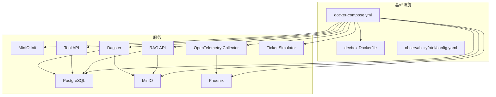
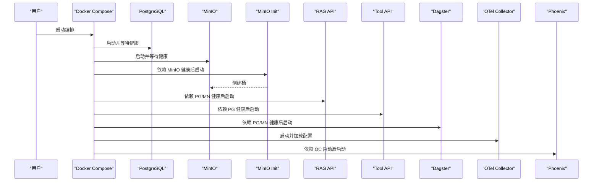
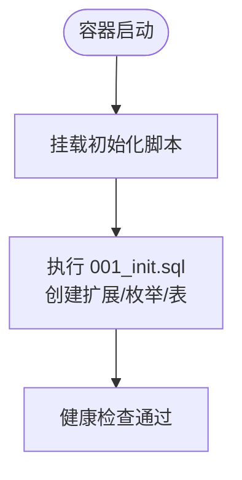

# 基础设施配置

<cite>
**本文引用的文件**
- [docker-compose.yml](file://infra/docker-compose.yml)
- [devbox.Dockerfile](file://infra/devbox.Dockerfile)
- [config.yaml](file://observability/otel/config.yaml)
- [Dockerfile（RAG API）](file://services/rag_api/Dockerfile)
- [Dockerfile（Tool API）](file://services/tool_api/Dockerfile)
- [requirements.txt（RAG API）](file://services/rag_api/requirements.txt)
- [requirements.txt（Tool API）](file://services/tool_api/requirements.txt)
- [Dockerfile（合成生成器）](file://data/synthetic_generators/Dockerfile)
- [config.py（数据工厂设置）](file://pipelines/resources/config.py)
- [db.py（数据库连接池）](file://pipelines/ingestion/db.py)
- [001_init.sql](file://infra/migrations/001_init.sql)
- [week01-startup.md](file://runbooks/week01-startup.md)
- [podman-local.md](file://runbooks/podman-local.md)
- [pyproject.toml](file://pyproject.toml)
</cite>

## 目录
1. [简介](#简介)
2. [项目结构](#项目结构)
3. [核心组件](#核心组件)
4. [架构总览](#架构总览)
5. [详细组件分析](#详细组件分析)
6. [依赖分析](#依赖分析)
7. [性能考虑](#性能考虑)
8. [故障排查指南](#故障排查指南)
9. [结论](#结论)
10. [附录](#附录)

## 简介
本文件系统性梳理基于 Docker Compose 的基础设施配置，覆盖 PostgreSQL、MinIO、RAG API、Tool API、Dagster、OpenTelemetry Collector、Phoenix 以及开发容器（devbox）的完整编排。内容包括服务间依赖与启动顺序、健康检查、网络与卷挂载、环境变量管理、端口映射、配置文件路径，以及开发/测试/生产环境的差异与最佳实践。

## 项目结构
- 基础设施编排与开发容器镜像位于 infra 目录
- 观测性配置位于 observability/otel
- 业务服务位于 services（RAG API、Tool API）
- 数据管道与资源配置位于 pipelines
- 数据库初始化脚本位于 infra/migrations
- 启动与兼容性说明位于 runbooks



图表来源
- [docker-compose.yml:1-340](file://infra/docker-compose.yml#L1-L340)
- [config.yaml:1-66](file://observability/otel/config.yaml#L1-L66)
- [devbox.Dockerfile:1-25](file://infra/devbox.Dockerfile#L1-L25)

章节来源
- [docker-compose.yml:1-340](file://infra/docker-compose.yml#L1-L340)

## 核心组件
- 网络与卷
  - 网络：omni_net（bridge）
  - 卷：postgres_data、minio_data、dagster_data、phoenix_data
- 服务与职责
  - PostgreSQL：结构化数据与向量扩展
  - MinIO：对象存储（S3 兼容），提供多个业务桶
  - MinIO Init：初始化 MinIO 桶
  - RAG API：检索增强生成服务，提供查询与管理接口
  - Tool API：工单工具与审计日志服务
  - Dagster：数据资产化编排与流水线
  - OpenTelemetry Collector：统一采集 traces/metrics/logs 并转发至 Phoenix
  - Phoenix：AI 请求可观测性平台
  - Ticket Simulator：工单种子数据生成器
  - Devbox：开发验证容器，免本地 Python 依赖

章节来源
- [docker-compose.yml:5-340](file://infra/docker-compose.yml#L5-L340)

## 架构总览
服务启动顺序严格遵循：postgres → minio → minio_init → rag_api/tool_api → dagster → otel_collector → phoenix。健康检查确保前置服务就绪后再启动依赖方；网络采用同一 bridge 网络实现服务间 DNS 解析；卷持久化关键数据。



图表来源
- [docker-compose.yml:19-340](file://infra/docker-compose.yml#L19-L340)
- [config.yaml:1-66](file://observability/otel/config.yaml#L1-L66)

## 详细组件分析

### PostgreSQL（结构化存储 + 向量检索）
- 镜像与容器名：pgvector/pgvector:pg16，omni_postgres
- 环境变量：POSTGRES_USER、POSTGRES_PASSWORD、POSTGRES_DB
- 卷：postgres_data，初始化脚本挂载至 /docker-entrypoint-initdb.d
- 健康检查：使用 pg_isready，间隔与重试次数已配置
- 初始化脚本：创建扩展（uuid-ossp、vector、pg_trgm）、枚举类型与多张核心表（含向量列）



图表来源
- [docker-compose.yml:19-37](file://infra/docker-compose.yml#L19-L37)
- [001_init.sql:1-288](file://infra/migrations/001_init.sql#L1-L288)

章节来源
- [docker-compose.yml:19-37](file://infra/docker-compose.yml#L19-L37)
- [001_init.sql:1-288](file://infra/migrations/001_init.sql#L1-L288)

### MinIO（对象存储）
- 镜像与命令：minio/minio:latest，启动控制台端口 9001
- 环境变量：MINIO_ROOT_USER、MINIO_ROOT_PASSWORD
- 端口映射：9000（S3 API）、9001（Web 控制台）
- 健康检查：使用 mc ready local
- MinIO Init：在 MinIO 健康后创建业务桶（raw-documents、raw-audio、raw-video、raw-tickets、parsed、indexes、evals、releases、lakehouse）

章节来源
- [docker-compose.yml:41-86](file://infra/docker-compose.yml#L41-L86)

### MinIO Init（桶初始化）
- 依赖：minio（健康条件）
- 作用：通过 mc 命令创建多个业务桶，保证后续服务可用

章节来源
- [docker-compose.yml:65-86](file://infra/docker-compose.yml#L65-L86)

### RAG API（检索增强生成服务）
- 构建上下文：../services/rag_api，Dockerfile
- 环境变量：DATABASE_URL、MINIO_ENDPOINT、MINIO_ACCESS_KEY、MINIO_SECRET_KEY、ANTHROPIC_API_KEY、OTEL_EXPORTER_OTLP_ENDPOINT、OTEL_SERVICE_NAME、RELEASE_ID
- 端口映射：8000
- 依赖：postgres、minio（健康条件）
- 健康检查：curl 访问 /health
- 开发挂载：/app 映射为源码目录，便于热更新

章节来源
- [docker-compose.yml:91-122](file://infra/docker-compose.yml#L91-L122)
- [Dockerfile（RAG API）:1-20](file://services/rag_api/Dockerfile#L1-L20)
- [requirements.txt（RAG API）:1-29](file://services/rag_api/requirements.txt#L1-L29)

### Tool API（工单工具 + 审计日志）
- 构建上下文：../services/tool_api，Dockerfile
- 环境变量：DATABASE_URL、OTEL_EXPORTER_OTLP_ENDPOINT、OTEL_SERVICE_NAME、RELEASE_ID、METRIC_REGISTRY_PATH
- 端口映射：8001
- 依赖：postgres（健康条件）
- 健康检查：curl 访问 /health
- 卷挂载：服务源码、analytics、contracts 只读挂载

章节来源
- [docker-compose.yml:126-154](file://infra/docker-compose.yml#L126-L154)
- [Dockerfile（Tool API）:1-16](file://services/tool_api/Dockerfile#L1-L16)
- [requirements.txt（Tool API）:1-14](file://services/tool_api/requirements.txt#L1-L14)

### Dagster（数据资产化编排）
- 镜像：dagster/dagster-k8s:latest，开发模式启动
- 环境变量：DATABASE_URL、MINIO_ENDPOINT、MINIO_ACCESS_KEY、MINIO_SECRET_KEY、DAGSTER_HOME、SEED_MANIFEST_PATH、Iceberg 相关、Week04/Week05/Week06 相关路径与标识、DBT 相关等
- 端口映射：3000
- 依赖：postgres、minio（健康条件）
- 卷挂载：pipelines 源码、多种只读数据与报告目录、DAG 工作目录持久化

章节来源
- [docker-compose.yml:158-226](file://infra/docker-compose.yml#L158-L226)

### OpenTelemetry Collector（统一采集）
- 镜像：otel/opentelemetry-collector-contrib:latest
- 配置：/etc/otel/config.yaml，接收 gRPC/HTTP OTLP，批量处理、内存限制、资源属性注入
- 端口映射：4317（gRPC OTLP）、4318（HTTP OTLP）、8889（Prometheus）
- 依赖：无（独立服务）

章节来源
- [docker-compose.yml:230-243](file://infra/docker-compose.yml#L230-L243)
- [config.yaml:1-66](file://observability/otel/config.yaml#L1-L66)

### Phoenix（AI 请求可观测）
- 镜像：arizephoenix/phoenix:latest
- 环境变量：PHOENIX_PORT、PHOENIX_GRPC_PORT
- 端口映射：6006
- 依赖：otel_collector（健康条件）

章节来源
- [docker-compose.yml:247-260](file://infra/docker-compose.yml#L247-L260)

### Ticket Simulator（工单种子数据生成器）
- 构建上下文：../data/synthetic_generators，Dockerfile
- 环境变量：DATABASE_URL、SEED_MANIFEST_PATH、TICKET_COUNT
- 依赖：postgres（健康条件）
- 卷挂载：种子清单与规范化数据只读挂载

章节来源
- [docker-compose.yml:266-284](file://infra/docker-compose.yml#L266-L284)
- [Dockerfile（合成生成器）:1-11](file://data/synthetic_generators/Dockerfile#L1-L11)

### Devbox（开发验证容器）
- 构建上下文：根目录，devbox.Dockerfile
- 工作目录：/workspace
- 环境变量：PYTHONPATH、DATABASE_URL、MINIO_*、Iceberg 相关、Week04/Week05/Week06 相关、DBT 相关、METRIC_REGISTRY_PATH
- 卷挂载：/workspace 挂载为源码根目录
- 启动方式：通过 profiles: ["tools"] 与 compose run 使用

章节来源
- [docker-compose.yml:288-340](file://infra/docker-compose.yml#L288-L340)
- [devbox.Dockerfile:1-25](file://infra/devbox.Dockerfile#L1-L25)

## 依赖分析
- 服务内聚与耦合
  - RAG API/Tool API 与 PostgreSQL 强耦合（数据库连接）
  - RAG API/Tool API 与 MinIO 强耦合（对象存储访问）
  - Dagster 与 PostgreSQL、MinIO 强耦合（数据湖与元数据）
  - Phoenix 依赖 OpenTelemetry Collector（OTLP gRPC）
- 直接与间接依赖
  - MinIO Init 间接依赖 MinIO
  - Ticket Simulator 间接依赖 PostgreSQL
- 循环依赖：无
- 外部依赖与集成点
  - OpenTelemetry Collector 作为统一出口，对接 Phoenix
  - Anthropic API（可选）由 RAG API 使用

```mermaid
graph LR
PG["PostgreSQL"] <- --> RAG["RAG API"]
PG <- --> TOOL["Tool API"]
PG <- --> DAG["Dagster"]
MIN["MinIO"] <- --> RAG
MIN <- --> DAG
OTEL["OTel Collector"] --> PHX["Phoenix"]
RAG -.-> OTEL
TOOL -.-> OTEL
```

图表来源
- [docker-compose.yml:19-340](file://infra/docker-compose.yml#L19-L340)
- [config.yaml:1-66](file://observability/otel/config.yaml#L1-L66)

章节来源
- [docker-compose.yml:19-340](file://infra/docker-compose.yml#L19-L340)

## 性能考虑
- 连接池与并发
  - 数据库连接池：Dagster 管道使用 asyncpg 连接池，最小/最大连接数可按负载调整
- 观测性与资源限制
  - OpenTelemetry Collector 配置了内存限制与批处理策略，降低资源占用
- 存储与 I/O
  - MinIO 使用对象存储，建议根据数据规模与访问模式调整桶命名与生命周期策略
- 端口与网络
  - 仅暴露必要端口，避免不必要的外部暴露

章节来源
- [db.py（数据库连接池）:21-30](file://pipelines/ingestion/db.py#L21-L30)
- [config.yaml:25-29](file://observability/otel/config.yaml#L25-L29)

## 故障排查指南
- 常见问题与处理
  - MinIO Init 退出非 0：MinIO 尚未就绪，等待后重试
  - RAG API 健康检查返回数据库不可用：等待初始化脚本执行完成
  - devbox 首次运行失败：先构建 devbox 镜像
  - 契约测试失败：检查 contracts 目录结构是否完整
- 健康检查失败定位
  - PostgreSQL：确认初始化脚本执行与扩展创建
  - MinIO：确认控制台端口与凭据
  - API 服务：确认依赖服务健康与环境变量正确
- 清理与重启
  - 停止但保留数据卷：compose down
  - 完全清理：compose down -v

章节来源
- [week01-startup.md:128-148](file://runbooks/week01-startup.md#L128-L148)

## 结论
该基础设施以 Docker Compose 实现端到端服务编排，明确的服务依赖与健康检查保障了启动顺序与稳定性；通过统一的 OpenTelemetry 配置与 Phoenix 可观测性，实现了对 AI 服务的全链路观测；Devbox 提供了免本地依赖的开发验证路径。建议在生产环境中进一步完善密钥管理、网络隔离与资源配额，并结合实际负载调整连接池与 Collector 批处理参数。

## 附录

### 环境变量管理
- 数据库连接
  - DATABASE_URL：由 compose 注入，指向 postgres 服务
- 存储配置
  - MINIO_ENDPOINT、MINIO_ACCESS_KEY、MINIO_SECRET_KEY：由 compose 注入，指向 minio 服务
  - Iceberg 相关：catalog 名称、类型、URI、仓库、命名空间、S3 端点与凭证、区域、路径风格访问等
- API 密钥
  - ANTHROPIC_API_KEY：可选，用于 LLM 调用
- 可观测性配置
  - OTEL_EXPORTER_OTLP_ENDPOINT：指向 otel_collector
  - OTEL_SERVICE_NAME：区分服务
  - PHOENIX_PORT、PHOENIX_GRPC_PORT：Phoenix 端口
- 其他
  - RELEASE_ID、METRIC_REGISTRY_PATH、DBT_*、WEEK04/05/06 相关路径与标识

章节来源
- [docker-compose.yml:97-105](file://infra/docker-compose.yml#L97-L105)
- [docker-compose.yml:132-137](file://infra/docker-compose.yml#L132-L137)
- [docker-compose.yml:164-204](file://infra/docker-compose.yml#L164-L204)
- [docker-compose.yml:251-253](file://infra/docker-compose.yml#L251-L253)
- [config.py（数据工厂设置）:67-113](file://pipelines/resources/config.py#L67-L113)

### 端口映射与卷挂载
- 端口映射
  - PostgreSQL：未映射至宿主（通过网络内部访问）
  - MinIO：9000（S3 API）、9001（Web 控制台）
  - RAG API：8000
  - Tool API：8001
  - Dagster：3000
  - OpenTelemetry Collector：4317、4318、8889
  - Phoenix：6006
- 卷挂载
  - 数据持久化：postgres_data、minio_data、dagster_data、phoenix_data
  - 源码挂载：RAG/Tool API 的 /app 目录
  - 只读挂载：Dagster 的 pipelines、data、analytics、contracts、docs、runbooks、reports
  - Devbox：/workspace 源码根目录

章节来源
- [docker-compose.yml:49-51](file://infra/docker-compose.yml#L49-L51)
- [docker-compose.yml:106-107](file://infra/docker-compose.yml#L106-L107)
- [docker-compose.yml:138-139](file://infra/docker-compose.yml#L138-L139)
- [docker-compose.yml:207-208](file://infra/docker-compose.yml#L207-L208)
- [docker-compose.yml:235-238](file://infra/docker-compose.yml#L235-L238)
- [docker-compose.yml:254-255](file://infra/docker-compose.yml#L254-L255)
- [docker-compose.yml:115-116](file://infra/docker-compose.yml#L115-L116)
- [docker-compose.yml:146-148](file://infra/docker-compose.yml#L146-L148)
- [docker-compose.yml:216-225](file://infra/docker-compose.yml#L216-L225)
- [docker-compose.yml:336-337](file://infra/docker-compose.yml#L336-L337)

### 不同环境（开发/测试/生产）的配置差异与最佳实践
- 开发环境
  - 使用 compose 默认配置，服务间通过内部网络通信
  - 通过 devbox 进行本地无依赖验证
  - 可选启用 LLM 密钥以进行端到端验证
- 测试环境
  - 建议分离数据库与对象存储，使用独立卷与备份策略
  - 启用更严格的健康检查与超时设置
  - 限制 OpenTelemetry Collector 内存与批处理大小
- 生产环境
  - 秘钥与敏感配置通过安全渠道注入（如 secrets manager 或加密环境变量）
  - 网络隔离：仅暴露必要端口，内部服务通过专用网络访问
  - 资源配额：为数据库、Collector、API 设置 CPU/内存限制
  - 备份与恢复：定期备份 postgres_data、minio_data、dagster_data
  - 日志与告警：统一接入监控与日志平台，配置告警规则

章节来源
- [week01-startup.md:1-148](file://runbooks/week01-startup.md#L1-L148)
- [podman-local.md:1-296](file://runbooks/podman-local.md#L1-L296)