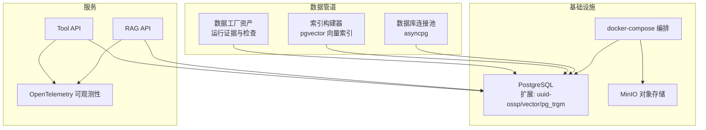
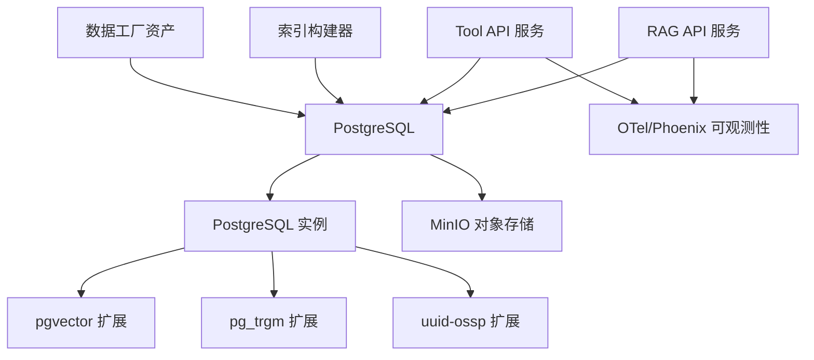
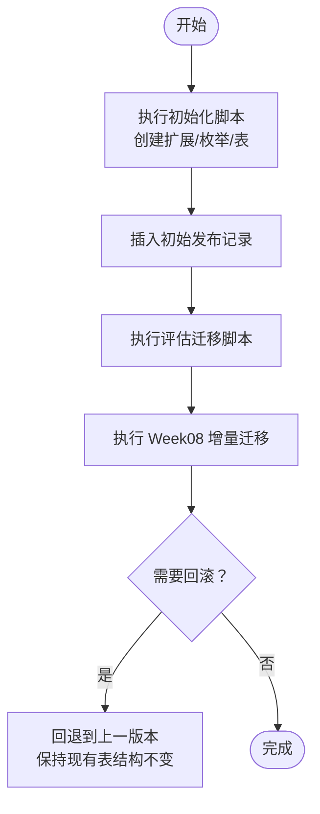
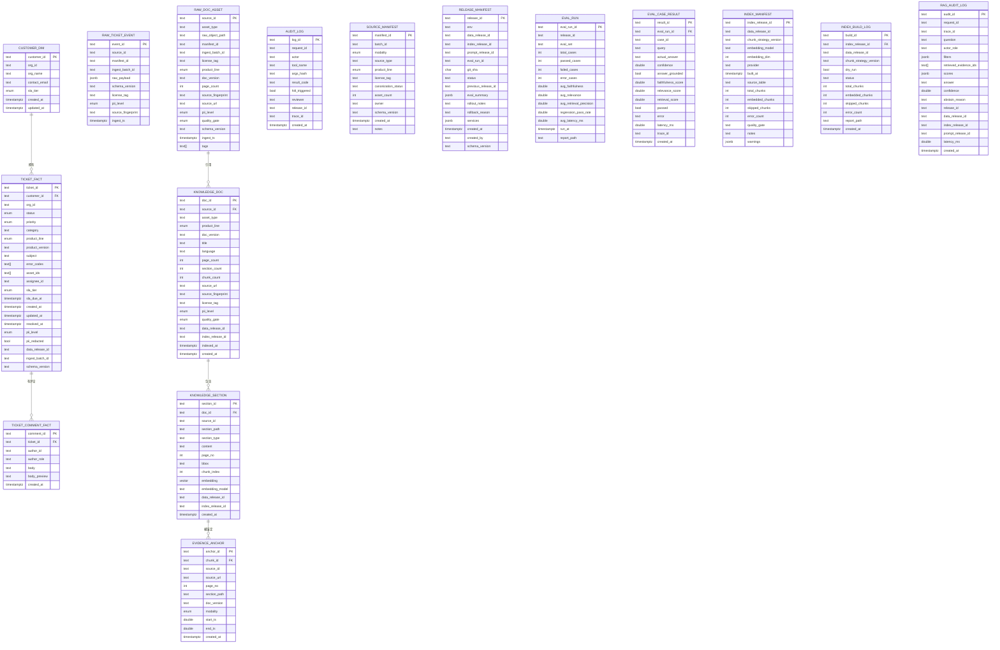
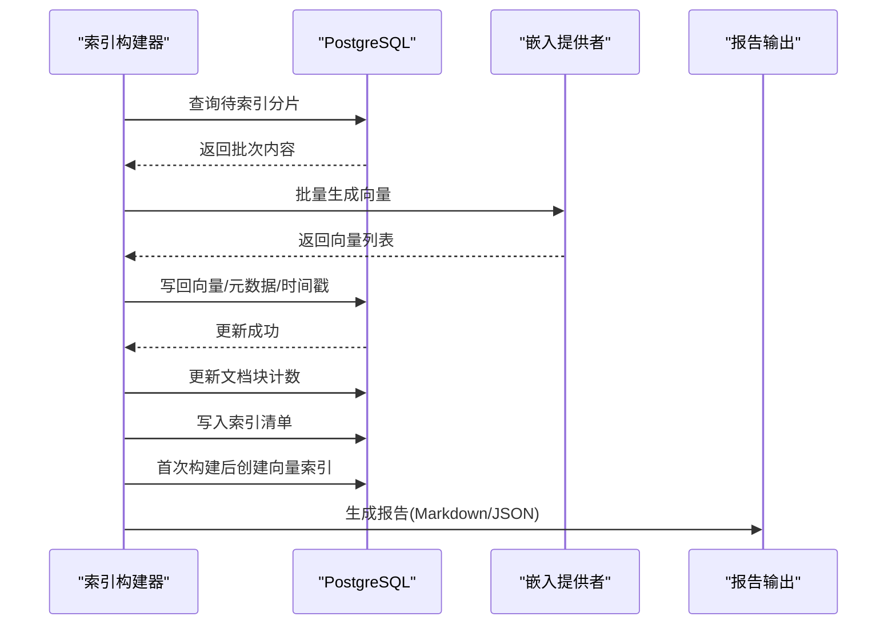
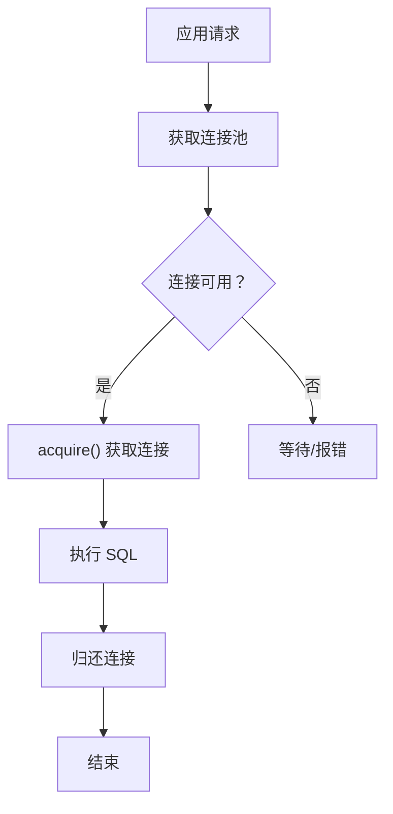
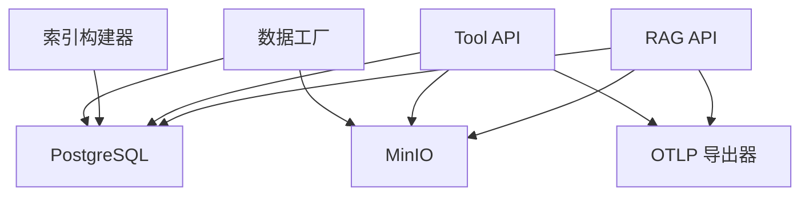

# 数据库管理

<cite>
**本文引用的文件**
- [001_init.sql](file://infra/migrations/001_init.sql)
- [002_eval_tables.sql](file://infra/migrations/002_eval_tables.sql)
- [003_week08_index_rag.sql](file://infra/migrations/003_week08_index_rag.sql)
- [docker-compose.yml](file://infra/docker-compose.yml)
- [db.py](file://pipelines/ingestion/db.py)
- [embedder.py](file://pipelines/indexing/embedder.py)
- [assets.py（索引）](file://pipelines/indexing/assets.py)
- [assets.py（数据工厂）](file://pipelines/data_factory/assets.py)
- [main.py（RAG API）](file://services/rag_api/app/main.py)
- [main.py（Tool API）](file://services/tool_api/app/main.py)
- [observability.py（RAG API）](file://services/rag_api/app/observability.py)
- [kpi_query.py](file://services/tool_api/app/kpi_query.py)
- [config.py（Tool API）](file://services/tool_api/app/config.py)
- [postgres.py](file://pipelines/resources/postgres.py)
- [reporting.py](file://pipelines/indexing/reporting.py)
</cite>

## 目录
1. [简介](#简介)
2. [项目结构](#项目结构)
3. [核心组件](#核心组件)
4. [架构总览](#架构总览)
5. [详细组件分析](#详细组件分析)
6. [依赖分析](#依赖分析)
7. [性能考虑](#性能考虑)
8. [故障排除指南](#故障排除指南)
9. [结论](#结论)
10. [附录](#附录)

## 简介
本文件面向数据库管理员与工程师，系统化梳理基于 PostgreSQL + pgvector 的数据库架构与运维实践。内容覆盖初始化脚本与迁移策略、模式与表结构、向量数据库配置与使用、索引与查询优化、备份与迁移最佳实践、以及监控与故障排除。文档以仓库中的实际实现为依据，结合架构图与流程图帮助读者快速理解并落地。

## 项目结构
数据库相关能力主要分布在以下位置：
- 初始化与迁移：infra/migrations 下的 SQL 脚本
- 数据访问层：pipelines/ingestion/db.py 提供 asyncpg 连接池
- 向量索引构建：pipelines/indexing/embedder.py 与 assets.py
- 服务侧集成：services/rag_api 与 services/tool_api 的路由与可观测性
- 编排与证据：pipelines/data_factory/assets.py 产出运行证据与检查结果
- 运行时编排：infra/docker-compose.yml 定义服务与依赖顺序

图表来源
- [docker-compose.yml:19-340](file://infra/docker-compose.yml#L19-L340)
- [db.py:21-45](file://pipelines/ingestion/db.py#L21-L45)
- [embedder.py:160-351](file://pipelines/indexing/embedder.py#L160-L351)
- [assets.py（数据工厂）:116-535](file://pipelines/data_factory/assets.py#L116-L535)
- [main.py（RAG API）:26-73](file://services/rag_api/app/main.py#L26-L73)
- [main.py（Tool API）:24-64](file://services/tool_api/app/main.py#L24-L64)

章节来源
- [docker-compose.yml:19-340](file://infra/docker-compose.yml#L19-L340)

## 核心组件
- 初始化与迁移
  - 初始化脚本创建扩展、枚举类型与核心表，并插入初始发布记录
  - 增量迁移脚本用于评估表与 Week08 的索引/审计日志表
- 数据访问层
  - asyncpg 连接池封装，统一数据库连接生命周期管理
- 向量索引构建
  - 从知识分片表读取未嵌入文本，批量生成向量并写回，随后更新文档统计与索引清单
- 服务集成
  - RAG API 与 Tool API 在启动时进行可观测性初始化，并通过中间件注入请求 ID
- 编排与证据
  - 数据工厂资产产出运行证据与检查结果，支撑交付总结与下游决策

章节来源
- [001_init.sql:1-288](file://infra/migrations/001_init.sql#L1-L288)
- [003_week08_index_rag.sql:1-78](file://infra/migrations/003_week08_index_rag.sql#L1-L78)
- [db.py:21-45](file://pipelines/ingestion/db.py#L21-L45)
- [embedder.py:160-351](file://pipelines/indexing/embedder.py#L160-L351)
- [assets.py（数据工厂）:116-535](file://pipelines/data_factory/assets.py#L116-L535)
- [main.py（RAG API）:19-73](file://services/rag_api/app/main.py#L19-L73)
- [main.py（Tool API）:19-64](file://services/tool_api/app/main.py#L19-L64)

## 架构总览
PostgreSQL 作为主存储，承载结构化数据与向量索引；pgvector 提供向量相似度检索；对象存储 MinIO 存放原始资产；服务通过 API 访问数据库并输出可观测信号；Dagster 负责数据工厂资产的编排与证据生成。

图表来源
- [docker-compose.yml:19-340](file://infra/docker-compose.yml#L19-L340)
- [embedder.py:374-396](file://pipelines/indexing/embedder.py#L374-L396)
- [main.py（RAG API）:26-73](file://services/rag_api/app/main.py#L26-L73)
- [main.py（Tool API）:24-64](file://services/tool_api/app/main.py#L24-L64)

## 详细组件分析

### 初始化与迁移策略
- 初始化脚本
  - 创建扩展：uuid-ossp、vector、pg_trgm
  - 定义枚举类型：工单状态、优先级、产品线、SLA 等
  - 建表：原始资产、原始工单事件、客户维度、工单事实、评论、知识文档、知识分片、证据锚点、审计日志、源清单、发布清单
  - 插入初始发布记录
- 增量迁移
  - 评估表：新增评估运行与案例结果表，便于回归与质量度量
  - Week08 增量：为知识文档与分片添加列，新增索引清单、索引构建日志与 RAG 审计日志表，并建立过滤与时间索引
- 回滚与版本控制
  - 当前脚本采用“安全增量”思路，不重命名既有表，便于回退到上一个版本
  - 发布清单记录环境、数据/索引/提示词版本与状态，支撑灰度与回滚

图表来源
- [001_init.sql:1-288](file://infra/migrations/001_init.sql#L1-L288)
- [002_eval_tables.sql:1-44](file://infra/migrations/002_eval_tables.sql#L1-L44)
- [003_week08_index_rag.sql:1-78](file://infra/migrations/003_week08_index_rag.sql#L1-L78)

章节来源
- [001_init.sql:1-288](file://infra/migrations/001_init.sql#L1-L288)
- [002_eval_tables.sql:1-44](file://infra/migrations/002_eval_tables.sql#L1-L44)
- [003_week08_index_rag.sql:1-78](file://infra/migrations/003_week08_index_rag.sql#L1-L78)

### 数据模式设计与表结构
- 枚举类型
  - 工单状态、优先级、产品线、SLA 等，统一约束业务语义
- 核心表
  - 原始资产表：记录源标识、产品线、版本、页数、指纹、标签等
  - 原始工单事件：保留原始负载与指纹，便于溯源
  - 客户维度：组织信息与 SLA 等级
  - 工单事实：状态、优先级、分类、版本、错误码、资产关联、SLA 截止时间、PII 等
  - 工单评论：作者角色、正文预览、时间戳
  - 知识文档：标题、语言、分段/块计数、索引版本、创建时间
  - 知识分片：内容、页面号、坐标、嵌入向量、模型/维度、索引版本、创建时间
  - 证据锚点：指向分片与媒体片段的时间区间
  - 审计日志：工具名、参数哈希、结果码、人工介入触发、审查人、跟踪 ID
  - 源清单：模态、产品线、许可证、所有者、状态、计数
  - 发布清单：环境、数据/索引/提示词版本、状态、上游发布、评估摘要
  - 评估运行与案例结果：回归指标、延迟、报告路径
- 索引策略
  - 结构化字段：按状态、优先级、产品线、客户、创建时间建立索引
  - 文本检索：FTS（to_tsvector）GIN 索引
  - 向量相似度：IVFFlat 索引（按分片数量动态设置 lists）

图表来源
- [001_init.sql:36-287](file://infra/migrations/001_init.sql#L36-L287)
- [002_eval_tables.sql:4-44](file://infra/migrations/002_eval_tables.sql#L4-L44)
- [003_week08_index_rag.sql:14-65](file://infra/migrations/003_week08_index_rag.sql#L14-L65)

章节来源
- [001_init.sql:36-287](file://infra/migrations/001_init.sql#L36-L287)
- [002_eval_tables.sql:4-44](file://infra/migrations/002_eval_tables.sql#L4-L44)
- [003_week08_index_rag.sql:14-65](file://infra/migrations/003_week08_index_rag.sql#L14-L65)

### 向量数据库配置与使用（pgvector）
- 扩展与类型
  - 初始化脚本启用 vector 扩展，知识分片表包含向量列
- 嵌入提供者
  - 支持 Voyage AI、OpenAI 与本地 sentence-transformers，自动探测可用后端
  - 维度与模型信息写入索引清单与分片记录
- 索引构建流程
  - 读取未嵌入或版本不匹配的分片，批量生成向量并写回
  - 更新文档块计数与索引清单，首次构建后创建 IVFFlat 向量索引
- 运行证据与报告
  - 写出 Markdown 与 JSON 报告，记录质量门禁与警告

图表来源
- [embedder.py:160-351](file://pipelines/indexing/embedder.py#L160-L351)
- [reporting.py:11-53](file://pipelines/indexing/reporting.py#L11-L53)

章节来源
- [embedder.py:36-140](file://pipelines/indexing/embedder.py#L36-L140)
- [embedder.py:160-351](file://pipelines/indexing/embedder.py#L160-L351)
- [reporting.py:11-53](file://pipelines/indexing/reporting.py#L11-L53)

### 数据访问层与连接池
- asyncpg 连接池
  - 默认最小/最大连接数，DSN 规范化处理
  - 提供上下文管理器，确保连接正确归还
- 服务侧使用
  - RAG API 与 Tool API 通过中间件注入请求 ID，便于跨服务追踪
  - Tool API 的 KPI 查询模块对数据库连接进行规范化与异常处理

图表来源
- [db.py:21-45](file://pipelines/ingestion/db.py#L21-L45)
- [main.py（RAG API）:44-52](file://services/rag_api/app/main.py#L44-L52)
- [main.py（Tool API）:39-45](file://services/tool_api/app/main.py#L39-L45)
- [kpi_query.py:200-228](file://services/tool_api/app/kpi_query.py#L200-L228)

章节来源
- [db.py:21-45](file://pipelines/ingestion/db.py#L21-L45)
- [main.py（RAG API）:44-52](file://services/rag_api/app/main.py#L44-L52)
- [main.py（Tool API）:39-45](file://services/tool_api/app/main.py#L39-L45)
- [kpi_query.py:200-228](file://services/tool_api/app/kpi_query.py#L200-L228)

### 数据工厂资产与运行证据
- 资产职责
  - 种子清单发现、清单门禁、分区化工单事件、银层事实交付、湖仓与 KPI 状态观察、回填计划、运行证据与交付总结
- 证据与检查
  - 产出 JSON 证据与 Markdown 汇总，记录状态、原因码与下游决策
- 与数据库交互
  - 通过连接池写入银层事实与运行证据，支持干跑模式避免变更

章节来源
- [assets.py（数据工厂）:116-535](file://pipelines/data_factory/assets.py#L116-L535)
- [postgres.py:6-16](file://pipelines/resources/postgres.py#L6-L16)

### 服务可观测性与审计
- RAG API
  - 启动时初始化 OTel Tracing，注入 release_id，支持 HTTP/OTLP 导出
- Tool API
  - 中间件注入请求 ID，全局异常处理器返回统一错误格式
  - 审计日志表记录工具调用、参数哈希、结果码与审查人

章节来源
- [observability.py（RAG API）:11-55](file://services/rag_api/app/observability.py#L11-L55)
- [main.py（Tool API）:39-64](file://services/tool_api/app/main.py#L39-L64)
- [001_init.sql:217-229](file://infra/migrations/001_init.sql#L217-L229)

## 依赖分析
- 服务依赖
  - RAG API 与 Tool API 依赖 PostgreSQL 与 MinIO，OTel 收集器提供统一导出
  - 数据工厂依赖 PostgreSQL 与 MinIO，同时读取外部报告与度量注册表
- 数据依赖
  - 知识分片依赖嵌入提供者，首次构建后创建向量索引
  - 审计日志与评估表支撑质量度量与回溯

图表来源
- [docker-compose.yml:19-340](file://infra/docker-compose.yml#L19-L340)
- [embedder.py:160-351](file://pipelines/indexing/embedder.py#L160-L351)
- [assets.py（数据工厂）:116-535](file://pipelines/data_factory/assets.py#L116-L535)

章节来源
- [docker-compose.yml:19-340](file://infra/docker-compose.yml#L19-L340)

## 性能考虑
- 索引策略
  - 结构化字段：按常用过滤/排序字段建立索引，减少全表扫描
  - 文本检索：FTS GIN 索引提升 BM25-like 检索性能
  - 向量相似度：IVFFlat 索引按分片总数平方根设置 lists，平衡召回与吞吐
- 批处理与并发
  - 向量构建采用批处理与连接池并发，降低网络与序列化开销
- 查询优化
  - 使用参数化查询与索引提示，避免隐式转换导致的索引失效
  - 对高基数字段使用范围/等值过滤，配合 LIMIT 控制结果规模
- 连接与资源
  - 合理设置连接池大小，避免峰值拥塞
  - 干跑模式用于验证逻辑，减少对生产库的影响

章节来源
- [embedder.py:238-281](file://pipelines/indexing/embedder.py#L238-L281)
- [db.py:21-30](file://pipelines/ingestion/db.py#L21-L30)

## 故障排除指南
- 连接问题
  - 检查 DATABASE_URL 规范化与连接池状态
  - 确认服务健康检查与容器依赖顺序
- 向量索引构建失败
  - 检查嵌入提供者可用性与维度一致性
  - 查看索引清单与构建日志，确认错误计数与警告
- 审计与回溯
  - 使用审计日志表按工具名/时间/跟踪 ID 进行检索
  - 评估表记录回归指标，定位性能退化
- 数据工厂运行证据
  - 查看运行证据 JSON 与 Markdown 汇总，识别失败原因码与下游决策

章节来源
- [db.py:21-45](file://pipelines/ingestion/db.py#L21-L45)
- [embedder.py:374-396](file://pipelines/indexing/embedder.py#L374-L396)
- [002_eval_tables.sql:4-44](file://infra/migrations/002_eval_tables.sql#L4-L44)
- [assets.py（数据工厂）:392-474](file://pipelines/data_factory/assets.py#L392-L474)

## 结论
该数据库方案以 PostgreSQL + pgvector 为核心，结合对象存储与服务可观测性，形成从原始数据到结构化银层再到向量检索的完整链路。通过增量迁移与发布清单实现版本化演进，借助评估表与审计日志保障质量与可追溯性。建议在生产环境中持续完善索引策略、监控告警与备份恢复流程，确保系统稳定与性能达标。

## 附录
- 启动顺序与依赖
  - PostgreSQL → MinIO → RAG API/Tool API → Dagster → OTel Collector → Phoenix
- 关键环境变量
  - DATABASE_URL、MINIO_*、OTEL_*、RELEASE_ID 等
- 常用操作
  - 向量索引构建：通过索引资产或命令行工具执行
  - 干跑模式：在数据工厂与索引构建中广泛使用，避免误变更

章节来源
- [docker-compose.yml:19-340](file://infra/docker-compose.yml#L19-L340)
- [assets.py（索引）:17-55](file://pipelines/indexing/assets.py#L17-L55)
- [config.py（Tool API）:4-19](file://services/tool_api/app/config.py#L4-L19)