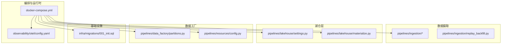
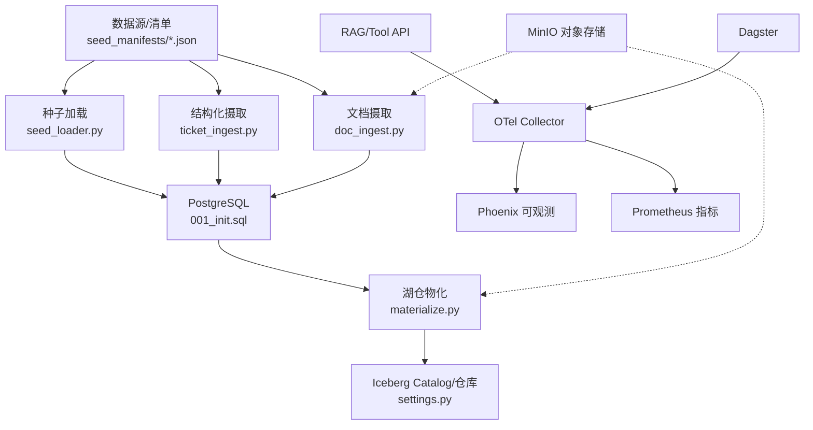
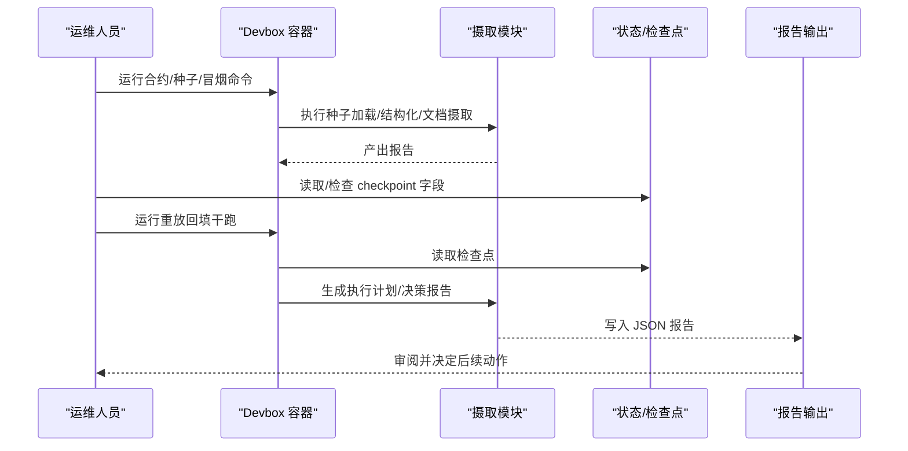
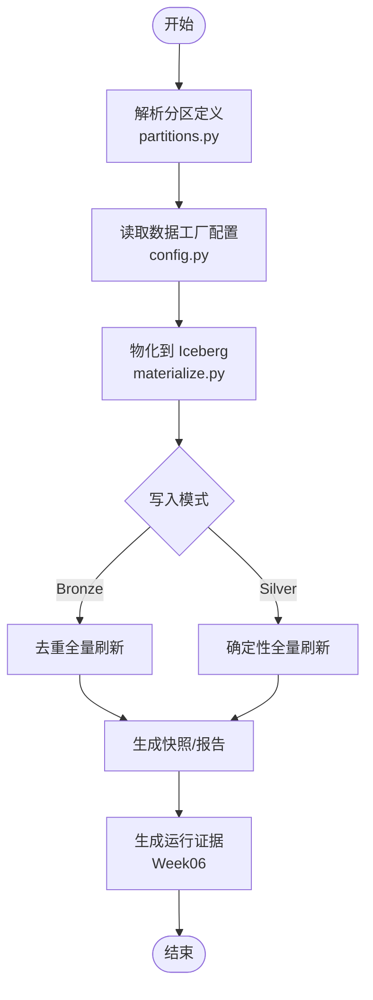
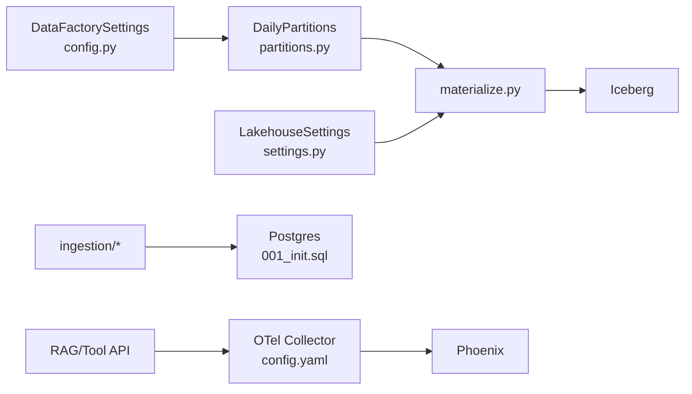

# 运维操作手册

<cite>
**本文引用的文件**
- [runbooks/week01-startup.md](file://runbooks/week01-startup.md)
- [runbooks/ingestion_runbook_v1.md](file://runbooks/ingestion_runbook_v1.md)
- [runbooks/lakehouse_runbook.md](file://runbooks/lakehouse_runbook.md)
- [runbooks/week06-data-factory.md](file://runbooks/week06-data-factory.md)
- [runbooks/podman-local.md](file://runbooks/podman-local.md)
- [infra/docker-compose.yml](file://infra/docker-compose.yml)
- [observability/otel/config.yaml](file://observability/otel/config.yaml)
- [pipelines/lakehouse/materialize.py](file://pipelines/lakehouse/materialize.py)
- [pipelines/lakehouse/settings.py](file://pipelines/lakehouse/settings.py)
- [pipelines/ingestion/replay_backfill.py](file://pipelines/ingestion/replay_backfill.py)
- [pipelines/data_factory/partitions.py](file://pipelines/data_factory/partitions.py)
- [pipelines/resources/config.py](file://pipelines/resources/config.py)
- [infra/migrations/001_init.sql](file://infra/migrations/001_init.sql)
</cite>

## 目录
1. [简介](#简介)
2. [项目结构](#项目结构)
3. [核心组件](#核心组件)
4. [架构总览](#架构总览)
5. [详细组件分析](#详细组件分析)
6. [依赖分析](#依赖分析)
7. [性能考虑](#性能考虑)
8. [故障排除指南](#故障排除指南)
9. [结论](#结论)
10. [附录](#附录)

## 简介
本运维操作手册面向日常数据平台运维与工程团队，覆盖服务启动/停止/重启与状态监控、数据摄取流程（含验证、质量检查与错误处理）、湖仓管理（分区、模式演进与数据刷新）、故障排除（诊断、性能调优与应急响应）、监控告警与日志分析、备份恢复与容量规划、扩展策略以及安全加固与权限管理等。内容以仓库内现有 runbook、配置与脚本为依据，结合实际代码路径给出可执行的操作步骤与可视化流程。

## 项目结构
该仓库采用分层与功能域结合的组织方式：
- 运维与编排：docker-compose 定义服务与网络；OpenTelemetry 采集与导出；Podman 兼容路径
- 数据摄取：种子清单校验、结构化/文档摄取、状态与重放回填
- 湖仓层：Iceberg Catalog/仓库对接、Bronze/Silver 表物化、快照与时间旅行
- 数据工厂：按日分区的资产化编排、干跑回填计划、检查与运行证据
- 观测性：OTel Collector 配置、Phoenix 可观测、Prometheus 指标导出
- 基础设施：PostgreSQL 初始化 DDL（枚举、索引、表结构）

图表来源
- [infra/docker-compose.yml:1-340](file://infra/docker-compose.yml#L1-L340)
- [observability/otel/config.yaml:1-66](file://observability/otel/config.yaml#L1-L66)
- [pipelines/lakehouse/settings.py:1-149](file://pipelines/lakehouse/settings.py#L1-L149)
- [pipelines/lakehouse/materialize.py:1-231](file://pipelines/lakehouse/materialize.py#L1-L231)
- [pipelines/ingestion/replay_backfill.py:1-166](file://pipelines/ingestion/replay_backfill.py#L1-L166)
- [pipelines/data_factory/partitions.py:1-18](file://pipelines/data_factory/partitions.py#L1-L18)
- [pipelines/resources/config.py:1-136](file://pipelines/resources/config.py#L1-L136)
- [infra/migrations/001_init.sql:1-288](file://infra/migrations/001_init.sql#L1-L288)

章节来源
- [infra/docker-compose.yml:1-340](file://infra/docker-compose.yml#L1-L340)
- [runbooks/week01-startup.md:1-148](file://runbooks/week01-startup.md#L1-L148)

## 核心组件
- 服务编排与网络：通过 docker-compose 定义服务生命周期、健康检查、端口映射与卷挂载，确保 Postgres、MinIO、API、Dagster、OTel Collector、Phoenix 等服务有序启动与依赖等待
- 数据摄取流水线：种子清单校验、结构化/文档摄取、状态记录与重放回填，支持 dry-run 与报告输出
- 湖仓物化：将 PostgreSQL 中的银表物化到 Iceberg，支持写入模式、快照与报告
- 数据工厂：按日分区的资产化编排，支持干跑回填计划、五项核心检查与运行证据生成
- 观测性：OTel Collector 接收 gRPC/HTTP OTLP，批量与内存限制处理器，导出至 Phoenix 并暴露 Prometheus 指标
- 基础设施：PostgreSQL 初始化脚本创建枚举类型、核心表与索引，支撑后续湖仓与检索

章节来源
- [runbooks/ingestion_runbook_v1.md:1-111](file://runbooks/ingestion_runbook_v1.md#L1-L111)
- [runbooks/lakehouse_runbook.md:1-82](file://runbooks/lakehouse_runbook.md#L1-L82)
- [runbooks/week06-data-factory.md:1-190](file://runbooks/week06-data-factory.md#L1-L190)
- [observability/otel/config.yaml:1-66](file://observability/otel/config.yaml#L1-L66)
- [infra/migrations/001_init.sql:1-288](file://infra/migrations/001_init.sql#L1-L288)

## 架构总览
下图展示从数据源到湖仓与可观测性的整体路径，体现服务启动顺序、依赖关系与数据流方向。

图表来源
- [runbooks/ingestion_runbook_v1.md:14-27](file://runbooks/ingestion_runbook_v1.md#L14-L27)
- [runbooks/lakehouse_runbook.md:9-22](file://runbooks/lakehouse_runbook.md#L9-L22)
- [runbooks/week06-data-factory.md:3-14](file://runbooks/week06-data-factory.md#L3-L14)
- [infra/docker-compose.yml:15-340](file://infra/docker-compose.yml#L15-L340)
- [observability/otel/config.yaml:1-66](file://observability/otel/config.yaml#L1-L66)
- [pipelines/lakehouse/materialize.py:1-231](file://pipelines/lakehouse/materialize.py#L1-L231)
- [pipelines/lakehouse/settings.py:1-149](file://pipelines/lakehouse/settings.py#L1-L149)

## 详细组件分析

### 服务启动/停止/重启与状态监控
- 启动：复制并编辑环境变量模板，使用 docker-compose 按 profile 启动完整栈或指定服务
- 停止：down 命令停止并可选择删除数据卷
- 重启：针对特定服务进行 restart 或按健康检查条件依赖启动
- 健康检查：Postgres、MinIO、API、Dagster、OTel Collector、Phoenix 均配置健康检查
- 端口与 UI：RAG API、Tool API、MinIO 控制台、Dagster UI、Phoenix、OTel Prometheus 端口均在 compose 中定义

章节来源
- [runbooks/week01-startup.md:19-148](file://runbooks/week01-startup.md#L19-L148)
- [infra/docker-compose.yml:19-340](file://infra/docker-compose.yml#L19-L340)

### 数据摄取流程（验证、质量检查与错误处理）
- 合约基线：运行契约测试，确保 schema 与输出符合预期
- 种子加载冒烟：对多个种子清单进行 dry-run，确认资产接受
- 结构化/文档摄取冒烟：对示例输入执行 dry-run，生成报告
- 状态与重放回填：检查 checkpoint 文件字段，基于模式（retry/rerun/replay/backfill）生成干跑执行计划与决策报告
- 错误处理：通过报告与警告收集、推荐动作与状态汇总，指导下一步操作

图表来源
- [runbooks/ingestion_runbook_v1.md:34-111](file://runbooks/ingestion_runbook_v1.md#L34-L111)
- [pipelines/ingestion/replay_backfill.py:25-166](file://pipelines/ingestion/replay_backfill.py#L25-L166)

章节来源
- [runbooks/ingestion_runbook_v1.md:1-111](file://runbooks/ingestion_runbook_v1.md#L1-L111)
- [pipelines/ingestion/replay_backfill.py:1-166](file://pipelines/ingestion/replay_backfill.py#L1-L166)

### 湖仓管理（分区、模式演进与数据刷新）
- 分区：Week06 数据工厂按日分区定义，默认分区键由环境变量配置
- 模式演进：Iceberg Catalog 通过 SQL Catalog 与 MinIO 仓库对接，支持 Bronze/Silver 表的 schema 设计与演进
- 数据刷新：物化脚本将 PostgreSQL 银表写入 Iceberg，支持 dry-run/plan 模式，生成快照与报告
- 运行证据：Week06 生成 backfill、checks、run_evidence 等证据文件，便于审计与交付

图表来源
- [pipelines/data_factory/partitions.py:10-18](file://pipelines/data_factory/partitions.py#L10-L18)
- [pipelines/resources/config.py:44-136](file://pipelines/resources/config.py#L44-L136)
- [pipelines/lakehouse/materialize.py:131-184](file://pipelines/lakehouse/materialize.py#L131-L184)
- [runbooks/week06-data-factory.md:128-156](file://runbooks/week06-data-factory.md#L128-L156)

章节来源
- [runbooks/lakehouse_runbook.md:1-82](file://runbooks/lakehouse_runbook.md#L1-L82)
- [pipelines/lakehouse/settings.py:1-149](file://pipelines/lakehouse/settings.py#L1-L149)
- [pipelines/lakehouse/materialize.py:1-231](file://pipelines/lakehouse/materialize.py#L1-L231)
- [runbooks/week06-data-factory.md:1-190](file://runbooks/week06-data-factory.md#L1-L190)

### 监控告警与日志分析
- OTel Collector：接收 gRPC/HTTP OTLP，批量与内存限制处理器，资源属性注入，导出至 Phoenix 并暴露 Prometheus 指标端点
- 日志与可观测：API 与 Dagster 通过 OTel 导出 trace/metrics/logs，Phoenix 提供 AI 请求可观测与回放
- 健康检查：compose 中为关键服务配置健康检查，便于自动化监控

章节来源
- [observability/otel/config.yaml:1-66](file://observability/otel/config.yaml#L1-L66)
- [infra/docker-compose.yml:32-121](file://infra/docker-compose.yml#L32-L121)

### 备份恢复策略、容量规划与扩展指南
- 备份：Postgres、MinIO、Dagster、Phoenix 使用命名卷持久化，可通过 down -v 清理或单独重建卷
- 恢复：停止后重新 up 即可恢复；若需清理数据，使用 down -v 删除卷
- 容量规划：MinIO 与 Postgres 卷大小根据数据增长评估；对象存储桶按业务分区创建
- 扩展：Compose 中新增服务遵循现有网络与健康检查模式；OTel 可横向扩展 Collector

章节来源
- [runbooks/week01-startup.md:139-148](file://runbooks/week01-startup.md#L139-L148)
- [infra/docker-compose.yml:9-13](file://infra/docker-compose.yml#L9-L13)

### 安全加固、权限管理与合规检查
- 环境变量与密钥：通过 .env.local 注入数据库、MinIO、OTel 等敏感参数；OTel 导出端点与服务名在 compose 中集中配置
- 访问控制：MinIO 使用根用户凭据初始化；API 服务通过容器内环境变量访问；Dagster 与分析目录挂载只读
- 合规：PostgreSQL 初始化脚本中包含审计日志表与发布清单表，支持版本追踪与审计

章节来源
- [runbooks/week01-startup.md:19-29](file://runbooks/week01-startup.md#L19-L29)
- [infra/docker-compose.yml:23-104](file://infra/docker-compose.yml#L23-L104)
- [infra/migrations/001_init.sql:214-275](file://infra/migrations/001_init.sql#L214-L275)

## 依赖分析
- 组件耦合：数据工厂依赖分区定义与配置；湖仓物化依赖 Catalog/仓库设置；摄取模块依赖 Postgres 与 MinIO；OTel 为跨服务统一观测
- 外部依赖：Docker/Podman Compose、Postgres、MinIO、OTel Collector、Phoenix、Dagster
- 潜在循环：当前文件间未发现直接循环导入；配置读取通过环境变量解耦

图表来源
- [pipelines/resources/config.py:44-136](file://pipelines/resources/config.py#L44-L136)
- [pipelines/data_factory/partitions.py:10-18](file://pipelines/data_factory/partitions.py#L10-L18)
- [pipelines/lakehouse/materialize.py:131-184](file://pipelines/lakehouse/materialize.py#L131-L184)
- [pipelines/lakehouse/settings.py:40-104](file://pipelines/lakehouse/settings.py#L40-L104)
- [infra/migrations/001_init.sql:1-288](file://infra/migrations/001_init.sql#L1-L288)
- [observability/otel/config.yaml:1-66](file://observability/otel/config.yaml#L1-L66)

## 性能考虑
- OTel 批量与内存限制：批量发送与内存上限配置降低资源占用与 OOM 风险
- 查询与索引：PostgreSQL 初始化脚本包含常用维度索引，有助于查询性能
- 物化写入：Bronze/Silver 写入模式不同，Bronze 侧重去重全量刷新，Silver 为确定性全量刷新，结合快照提升可追溯性

章节来源
- [observability/otel/config.yaml:12-29](file://observability/otel/config.yaml#L12-L29)
- [infra/migrations/001_init.sql:115-120](file://infra/migrations/001_init.sql#L115-L120)
- [pipelines/lakehouse/materialize.py:187-191](file://pipelines/lakehouse/materialize.py#L187-L191)

## 故障排除指南
- Podman 兼容性：提供 Podman Desktop 与 CLI 路径，包含环境准备、服务验证、常见症状与处理建议
- 健康检查失败：等待服务就绪或检查 compose provider 与固定容器名冲突
- 端口占用：确保 Docker 与 Podman 栈不同时运行，避免端口冲突
- 权限与卷：rootless 卷所有权问题可重建受影响卷；绑定挂载为空检查路径共享
- dbt 连接：在 devbox 容器内运行 dbt，避免宿主机直连导致连接失败

章节来源
- [runbooks/podman-local.md:118-335](file://runbooks/podman-local.md#L118-L335)
- [runbooks/week01-startup.md:128-136](file://runbooks/week01-startup.md#L128-L136)

## 结论
本手册基于仓库内的 runbook、配置与脚本，提供了从服务启动到数据摄取、湖仓物化、可观测性、备份恢复、安全加固与故障排除的完整运维实践路径。建议在日常工作中结合健康检查与报告输出，持续优化分区策略、物化写入模式与 OTel 配置，确保系统稳定与可追溯。

## 附录
- 常用命令参考
  - 启动/停止/重启：参见 Week01 启动手册与 docker-compose 定义
  - 摄取冒烟：参见 Week03 摄取手册中的各步骤命令
  - 湖仓物化：参见 Week04 湖仓手册与 materialize.py 参数
  - 数据工厂：参见 Week06 数据工厂手册与分区/配置
  - 观测性：参见 OTel Collector 配置与 Phoenix/指标端点

章节来源
- [runbooks/week01-startup.md:33-116](file://runbooks/week01-startup.md#L33-L116)
- [runbooks/ingestion_runbook_v1.md:34-111](file://runbooks/ingestion_runbook_v1.md#L34-L111)
- [runbooks/lakehouse_runbook.md:59-79](file://runbooks/lakehouse_runbook.md#L59-L79)
- [runbooks/week06-data-factory.md:63-101](file://runbooks/week06-data-factory.md#L63-L101)
- [observability/otel/config.yaml:41-66](file://observability/otel/config.yaml#L41-L66)