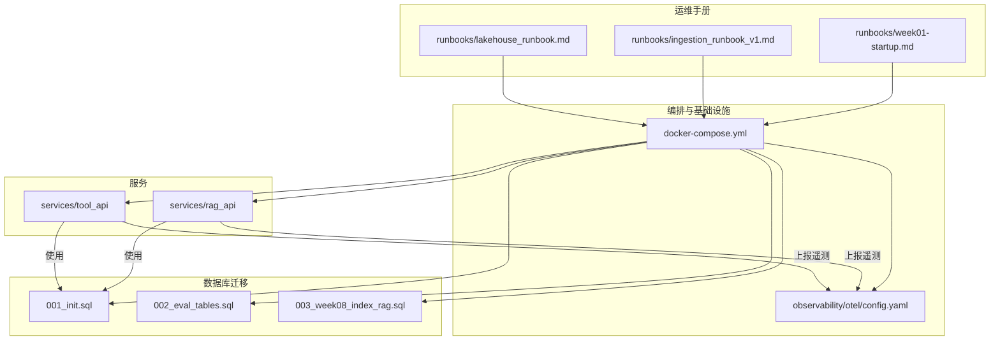
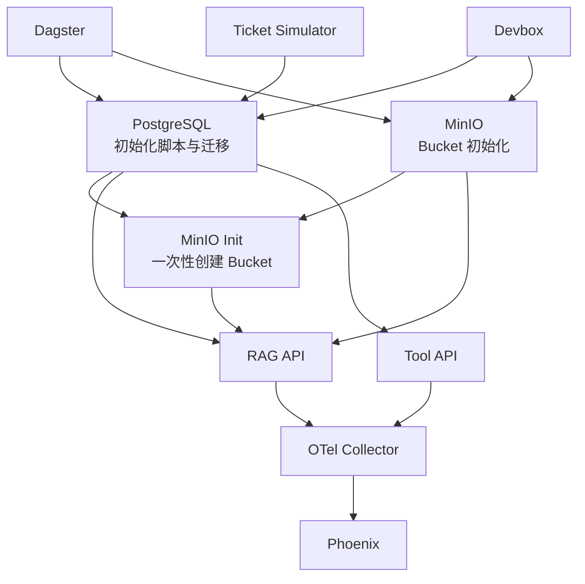
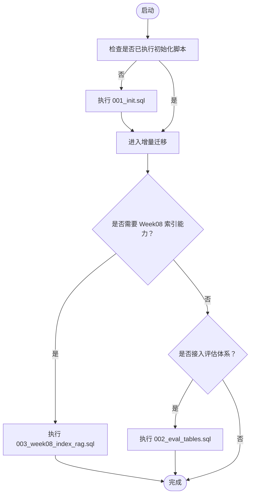
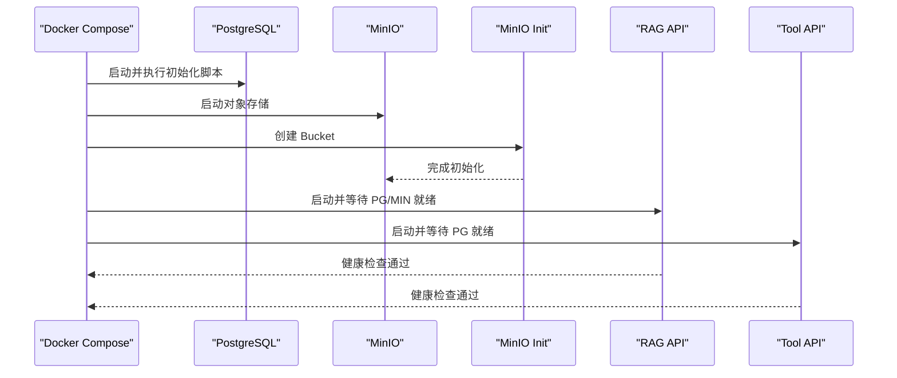
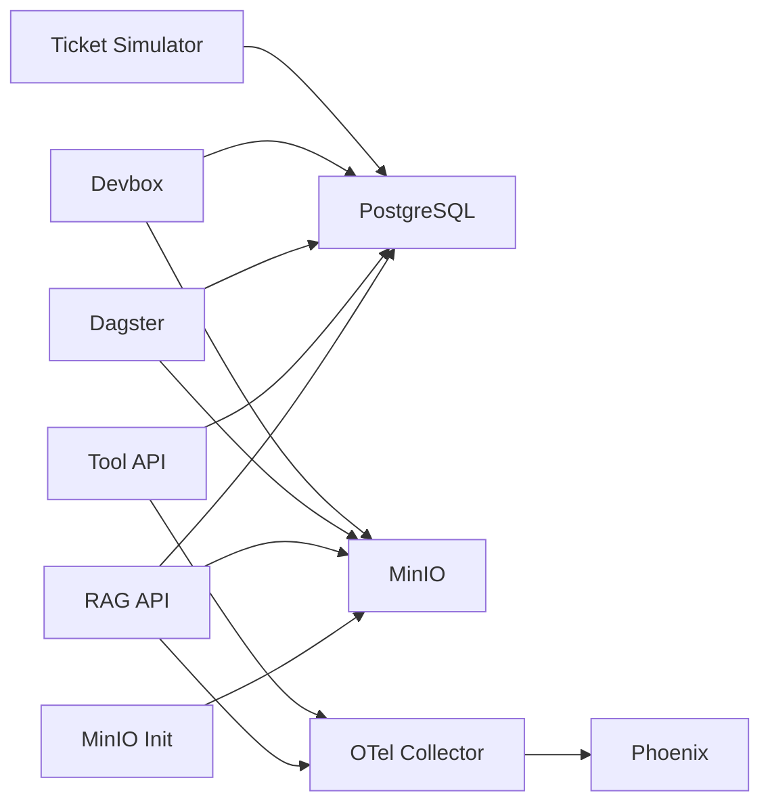

# 部署与运维

<cite>
**本文引用的文件**
- [docker-compose.yml](file://infra/docker-compose.yml)
- [001_init.sql](file://infra/migrations/001_init.sql)
- [002_eval_tables.sql](file://infra/migrations/002_eval_tables.sql)
- [003_week08_index_rag.sql](file://infra/migrations/003_week08_index_rag.sql)
- [Dockerfile（RAG API）](file://services/rag_api/Dockerfile)
- [Dockerfile（Tool API）](file://services/tool_api/Dockerfile)
- [RAG API 应用入口](file://services/rag_api/app/main.py)
- [Tool API 应用入口](file://services/tool_api/app/main.py)
- [RAG API 配置](file://services/rag_api/app/config.py)
- [Tool API 配置](file://services/tool_api/app/config.py)
- [OpenTelemetry Collector 配置](file://observability/otel/config.yaml)
- [周01 启动手册](file://runbooks/week01-startup.md)
- [周03 入湖运行手册](file://runbooks/ingestion_runbook_v1.md)
- [周04 数据湖运行手册](file://runbooks/lakehouse_runbook.md)
</cite>

## 目录
1. [简介](#简介)
2. [项目结构](#项目结构)
3. [核心组件](#核心组件)
4. [架构总览](#架构总览)
5. [详细组件分析](#详细组件分析)
6. [依赖关系分析](#依赖关系分析)
7. [性能考量](#性能考量)
8. [故障排查指南](#故障排查指南)
9. [结论](#结论)
10. [附录](#附录)

## 简介
本文件面向 OmniSupport Copilot 的部署与运维团队，系统化梳理基于 Docker Compose 的完整部署配置、服务依赖关系、环境变量管理与健康检查机制；解释数据库迁移设计（初始化脚本、模式变更与数据迁移策略）；提供运维操作手册（常见问题、性能优化、故障排除与最佳实践）；覆盖监控告警、日志管理与备份恢复；给出扩展性、容量规划与灾难恢复策略；说明版本升级、回滚与蓝绿部署思路，并提供安全加固、权限管理与合规检查的实施要点。

## 项目结构
本项目采用分层与功能模块结合的组织方式：
- 基础设施与编排：infra/docker-compose.yml、observability/otel/config.yaml
- 数据库迁移：infra/migrations/*.sql
- 服务层：services/rag_api、services/tool_api
- 运维手册：runbooks/*.md
- 数据与管道：pipelines/*、data/*、analytics/*、contracts/*

下图展示与部署运维直接相关的目录与文件关系：

图表来源
- [docker-compose.yml:1-340](file://infra/docker-compose.yml#L1-L340)
- [001_init.sql:1-288](file://infra/migrations/001_init.sql#L1-L288)
- [002_eval_tables.sql:1-44](file://infra/migrations/002_eval_tables.sql#L1-L44)
- [003_week08_index_rag.sql:1-78](file://infra/migrations/003_week08_index_rag.sql#L1-L78)
- [OpenTelemetry Collector 配置:1-66](file://observability/otel/config.yaml#L1-L66)
- [周01 启动手册:1-148](file://runbooks/week01-startup.md#L1-L148)
- [周03 入湖运行手册:1-111](file://runbooks/ingestion_runbook_v1.md#L1-L111)
- [周04 数据湖运行手册:1-82](file://runbooks/lakehouse_runbook.md#L1-L82)

章节来源
- [docker-compose.yml:1-340](file://infra/docker-compose.yml#L1-L340)
- [OpenTelemetry Collector 配置:1-66](file://observability/otel/config.yaml#L1-L66)

## 核心组件
- PostgreSQL（含 pgvector 扩展）：结构化数据与向量检索存储，首次启动自动执行初始化脚本，后续通过增量迁移演进。
- MinIO（S3 兼容）：对象存储，承载原始资产与中间制品；提供初始化容器自动创建所需 Bucket。
- RAG API：FastAPI 服务，提供健康检查与查询接口，集成 OpenTelemetry 上报。
- Tool API：工单工具链与审计日志服务，提供健康检查与工具路由。
- Dagster：数据管线编排（开发模式），连接数据库与对象存储，承载入湖与索引等任务。
- OpenTelemetry Collector：统一接收 traces/metrics/logs，转发至 Phoenix（Arize）进行 AI 请求可观测。
- Phoenix：AI 请求可视化与回放平台。
- Devbox：无本地 Python 依赖的工具容器，用于运行测试、入湖与评估。
- Ticket Simulator：工单种子数据生成器。

章节来源
- [docker-compose.yml:15-340](file://infra/docker-compose.yml#L15-L340)
- [RAG API 应用入口:1-73](file://services/rag_api/app/main.py#L1-L73)
- [Tool API 应用入口:1-64](file://services/tool_api/app/main.py#L1-L64)

## 架构总览
下图展示服务间的启动顺序、依赖关系与数据流：

图表来源
- [docker-compose.yml:1-340](file://infra/docker-compose.yml#L1-L340)
- [OpenTelemetry Collector 配置:1-66](file://observability/otel/config.yaml#L1-L66)

## 详细组件分析

### 数据库与迁移策略
- 初始化脚本
  - 扩展：uuid-ossp、vector、pg_trgm
  - 枚举类型：工单状态、优先级、产品线、SLA 等
  - 表结构：Bronze/Silver 层元数据、知识资产与证据锚点、审计日志、Release Manifest 等
  - 关键索引：FTS 与检索相关索引，审计与时间序列索引
- 增量迁移
  - 评估表：新增评估运行与案例结果表，支持回归指标与报告路径
  - Week08 索引与 RAG：为知识资产与段落增加可见性、授权与质量状态字段，新增索引清单与构建日志表，以及 RAG 审计日志表
- 迁移执行策略
  - 初始化脚本在首次启动时自动执行
  - 增量迁移按阶段手动执行，确保向后兼容与安全添加

图表来源
- [001_init.sql:1-288](file://infra/migrations/001_init.sql#L1-L288)
- [002_eval_tables.sql:1-44](file://infra/migrations/002_eval_tables.sql#L1-L44)
- [003_week08_index_rag.sql:1-78](file://infra/migrations/003_week08_index_rag.sql#L1-L78)

章节来源
- [001_init.sql:1-288](file://infra/migrations/001_init.sql#L1-L288)
- [002_eval_tables.sql:1-44](file://infra/migrations/002_eval_tables.sql#L1-L44)
- [003_week08_index_rag.sql:1-78](file://infra/migrations/003_week08_index_rag.sql#L1-L78)

### 服务与健康检查
- PostgreSQL
  - 健康检查：使用 pg_isready 检测数据库可用性
  - 重启策略：unless-stopped
- MinIO
  - 健康检查：使用 mc ready 检测节点就绪
  - 端口映射：S3 API 与 Web 控制台
- MinIO Init
  - 依赖：等待 MinIO 健康后创建 Bucket
- RAG API
  - 健康检查：HTTP GET /health
  - 依赖：PostgreSQL 与 MinIO 健康
  - 端口：8000
- Tool API
  - 健康检查：HTTP GET /health
  - 依赖：PostgreSQL 健康
  - 端口：8001
- Dagster
  - 健康检查：通过服务自身可用性保障
  - 依赖：PostgreSQL 与 MinIO 健康
- OTel Collector
  - 端口：4317/4318（OTLP）、8889（Prometheus）
- Phoenix
  - 依赖：OTel Collector
- Devbox
  - 用途：运行测试与入湖命令，无健康检查
- Ticket Simulator
  - 用途：生成种子数据，一次性运行

图表来源
- [docker-compose.yml:19-121](file://infra/docker-compose.yml#L19-L121)

章节来源
- [docker-compose.yml:19-121](file://infra/docker-compose.yml#L19-L121)

### 配置与环境变量管理
- PostgreSQL
  - 关键变量：POSTGRES_USER、POSTGRES_PASSWORD、POSTGRES_DB
- MinIO
  - 关键变量：MINIO_ROOT_USER、MINIO_ROOT_PASSWORD
- RAG API
  - 数据库：DATABASE_URL
  - 存储：MINIO_ENDPOINT、MINIO_ACCESS_KEY、MINIO_SECRET_KEY
  - LLM：ANTHROPIC_API_KEY（可选）
  - 遥测：OTEL_EXPORTER_OTLP_ENDPOINT、OTEL_SERVICE_NAME、RELEASE_ID
  - 端口：8000
- Tool API
  - 数据库：DATABASE_URL
  - 遥测：OTEL_EXPORTER_OTLP_ENDPOINT、OTEL_SERVICE_NAME、RELEASE_ID
  - 指标注册：METRIC_REGISTRY_PATH
  - 端口：8001
- Dagster
  - 大量 Iceberg 与数据工程相关变量，涵盖 Catalog、Warehouse、命名空间、分区与报告路径等
- OTel Collector
  - 接收 OTLP，批量与内存限制处理器，导出至 Phoenix 与 Prometheus
- Phoenix
  - 端口：6006
- Devbox
  - 与 Dagster 相同的大量变量，便于在容器内运行数据工程任务
- Ticket Simulator
  - 数据库：DATABASE_URL、SEED_MANIFEST_PATH、TICKET_COUNT

章节来源
- [docker-compose.yml:23-335](file://infra/docker-compose.yml#L23-L335)
- [RAG API 配置:1-53](file://services/rag_api/app/config.py#L1-L53)
- [Tool API 配置:1-19](file://services/tool_api/app/config.py#L1-L19)
- [OpenTelemetry Collector 配置:1-66](file://observability/otel/config.yaml#L1-L66)

### 运维操作手册
- 周01 工程基线启动
  - 步骤：复制并编辑 .env.local、启动服务、验证健康、生成种子数据、契约测试、冒烟查询、校验 Release Manifest
  - 常见问题：MinIO 初始化失败、RAG API 数据库未就绪、devbox 首次构建失败、契约测试失败
  - 停止与清理：保留数据卷或删除数据卷
- 周03 入湖运行
  - 步骤：契约基线、种子加载冒烟、工单入湖冒烟、文档入湖冒烟、检查点与回放干跑、集成测试
  - 依赖：devbox 工具容器、种子清单与合成数据
- 周04 数据湖运行
  - 目标：解释将入湖结果推进到可复现、可回滚、可追溯的数据底座
  - 步骤：Catalog 冒烟、物化核心表、快照与时间旅行检查
  - 强调：Bronze/Silver 分层、Snapshot/Time Travel/Schema Evolution 的工程价值

章节来源
- [周01 启动手册:1-148](file://runbooks/week01-startup.md#L1-L148)
- [周03 入湖运行手册:1-111](file://runbooks/ingestion_runbook_v1.md#L1-L111)
- [周04 数据湖运行手册:1-82](file://runbooks/lakehouse_runbook.md#L1-L82)

### 监控告警、日志与可观测性
- OTel Collector
  - 接收 gRPC/HTTP OTLP，批量与内存限制处理器，资源属性注入，导出至 Phoenix 与 Prometheus
- Phoenix
  - 可视化 AI 请求与回放，配合 OTel Collector 使用
- RAG API / Tool API
  - 通过 Uvicorn 启动，集成 OpenTelemetry，自动上报 traces/metrics/logs
- 日志管理
  - 建议：容器日志采集（stdout/stderr），结合 Prometheus/Grafana 进行指标聚合与告警
- 告警策略
  - 健康检查失败、OTel 导出失败、数据库连接超时、存储不可用、关键任务失败

章节来源
- [OpenTelemetry Collector 配置:1-66](file://observability/otel/config.yaml#L1-L66)
- [RAG API 应用入口:1-73](file://services/rag_api/app/main.py#L1-L73)
- [Tool API 应用入口:1-64](file://services/tool_api/app/main.py#L1-L64)

### 备份与恢复
- 数据库备份
  - 建议：定期执行逻辑备份（pg_dump），结合 WAL 归档实现点-in-time 恢复
- 对象存储备份
  - 建议：启用版本化与跨区域复制，定期校验对象完整性
- 配置与清单备份
  - 建议：将 docker-compose.yml、迁移脚本、OTel 配置纳入版本控制与备份
- 恢复演练
  - 建议：定期进行恢复演练，验证备份数据的可用性与一致性

[本节为通用运维建议，无需特定文件引用]

### 扩展性、容量规划与灾难恢复
- 扩展性
  - 服务水平扩展：RAG API/Tool API 通过负载均衡横向扩展
  - 存储扩展：MinIO 可水平扩展，建议使用纠删码与分片
  - 计算扩展：Dagster 以开发模式运行，生产建议迁移到 K8s 并启用工作器池
- 容量规划
  - 数据库：根据工单与文档规模估算表大小与索引成本，预留 CPU/内存/磁盘
  - 对象存储：按资产数量与平均大小估算容量，考虑压缩与去重
  - 遥测：OTel Collector 批量与内存限制参数需结合吞吐量调整
- 灾难恢复
  - RPO/RTO：依据业务 SLA 制定备份频率与恢复时间目标
  - 多活与异地：数据库与对象存储跨区域部署，定期进行跨区域同步与切换演练

[本节为通用运维建议，无需特定文件引用]

### 版本升级、回滚与蓝绿部署
- 升级流程
  - 评估：确认新版本对数据库与对象存储的影响
  - 迁移：先执行数据库迁移脚本，再滚动更新服务镜像
  - 验证：冒烟测试与关键路径回归测试
- 回滚策略
  - 快速回滚：回退到上一个稳定镜像，必要时回滚数据库到迁移前快照
  - 渐进式回滚：灰度回退部分实例，观察指标与日志
- 蓝绿部署
  - 预热：准备新版本镜像与配置
  - 切换：通过外部负载均衡器切换流量
  - 观察：持续监控健康检查、错误率与延迟

[本节为通用运维建议，无需特定文件引用]

### 安全加固、权限管理与合规
- 网络与访问控制
  - 仅暴露必要端口，内部服务通过 Docker 网络通信
  - 生产环境限制 CORS 源，避免跨域风险
- 凭据与密钥
  - 使用 .env.local 管理敏感变量，避免硬编码
  - 数据库与对象存储凭据定期轮换
- 审计与合规
  - 启用审计日志（Tool API/数据库），记录关键操作
  - 数据脱敏与最小化收集，PII 处理遵循合规要求
- 镜像与依赖
  - 使用官方基础镜像，定期扫描漏洞并更新依赖

[本节为通用运维建议，无需特定文件引用]

## 依赖关系分析
下图展示服务之间的直接依赖与耦合关系：

图表来源
- [docker-compose.yml:19-335](file://infra/docker-compose.yml#L19-L335)

章节来源
- [docker-compose.yml:19-335](file://infra/docker-compose.yml#L19-L335)

## 性能考量
- 数据库性能
  - 合理索引：FTS 与检索相关索引，避免全表扫描
  - 查询优化：针对高并发场景使用连接池与只读副本
- 对象存储性能
  - 分块上传与断点续传，启用压缩与去重
- 遥测性能
  - OTel Collector 批量大小与内存限制需结合吞吐量调优
- 服务性能
  - RAG API/Tool API 使用异步路由与连接池，避免阻塞
  - 负载均衡与缓存策略降低热点请求压力

[本节为通用性能建议，无需特定文件引用]

## 故障排查指南
- 健康检查失败
  - PostgreSQL：检查 pg_isready 与初始化脚本执行情况
  - MinIO：检查 mc ready 与端口映射
  - RAG/Tool API：检查数据库连接字符串与 OTel 导出端点
- MinIO 初始化失败
  - 等待 MinIO 就绪后重试 minio_init
- 数据库未就绪
  - 等待初始化脚本执行完成，确认表与索引创建
- Devbox 首次构建失败
  - 先执行构建命令，再运行交互式任务
- 契约测试失败
  - 检查 contracts 目录结构与 JSON Schema 文件

章节来源
- [周01 启动手册:128-136](file://runbooks/week01-startup.md#L128-L136)

## 结论
本部署与运维文档围绕 Docker Compose 编排、数据库迁移、服务健康检查、可观测性与运维手册展开，提供了从启动到扩展、从监控到安全的全栈实践指南。建议在生产环境中进一步完善自动化部署、灾备演练与合规审计，确保系统稳定、可追溯与可持续演进。

## 附录
- 服务端口与用途
  - PostgreSQL：5432（容器内）
  - MinIO：9000（S3 API）、9001（Web 控制台）
  - RAG API：8000
  - Tool API：8001
  - OTel Collector：4317/4318（OTLP）、8889（Prometheus）
  - Phoenix：6006
  - Dagster：3000
- 常用命令参考
  - 启动：docker compose --env-file infra/env/.env.local -f infra/docker-compose.yml up -d --build
  - 健康检查：curl http://localhost:8000/health 与 http://localhost:8001/health
  - 入湖与评估：通过 devbox 运行相应 Python 模块与测试

[本节为通用附录信息，无需特定文件引用]