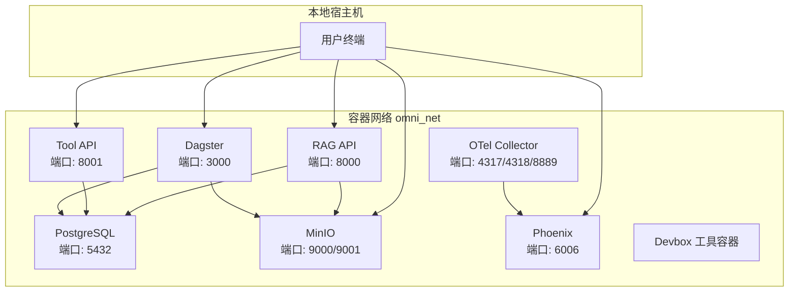
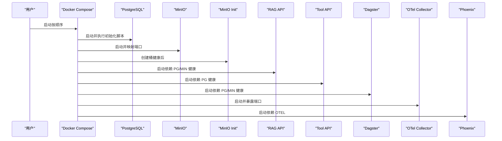
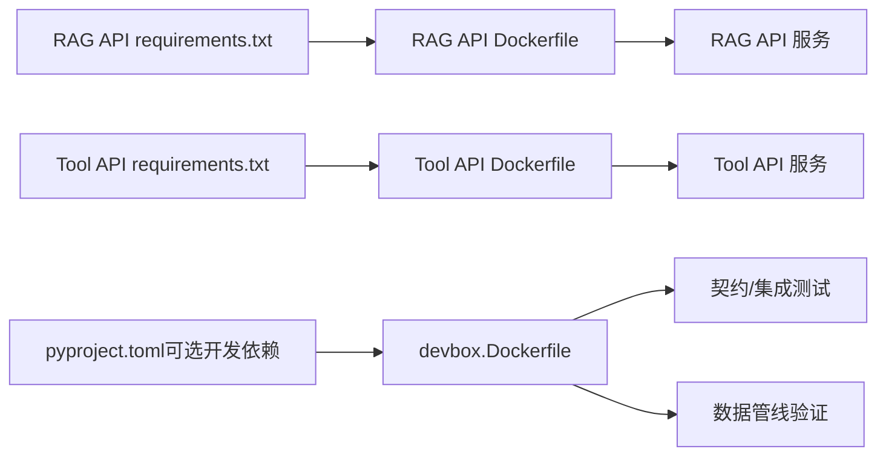

# 快速开始与本地部署

<cite>
**本文引用的文件**
- [docker-compose.yml](file://infra/docker-compose.yml)
- [week01-startup.md](file://runbooks/week01-startup.md)
- [podman-local.md](file://runbooks/podman-local.md)
- [Dockerfile（RAG API）](file://services/rag_api/Dockerfile)
- [Dockerfile（Tool API）](file://services/tool_api/Dockerfile)
- [requirements.txt（RAG API）](file://services/rag_api/requirements.txt)
- [requirements.txt（Tool API）](file://services/tool_api/requirements.txt)
- [requirements.txt（合成器）](file://data/synthetic_generators/requirements.txt)
- [devbox.Dockerfile](file://infra/devbox.Dockerfile)
- [main.py（RAG API）](file://services/rag_api/app/main.py)
- [main.py（Tool API）](file://services/tool_api/app/main.py)
- [otel 配置](file://observability/otel/config.yaml)
- [PostgreSQL 初始化脚本](file://infra/migrations/001_init.sql)
- [pyproject.toml](file://pyproject.toml)
</cite>

## 目录
1. [简介](#简介)
2. [项目结构](#项目结构)
3. [核心组件](#核心组件)
4. [架构总览](#架构总览)
5. [详细组件分析](#详细组件分析)
6. [依赖关系分析](#依赖关系分析)
7. [性能注意事项](#性能注意事项)
8. [故障排查指南](#故障排查指南)
9. [结论](#结论)
10. [附录](#附录)

## 简介
本指南面向首次接触 OmniSupport Copilot 的用户，提供从零到系统可用的完整本地部署路径。内容覆盖环境准备、依赖安装、系统启动、健康检查、种子数据生成与契约测试运行，并给出 Week01 基线验证的端到端命令清单。同时提供 Podman 替代方案与常见问题排查建议，帮助在受限环境下顺利启动工程基线。

## 项目结构
本项目采用“服务分层 + Compose 编排”的组织方式：
- 服务层：RAG API、Tool API、Dagster、Phoenix、OpenTelemetry Collector
- 基础设施：PostgreSQL（含向量扩展）、MinIO（S3 兼容对象存储）
- 开发工具：devbox 容器镜像，内置测试与管线依赖
- 可观测性：OTel Collector 聚合 traces/metrics/logs 并导出至 Phoenix

图表来源
- [docker-compose.yml:15-340](file://infra/docker-compose.yml#L15-L340)

章节来源
- [docker-compose.yml:1-340](file://infra/docker-compose.yml#L1-L340)

## 核心组件
- PostgreSQL（pgvector 扩展）：结构化数据与向量检索基础，随容器启动自动执行初始化脚本。
- MinIO（S3 兼容）：原始资产与中间制品存储，启动后自动创建所需桶。
- RAG API：FastAPI 应用，提供健康检查与查询端点；集成 OTel 与可选 LLM。
- Tool API：工单与 KPI 查询工具服务，集成 OTel。
- Dagster：数据管线编排与资产化，连接 Postgres 与 MinIO。
- OpenTelemetry Collector：统一接收与导出遥测数据至 Phoenix。
- Phoenix：AI 请求可观测性平台，可视化 traces 与指标。
- Devbox：无本地 Python 依赖的工具容器，用于契约测试、种子加载与管线验证。

章节来源
- [docker-compose.yml:19-340](file://infra/docker-compose.yml#L19-L340)
- [main.py（RAG API）:1-73](file://services/rag_api/app/main.py#L1-L73)
- [main.py（Tool API）:1-64](file://services/tool_api/app/main.py#L1-L64)
- [otel 配置:1-66](file://observability/otel/config.yaml#L1-L66)

## 架构总览
下图展示 Week01 基线启动顺序与服务间依赖关系：先启动数据库与对象存储，再启动应用与编排服务，最后启动可观测性组件。

图表来源
- [docker-compose.yml:1-340](file://infra/docker-compose.yml#L1-L340)

章节来源
- [docker-compose.yml:1-340](file://infra/docker-compose.yml#L1-L340)

## 详细组件分析

### 前置条件与推荐配置
- 容器运行时
  - Docker Desktop 或 Docker Engine（版本 ≥ 24.0）
  - Docker Compose V2（确保命令 docker compose 可用）
- 可选 LLM 凭据
  - Week01 可留空以验证工程基线；如需真实 LLM 调用，请在环境变量中配置相应密钥
- 现代浏览器
  - 用于访问 MinIO 控制台、Dagster UI、Phoenix 可观测界面
- 推荐机器配置
  - CPU：至少 4 核
  - 内存：8 GB+
  - 磁盘：25 GB+ 可用空间（含容器镜像与数据卷）

章节来源
- [week01-startup.md:8-16](file://runbooks/week01-startup.md#L8-L16)

### 环境变量与配置
- 复制并编辑环境文件
  - 将示例文件复制为本地配置，并根据需要填写 LLM 凭据
- 关键变量（示例）
  - 数据库：POSTGRES_USER、POSTGRES_PASSWORD、POSTGRES_DB
  - 对象存储：MINIO_ROOT_USER、MINIO_ROOT_PASSWORD
  - 服务端口与可观测：OTEL_EXPORTER_OTLP_ENDPOINT、OTEL_SERVICE_NAME、RELEASE_ID
- 服务内配置
  - RAG API/Tool API 通过环境变量读取数据库与对象存储地址
  - OTel Collector 配置接收 gRPC/HTTP 协议并导出至 Phoenix

章节来源
- [week01-startup.md:19-30](file://runbooks/week01-startup.md#L19-L30)
- [docker-compose.yml:23-105](file://infra/docker-compose.yml#L23-L105)
- [otel 配置:4-10](file://observability/otel/config.yaml#L4-L10)

### 服务启动与健康检查
- 启动命令
  - 使用 Compose 指定环境文件与配置文件，后台启动并构建
- 期望状态
  - postgres、minio、rag_api、tool_api、dagster、otel_collector、phoenix 均为 Up
  - minio_init 一次性初始化成功后退出
- 健康检查
  - RAG API/Tool API：访问本地健康端点
  - MinIO：浏览器打开控制台确认端点与凭据
  - Dagster/Phoenix：访问对应 UI 端口
- 端口与访问
  - RAG API：http://localhost:8000/health
  - Tool API：http://localhost:8001/health
  - MinIO：http://localhost:9001（控制台），9000 为 S3 API
  - Dagster：http://localhost:3000
  - Phoenix：http://localhost:6006
  - OTel：4317/4318（OTLP），8889（Prometheus）

章节来源
- [week01-startup.md:33-65](file://runbooks/week01-startup.md#L33-L65)
- [docker-compose.yml:32-121](file://infra/docker-compose.yml#L32-L121)
- [docker-compose.yml:49-51](file://infra/docker-compose.yml#L49-L51)
- [docker-compose.yml:235-238](file://infra/docker-compose.yml#L235-L238)
- [docker-compose.yml:254-255](file://infra/docker-compose.yml#L254-L255)

### 种子数据生成与加载
- 生成种子工单数据
  - 使用 devbox 容器内的 Python 脚本生成指定数量的工单数据
- Dry-run 种子加载
  - 使用 seed_loader 校验多个 Week01 基线清单，确保资产全部接受且无警告/隔离
- 注意事项
  - 若首次运行 devbox 报错，先执行镜像构建
  - 清单路径位于 data/seed_manifests 下

章节来源
- [week01-startup.md:69-90](file://runbooks/week01-startup.md#L69-L90)
- [docker-compose.yml:266-284](file://infra/docker-compose.yml#L266-L284)

### 契约测试运行
- 在 devbox 容器中执行契约测试套件
- Week01 验收标准：所有测试通过（绿色）
- 测试覆盖范围：合约模式、指标契约、数据工厂证据等

章节来源
- [week01-startup.md:94-101](file://runbooks/week01-startup.md#L94-L101)

### 冒烟测试与发布清单校验
- RAG API 冒烟查询
  - 发送测试查询，确认响应包含关键字段（答案、引用、证据 ID、置信度、发布号、跟踪号）
- 发布清单校验
  - 获取发布清单，确认 release_id 符合预期

章节来源
- [week01-startup.md:105-124](file://runbooks/week01-startup.md#L105-L124)

### 停止与清理
- 停止：保留数据卷
- 清理：删除数据卷，重新开始

章节来源
- [week01-startup.md:139-147](file://runbooks/week01-startup.md#L139-L147)

### 从零到可用的完整操作流程
- 步骤 1：克隆仓库并配置环境变量
- 步骤 2：启动所有服务（按顺序）
- 步骤 3：验证各服务健康
- 步骤 4：生成种子工单数据
- 步骤 5：Dry-run 种子加载
- 步骤 6：运行契约测试
- 步骤 7：RAG API 冒烟查询
- 步骤 8：校验发布清单

章节来源
- [week01-startup.md:19-124](file://runbooks/week01-startup.md#L19-L124)

## 依赖关系分析
- 语言与包管理
  - 项目使用 Python 3.11，依赖通过 pip 与 Poetry 风格的可选开发依赖管理
- 服务依赖
  - RAG API/Tool API 依赖 PostgreSQL 与 MinIO
  - Dagster 依赖 PostgreSQL 与 MinIO，并挂载工作目录与报告目录
  - OTel Collector 依赖 Phoenix 输出
- 容器镜像
  - RAG API/Tool API 基于 python:3.11-slim，安装系统与 Python 依赖
  - Devbox 镜像预装测试与管线依赖，便于在容器内执行验证任务

图表来源
- [requirements.txt（RAG API）:1-29](file://services/rag_api/requirements.txt#L1-L29)
- [requirements.txt（Tool API）:1-14](file://services/tool_api/requirements.txt#L1-L14)
- [devbox.Dockerfile:1-25](file://infra/devbox.Dockerfile#L1-L25)
- [pyproject.toml:17-31](file://pyproject.toml#L17-L31)

章节来源
- [requirements.txt（RAG API）:1-29](file://services/rag_api/requirements.txt#L1-L29)
- [requirements.txt（Tool API）:1-14](file://services/tool_api/requirements.txt#L1-L14)
- [requirements.txt（合成器）:1-3](file://data/synthetic_generators/requirements.txt#L1-L3)
- [devbox.Dockerfile:1-25](file://infra/devbox.Dockerfile#L1-L25)
- [pyproject.toml:17-31](file://pyproject.toml#L17-L31)

## 性能注意事项
- 首次启动可能因镜像拉取与依赖安装耗时较长，建议在网络稳定环境下进行
- PostgreSQL 与 MinIO 的数据卷持久化会占用磁盘空间，建议定期清理不再使用的卷
- OTel Collector 的内存限制与批量导出参数已配置，避免在资源受限环境中出现 OOM

章节来源
- [otel 配置:25-29](file://observability/otel/config.yaml#L25-L29)
- [otel 配置:13-17](file://observability/otel/config.yaml#L13-L17)

## 故障排查指南
- 常见问题与处理
  - minio_init 退出非 0：等待服务就绪后重试
  - rag_api 健康检查提示数据库不可用：等待初始化脚本执行完成
  - devbox 首次运行失败：先构建 devbox 镜像
  - 契约测试失败：检查 contracts 目录结构与文件完整性
- 端口冲突
  - 若宿主机已有服务占用 9000/9001/3000/6006/8000/8001，请停止冲突进程或调整映射
- Podman 替代方案
  - 项目 Compose 文件在 Podman 上具备兼容性，但部分特性（如 healthcheck、depends_on.condition、profiles）在旧版提供程序上存在差异
  - 建议在 Podman 机器内完成首次镜像拉取与构建，后续使用相同命令路径

章节来源
- [week01-startup.md:128-136](file://runbooks/week01-startup.md#L128-L136)
- [podman-local.md:11-26](file://runbooks/podman-local.md#L11-L26)
- [podman-local.md:298-312](file://runbooks/podman-local.md#L298-L312)

## 结论
通过本指南，您可以在本地快速搭建 OmniSupport Copilot Week01 工程基线，完成服务启动、健康检查、种子数据生成与契约测试运行。若受限于环境，Podman 提供了兼容的替代路径。遇到问题时，可依据故障排查章节定位并解决。

## 附录

### Week01 基线验证命令清单
- 环境变量配置
  - 复制并编辑环境文件
- 启动服务
  - 使用 Compose 指定环境文件与配置文件，后台启动并构建
- 健康检查
  - 访问 RAG API/Tool API 健康端点
  - 浏览器打开 MinIO 控制台确认桶创建
  - 访问 Dagster/Phoenix UI
- 种子数据生成
  - 在 devbox 容器中运行工单模拟器生成数据
- Dry-run 加载
  - 使用 seed_loader 校验多个清单
- 契约测试
  - 在 devbox 容器中执行契约测试套件
- 冒烟查询与发布清单
  - 发送测试查询并校验响应字段
  - 获取并核对发布清单中的 release_id

章节来源
- [week01-startup.md:19-124](file://runbooks/week01-startup.md#L19-L124)

### 服务端口与访问方式
- RAG API：http://localhost:8000/health
- Tool API：http://localhost:8001/health
- MinIO：http://localhost:9001（控制台），9000 为 S3 API
- Dagster：http://localhost:3000
- Phoenix：http://localhost:6006
- OTel：4317/4318（OTLP），8889（Prometheus）

章节来源
- [docker-compose.yml:49-51](file://infra/docker-compose.yml#L49-L51)
- [docker-compose.yml:235-238](file://infra/docker-compose.yml#L235-L238)
- [docker-compose.yml:254-255](file://infra/docker-compose.yml#L254-L255)

### PostgreSQL 初始化与数据模型概览
- 初始化脚本执行时机：容器首次启动时自动执行
- 关键表与索引：客户、工单、评论、知识文档与分段、证据锚点、审计日志、清单元数据等
- Week08 扩展：知识分段表包含向量列，支持向量相似度检索

章节来源
- [PostgreSQL 初始化脚本:1-288](file://infra/migrations/001_init.sql#L1-L288)