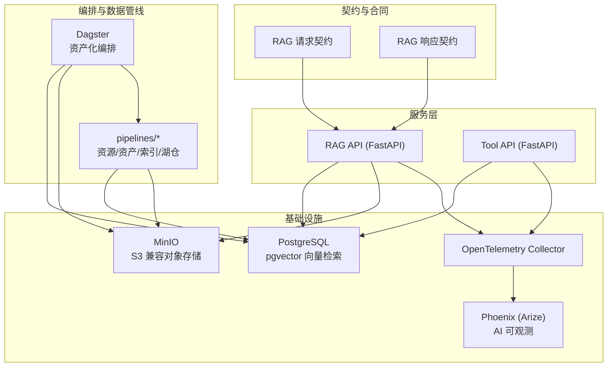
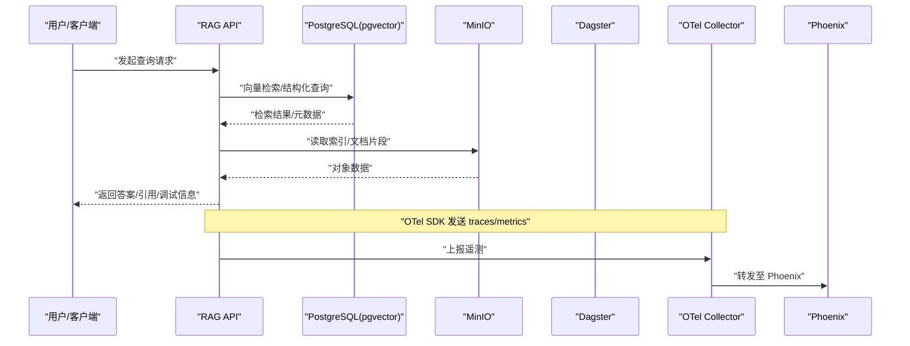
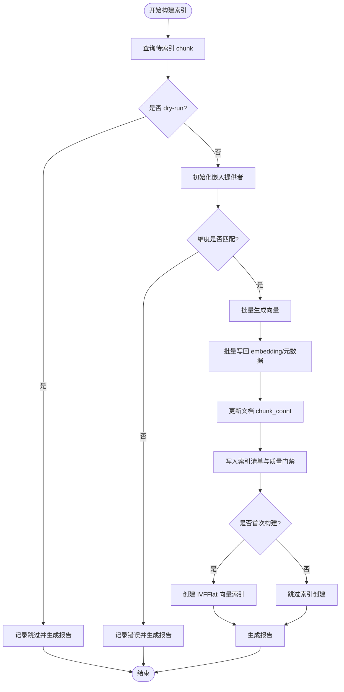
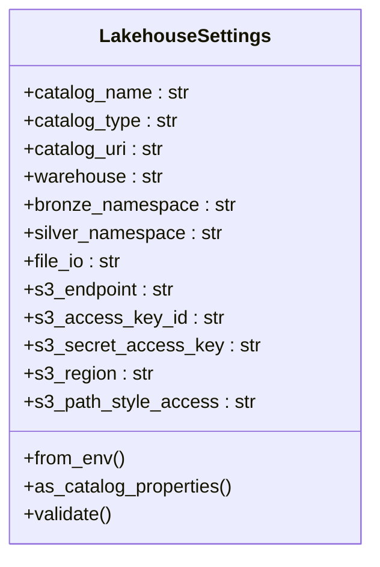
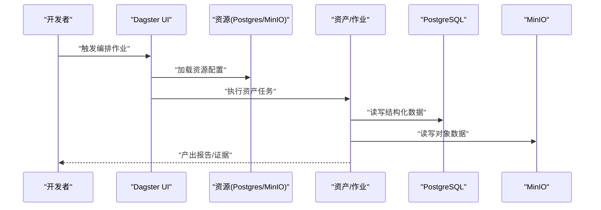
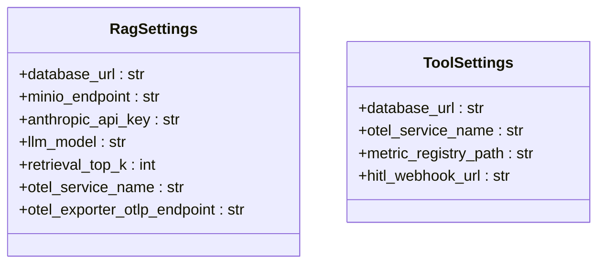
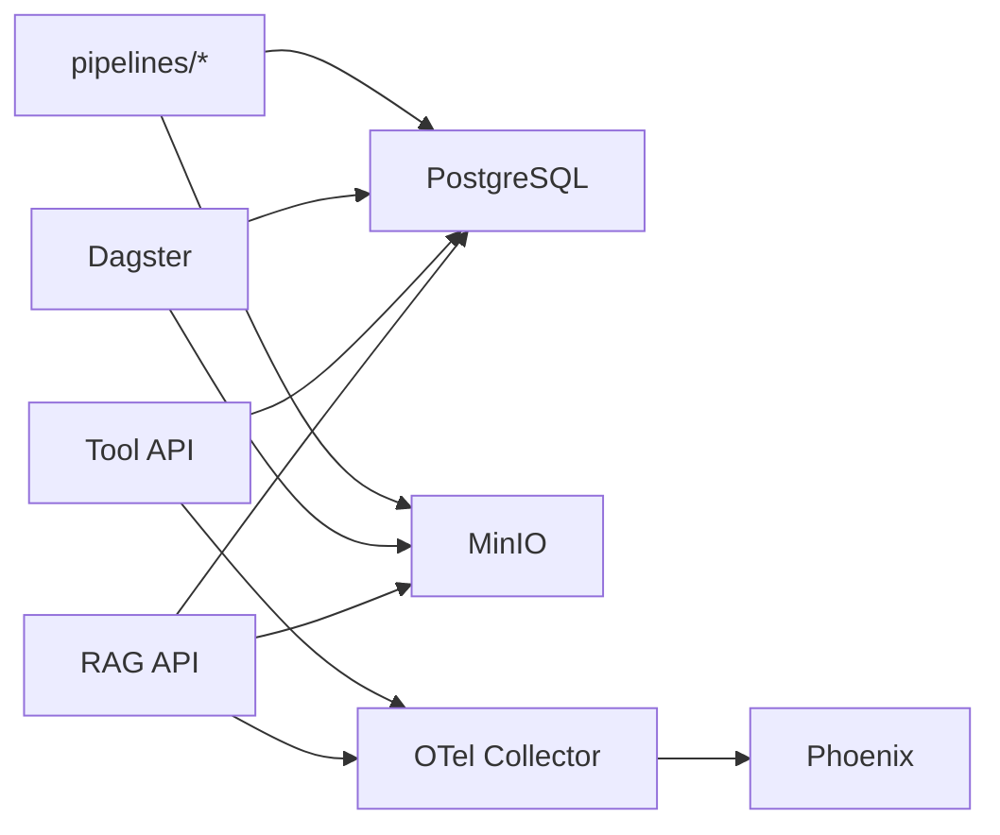

# 技术栈与选型理由

<cite>
**本文引用的文件**
- [pyproject.toml](file://pyproject.toml)
- [docker-compose.yml](file://infra/docker-compose.yml)
- [observability/otel/config.yaml](file://observability/otel/config.yaml)
- [services/rag_api/Dockerfile](file://services/rag_api/Dockerfile)
- [services/tool_api/Dockerfile](file://services/tool_api/Dockerfile)
- [services/rag_api/app/config.py](file://services/rag_api/app/config.py)
- [services/tool_api/app/config.py](file://services/tool_api/app/config.py)
- [pipelines/resources/config.py](file://pipelines/resources/config.py)
- [pipelines/resources/postgres.py](file://pipelines/resources/postgres.py)
- [pipelines/resources/minio.py](file://pipelines/resources/minio.py)
- [pipelines/lakehouse/settings.py](file://pipelines/lakehouse/settings.py)
- [pipelines/indexing/embedder.py](file://pipelines/indexing/embedder.py)
- [contracts/service/rag_request.schema.json](file://contracts/service/rag_request.schema.json)
- [contracts/service/rag_response.schema.json](file://contracts/service/rag_response.schema.json)
</cite>

## 目录
1. [简介](#简介)
2. [项目结构](#项目结构)
3. [核心组件](#核心组件)
4. [架构总览](#架构总览)
5. [详细组件分析](#详细组件分析)
6. [依赖关系分析](#依赖关系分析)
7. [性能考量](#性能考量)
8. [故障排查指南](#故障排查指南)
9. [结论](#结论)
10. [附录](#附录)

## 简介
本文件系统化梳理 OmniSupport Copilot 的技术栈与选型理由，围绕“先保证 Student Core Pack 本地可跑”与“后续章节自然扩展”的渐进式演进理念，解释对象存储（MinIO）、结构化+向量检索（PostgreSQL + pgvector）、湖仓层（Apache Iceberg）、编排层（Dagster）、服务层（FastAPI）、可观测性（OpenTelemetry + Phoenix）、契约层（JSON Schema）等关键技术组件如何协同工作，并在教学可理解性与生产级特性之间取得平衡。

## 项目结构
项目采用多模块分层组织：服务层（RAG API、Tool API）、编排与数据管线（Dagster + pipelines）、湖仓与索引（Iceberg + pgvector）、可观测性（OTel + Phoenix）、契约与合同（JSON Schema）、分析与度量（dbt + metric registry）。基础设施通过 Docker Compose 一键拉起，确保本地最小可运行基线。

图表来源
- [docker-compose.yml:15-340](file://infra/docker-compose.yml#L15-L340)
- [services/rag_api/Dockerfile:1-20](file://services/rag_api/Dockerfile#L1-L20)
- [services/tool_api/Dockerfile:1-16](file://services/tool_api/Dockerfile#L1-L16)
- [observability/otel/config.yaml:1-66](file://observability/otel/config.yaml#L1-L66)

章节来源
- [docker-compose.yml:1-340](file://infra/docker-compose.yml#L1-L340)

## 核心组件
- 对象存储：MinIO（S3 兼容），用于原始文档、解析产物、索引、评估与发布制品的统一存储，提供稳定、低成本的对象存储能力，便于后续扩展为 Iceberg 仓库后端。
- 结构化+向量检索：PostgreSQL + pgvector，提供结构化数据与向量相似度检索一体化能力，满足 RAG 检索与审计需求。
- 湖仓层：Apache Iceberg + PyIceberg，结合 PostgreSQL Catalog 与 MinIO S3 作为仓库后端，支撑增量/分区/时间旅行等湖仓能力，逐步承接大规模数据与复杂分析。
- 编排层：Dagster，以资产为中心的编排框架，串联 ingesting、parsing、indexing、lakehouse materialization 等环节，支持可视化与可追溯性。
- 服务层：FastAPI（RAG API、Tool API），提供健康检查、查询路由、指标查询、工单工具与审计日志，具备可观测性集成与安全配置。
- 可观测性：OpenTelemetry Collector + Phoenix，统一采集 traces/metrics/logs，转发至 Phoenix 进行 AI 请求可观测与问题复盘。
- 契约层：JSON Schema，对 RAG 请求/响应进行强约束，保障接口稳定性与可测试性。

章节来源
- [pyproject.toml:17-31](file://pyproject.toml#L17-L31)
- [docker-compose.yml:17-262](file://infra/docker-compose.yml#L17-L262)
- [observability/otel/config.yaml:1-66](file://observability/otel/config.yaml#L1-L66)
- [contracts/service/rag_request.schema.json:1-23](file://contracts/service/rag_request.schema.json#L1-L23)
- [contracts/service/rag_response.schema.json:1-58](file://contracts/service/rag_response.schema.json#L1-L58)

## 架构总览
下图展示从数据摄取到服务查询的端到端路径，以及可观测性贯穿始终的设计。

图表来源
- [services/rag_api/app/config.py:14-43](file://services/rag_api/app/config.py#L14-L43)
- [pipelines/indexing/embedder.py:160-351](file://pipelines/indexing/embedder.py#L160-L351)
- [observability/otel/config.yaml:30-65](file://observability/otel/config.yaml#L30-L65)

## 详细组件分析

### 对象存储：MinIO（S3 兼容）
- 作用：统一存放原始文档、解析产物、索引、评估与发布制品；为 Iceberg 仓库提供 S3 后端。
- 选型理由：轻量、易部署、与 S3 API 兼容；在本地与云端均可一致使用；支持桶级策略与生命周期管理。
- 关键配置：Compose 中定义多个命名空间桶，初始化脚本自动创建；服务间通过环境变量注入 endpoint 与凭证。

章节来源
- [docker-compose.yml:39-86](file://infra/docker-compose.yml#L39-L86)
- [docker-compose.yml:91-121](file://infra/docker-compose.yml#L91-L121)
- [docker-compose.yml:126-153](file://infra/docker-compose.yml#L126-L153)

### 结构化+向量检索：PostgreSQL + pgvector
- 作用：承载结构化业务表与向量列，支持基于向量相似度的检索与重排序，同时保存审计与元数据。
- 选型理由：PostgreSQL 生态成熟、运维简单；pgvector 提供原生向量索引与 cosine 距离，满足 RAG 场景；与服务层连接简单。
- 关键实现：索引构建器在首次构建时创建 IVFFlat 向量索引；嵌入维度校验与批量写回；提供 dry-run 与质量门禁报告。

图表来源
- [pipelines/indexing/embedder.py:160-351](file://pipelines/indexing/embedder.py#L160-L351)
- [pipelines/indexing/embedder.py:374-396](file://pipelines/indexing/embedder.py#L374-L396)

章节来源
- [docker-compose.yml:17-37](file://infra/docker-compose.yml#L17-L37)
- [pipelines/indexing/embedder.py:160-351](file://pipelines/indexing/embedder.py#L160-L351)

### 湖仓层：Apache Iceberg + PyIceberg
- 作用：以 Iceberg 表承载湖仓数据，结合 PostgreSQL Catalog 与 MinIO S3 作为仓库后端，支持分区、快照、Schema Evolution 等能力。
- 选型理由：标准开放格式，生态完善；与 dbt、PyIceberg 等工具链良好集成；适合渐进式扩展到更大规模数据。
- 关键配置：Catalog 类型为 sql，URI 指向 PostgreSQL；仓库 URI 为 s3:// 桶名；S3 端点、凭证、路径风格等参数通过环境变量注入。

图表来源
- [pipelines/lakehouse/settings.py:20-104](file://pipelines/lakehouse/settings.py#L20-L104)

章节来源
- [docker-compose.yml:158-225](file://infra/docker-compose.yml#L158-L225)
- [pipelines/lakehouse/settings.py:20-104](file://pipelines/lakehouse/settings.py#L20-L104)

### 编排层：Dagster
- 作用：以资产为中心的编排框架，串联 ingesting、parsing、indexing、lakehouse materialization 等任务；提供 UI 与可追溯性。
- 选型理由：资产模型清晰，易于教学演示；与本地 Compose 网络无缝对接；支持多周项目参数化与报告输出。
- 关键配置：通过环境变量注入数据库、MinIO、Iceberg 与 dbt 相关参数；挂载 contracts/docs/runbooks/analytics/data/reports 等目录。

图表来源
- [docker-compose.yml:158-225](file://infra/docker-compose.yml#L158-L225)
- [pipelines/resources/config.py:66-113](file://pipelines/resources/config.py#L66-L113)
- [pipelines/resources/postgres.py:6-15](file://pipelines/resources/postgres.py#L6-L15)
- [pipelines/resources/minio.py:6-13](file://pipelines/resources/minio.py#L6-L13)

章节来源
- [docker-compose.yml:158-225](file://infra/docker-compose.yml#L158-L225)
- [pipelines/resources/config.py:66-113](file://pipelines/resources/config.py#L66-L113)

### 服务层：FastAPI（RAG API 与 Tool API）
- 作用：对外提供健康检查、查询路由、指标查询、工单工具与审计日志；集成 OTel 与安全配置。
- 选型理由：类型安全、自动生成 OpenAPI 文档、异步支持好；与 Pydantic Settings 结合，便于环境变量注入。
- 关键实现：RAG API 支持检索参数、LLM 模型与温度、重排开关、版本与发布 ID；Tool API 支持指标注册路径与 HITL 配置；均暴露健康检查端点。

图表来源
- [services/rag_api/app/config.py:7-52](file://services/rag_api/app/config.py#L7-L52)
- [services/tool_api/app/config.py:4-18](file://services/tool_api/app/config.py#L4-L18)

章节来源
- [services/rag_api/Dockerfile:1-20](file://services/rag_api/Dockerfile#L1-L20)
- [services/tool_api/Dockerfile:1-16](file://services/tool_api/Dockerfile#L1-L16)
- [services/rag_api/app/config.py:7-52](file://services/rag_api/app/config.py#L7-L52)
- [services/tool_api/app/config.py:4-18](file://services/tool_api/app/config.py#L4-L18)

### 可观测性：OpenTelemetry + Phoenix
- 作用：统一采集 traces/metrics/logs，转发至 Phoenix 进行 AI 请求可观测与问题复盘。
- 选型理由：OTel 生态成熟、Collector 轻量；Phoenix 提供 AI 场景友好的可视化界面；便于教学演示与工程落地。
- 关键实现：Collector 接收 gRPC/HTTP OTLP，批量与内存限制处理器，导出到 Phoenix 与 Prometheus；服务侧通过环境变量启用 OTel Exporter。

章节来源
- [observability/otel/config.yaml:1-66](file://observability/otel/config.yaml#L1-L66)
- [docker-compose.yml:228-262](file://infra/docker-compose.yml#L228-L262)
- [services/rag_api/app/config.py:40-43](file://services/rag_api/app/config.py#L40-L43)
- [services/tool_api/app/config.py:8-10](file://services/tool_api/app/config.py#L8-L10)

### 契约层：JSON Schema
- 作用：对 RAG 请求/响应进行强约束，保障接口稳定性与可测试性；与测试用例配合形成契约门禁。
- 选型理由：标准规范、工具链完善；便于教学演示与自动化校验。
- 关键实现：请求 schema 定义必填字段与范围；响应 schema 定义结构与可选调试字段；测试用例覆盖有效/无效样本。

章节来源
- [contracts/service/rag_request.schema.json:1-23](file://contracts/service/rag_request.schema.json#L1-L23)
- [contracts/service/rag_response.schema.json:1-58](file://contracts/service/rag_response.schema.json#L1-L58)

## 依赖关系分析
- 组件耦合：服务层依赖 PostgreSQL 与 MinIO；Dagster 依赖 PostgreSQL 与 MinIO；OTel Collector 为服务与编排提供统一可观测性；Phoenix 作为 OTel 导出目标。
- 外部依赖：pyproject.toml 中声明了 dbt、dagster、pyiceberg、psycopg2、pyarrow 等开发依赖，支撑分析、编排与湖仓能力。
- 环境变量注入：通过 docker-compose 与各应用配置文件集中注入数据库、对象存储、Iceberg、OTel 等参数，确保本地与扩展环境一致性。

图表来源
- [docker-compose.yml:15-340](file://infra/docker-compose.yml#L15-L340)
- [observability/otel/config.yaml:30-65](file://observability/otel/config.yaml#L30-L65)

章节来源
- [pyproject.toml:17-31](file://pyproject.toml#L17-L31)
- [docker-compose.yml:15-340](file://infra/docker-compose.yml#L15-L340)

## 性能考量
- 向量检索：IVFFlat 索引的 lists 参数与数据量相关，建议在索引构建完成后根据实际数据规模调整；批量嵌入与批量写回减少往返开销。
- 编排与数据管线：合理设置批大小与并发度，避免 OTel Collector 内存压力；利用 dry-run 快速验证流程正确性。
- 观测性：OTel Collector 的批量与内存限制处理器有助于控制资源占用；Prometheus 导出便于监控与告警。

## 故障排查指南
- 健康检查失败：确认服务容器已就绪且端口可达；检查环境变量注入是否正确。
- OTel 上报异常：核对 OTLP 端点与服务名；确认 Collector 与 Phoenix 的连通性。
- pgvector 索引问题：确认首次构建后已创建 IVFFlat 索引；检查嵌入维度与表结构一致性。
- Iceberg 配置错误：核对 Catalog 类型与 URI、仓库 URI、S3 端点与凭证；使用设置校验工具定位问题。

章节来源
- [docker-compose.yml:32-121](file://infra/docker-compose.yml#L32-L121)
- [docker-compose.yml:228-262](file://infra/docker-compose.yml#L228-L262)
- [pipelines/indexing/embedder.py:374-396](file://pipelines/indexing/embedder.py#L374-L396)
- [pipelines/lakehouse/settings.py:90-104](file://pipelines/lakehouse/settings.py#L90-L104)

## 结论
该技术栈以“Student Core Pack 本地可跑”为基础，通过 MinIO、PostgreSQL + pgvector、Iceberg、Dagster、FastAPI、OTel + Phoenix、JSON Schema 等组件，构建了从数据摄取、索引构建、湖仓物化到服务查询与可观测性的完整闭环。选型兼顾教学可理解性与生产级特性，支持渐进式扩展，满足课程进度与工程实践的双重目标。

## 附录
- 本地启动顺序与端口：PostgreSQL → MinIO → RAG/Tool API → Dagster → OTel Collector → Phoenix；RAG API/Tool API/Collector/Phoenix 暴露端口便于访问与调试。
- 开发依赖：dbt、dagster、pyiceberg、psycopg2、pyarrow 等，支撑分析、编排与湖仓能力。

章节来源
- [docker-compose.yml:1-4](file://infra/docker-compose.yml#L1-L4)
- [pyproject.toml:17-31](file://pyproject.toml#L17-L31)