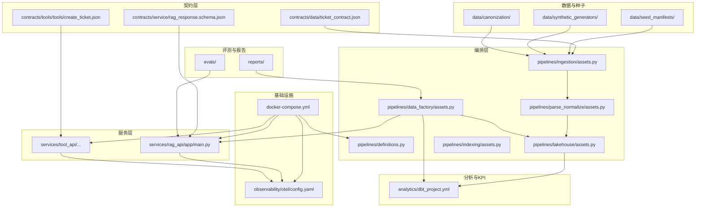
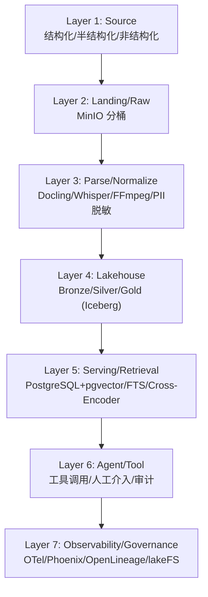
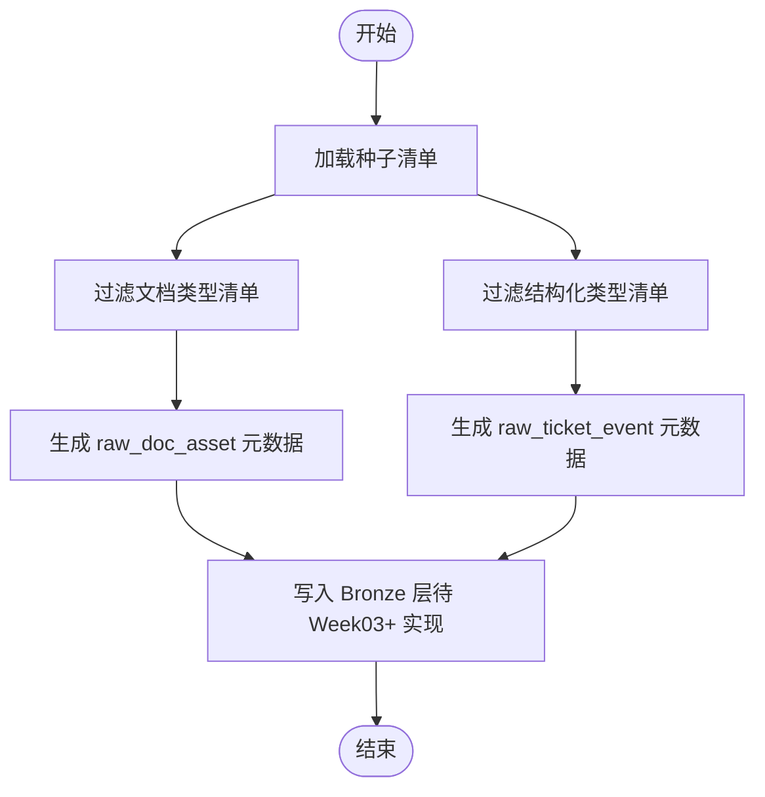
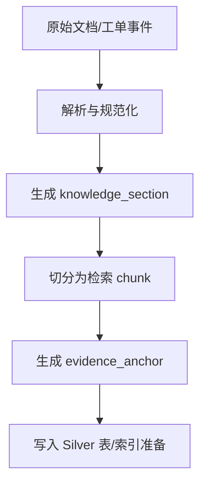
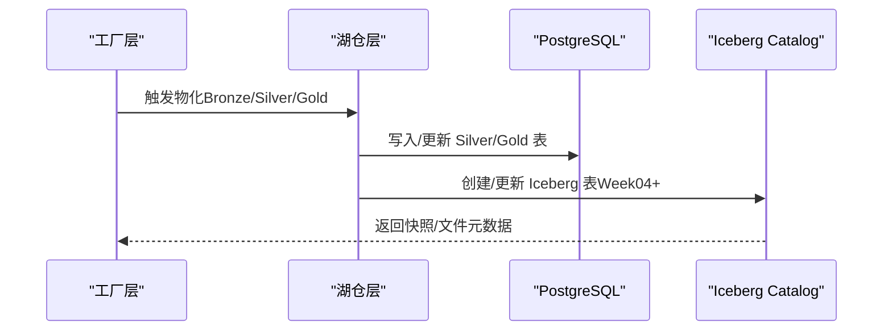
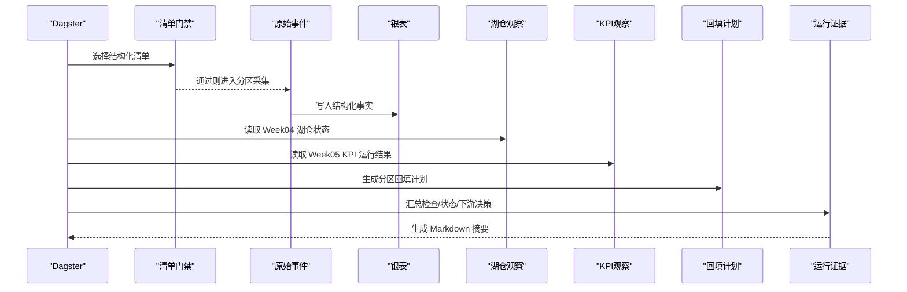
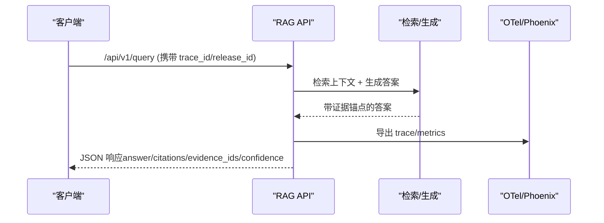
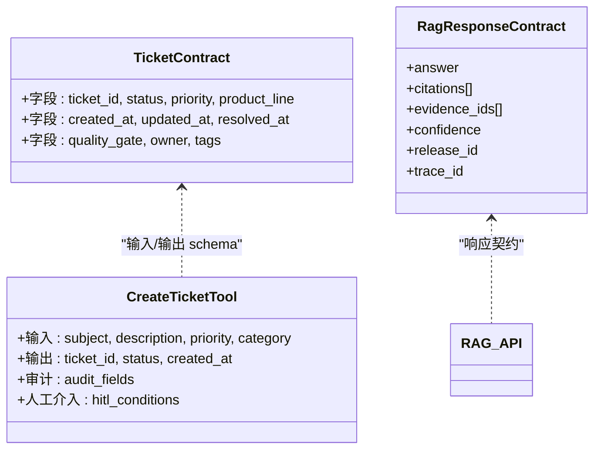
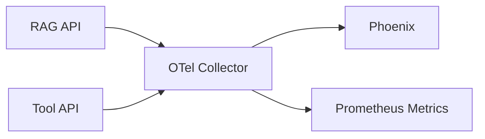
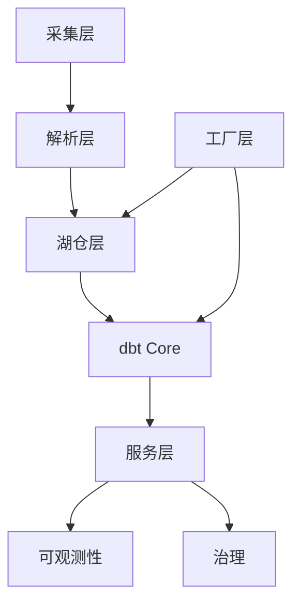

# 架构总览与设计理念

<cite>
**本文引用的文件**   
- [README.md](file://README.md)
- [project-blueprint.md](file://docs/blueprints/project-blueprint.md)
- [definitions.py](file://pipelines/definitions.py)
- [dbt_project.yml](file://analytics/dbt_project.yml)
- [ticket_contract.json](file://contracts/data/ticket_contract.json)
- [main.py](file://services/rag_api/app/main.py)
- [assets.py（湖仓层）](file://pipelines/lakehouse/assets.py)
- [assets.py（工厂层）](file://pipelines/data_factory/assets.py)
- [assets.py（解析与规范化层）](file://pipelines/parse_normalize/assets.py)
- [assets.py（采集层）](file://pipelines/ingestion/assets.py)
- [assets.py（索引层）](file://pipelines/indexing/assets.py)
- [create_ticket.json](file://contracts/tools/tools/create_ticket.json)
- [rag_response.schema.json](file://contracts/service/rag_response.schema.json)
- [config.yaml](file://observability/otel/config.yaml)
- [docker-compose.yml](file://infra/docker-compose.yml)
</cite>

## 目录
1. [引言](#引言)
2. [项目结构](#项目结构)
3. [核心组件](#核心组件)
4. [架构总览](#架构总览)
5. [详细组件分析](#详细组件分析)
6. [依赖关系分析](#依赖关系分析)
7. [性能考量](#性能考量)
8. [故障排查指南](#故障排查指南)
9. [结论](#结论)
10. [附录](#附录)

## 引言
本文件面向 OmniSupport Copilot 项目，系统化阐述其“七层架构”设计理念与实施原则，覆盖从数据摄取到应用交付的完整数据工程流水线。项目以渐进式演进方式推进，从 Week01 的工程基线逐步扩展到 Week08 的 RAG 服务与混合检索，同时在 Week09+ 进一步引入工具层、可观测性、Tracing、GraphRAG 与治理能力。本文还详解“Data-first”“Workflow-first”“Evidence-first”“Release-aware”“Dual-scale”五大核心原则，以及各层职责与相互关系。

## 项目结构
仓库采用“单仓多模块”的组织方式，围绕“基础设施、契约、数据、流水线、服务、可观测、评测、文档与运维手册”进行分层与职责划分。下图给出与运行链路相关的核心目录与职责映射：

**图表来源**
- [docker-compose.yml:1-340](file://infra/docker-compose.yml#L1-L340)
- [config.yaml:1-66](file://observability/otel/config.yaml#L1-L66)
- [ticket_contract.json:1-125](file://contracts/data/ticket_contract.json#L1-L125)
- [create_ticket.json:1-95](file://contracts/tools/tools/create_ticket.json#L1-L95)
- [rag_response.schema.json:1-58](file://contracts/service/rag_response.schema.json#L1-L58)
- [definitions.py:1-38](file://pipelines/definitions.py#L1-L38)
- [assets.py（工厂层）:1-535](file://pipelines/data_factory/assets.py#L1-L535)
- [assets.py（湖仓层）:1-125](file://pipelines/lakehouse/assets.py#L1-L125)
- [assets.py（解析与规范化层）:1-117](file://pipelines/parse_normalize/assets.py#L1-L117)
- [assets.py（采集层）:1-164](file://pipelines/ingestion/assets.py#L1-L164)
- [assets.py（索引层）:1-55](file://pipelines/indexing/assets.py#L1-L55)
- [dbt_project.yml:1-32](file://analytics/dbt_project.yml#L1-L32)
- [main.py（RAG服务）:1-73](file://services/rag_api/app/main.py#L1-L73)

**章节来源**
- [README.md: 183-216:183-216](file://README.md#L183-L216)
- [project-blueprint.md: 35-68:35-68](file://docs/blueprints/project-blueprint.md#L35-L68)

## 核心组件
- 数据层（Source/Landing/Bronze）：负责结构化/半结构化/非结构化源数据的落盘与基础清洗，形成原始资产与事件流。
- 湖仓层（Silver/Gold，Iceberg）：以 Apache Iceberg 为核心，提供快照、时间旅行与模式演进能力，支撑规范化事实表与服务消费视图。
- 编排层（Dagster）：以资产为中心的编排，串联采集、解析、湖仓物化、索引与工厂层的回填、检查与证据生成。
- 服务层（FastAPI）：对外提供检索增强生成（RAG）与工具服务，统一携带 trace_id、release_id 等发布信息。
- 契约层（JSON Schema）：定义数据契约、工具契约与发布契约，确保跨阶段可验证与可回放。
- 可观测性（OTel + Phoenix）：统一采集 trace/metrics/logs，支持请求级追踪与坏样本回放。
- 本地工具执行（Devbox/Docker）：通过容器化提供一致的本地验证路径，无需宿主机 Python 环境。

**章节来源**
- [project-blueprint.md: 35-68:35-68](file://docs/blueprints/project-blueprint.md#L35-L68)
- [README.md: 114-131:114-131](file://README.md#L114-L131)

## 架构总览
七层架构自底向上分别为：
- Layer 1：Source Layer（结构化/半结构化/非结构化源）
- Layer 2：Landing/Raw Zone（MinIO 分桶存储）
- Layer 3：Parse/Normalize Layer（Docling/Unstructured、Whisper、FFmpeg、PII 脱敏、统一元数据）
- Layer 4：Lakehouse Curated Layer（Bronze/Silver/Gold，Iceberg）
- Layer 5：Serving/Retrieval Layer（PostgreSQL + pgvector、FTS、Cross-Encoder、FastAPI RAG API）
- Layer 6：Agent/Tool Layer（工具调用：查询/创建/更新工单、KPI 查询、人工介入）
- Layer 7：Observability/Governance（OTel、Phoenix、OpenLineage、lakeFS、Release Manifest）

**图表来源**
- [project-blueprint.md: 35-68:35-68](file://docs/blueprints/project-blueprint.md#L35-L68)

## 详细组件分析

### 数据层（采集与落盘）
- 职责：从种子清单加载数据源，过滤结构化/非结构化清单，生成原始资产与事件记录，写入 Bronze 层。
- 关键资产：
  - seed_manifests：加载并校验清单
  - raw_doc_assets：文档资产元数据落盘
  - raw_ticket_events：工单事件源落盘
- 依赖：PostgreSQL（Week03+）、MinIO（对象存储）、Dagster 资产图。

**图表来源**
- [assets.py（采集层）: 28-154:28-154](file://pipelines/ingestion/assets.py#L28-L154)

**章节来源**
- [assets.py（采集层）: 1-164:1-164](file://pipelines/ingestion/assets.py#L1-L164)

### 解析与规范化层（多模态与证据链）
- 职责：对文档进行结构化解析（保留页码/表格/图像/坐标），切分为检索 chunk，生成 evidence_anchor，为向量索引与检索做准备。
- 关键资产：
  - parsed_doc_sections：文档解析 → section 记录
  - knowledge_chunks：chunk 切分 + evidence_anchor
  - ticket_facts：工单事件规范化 → Silver 表记录
- 依赖：Docling/Unstructured（Week07+）、Whisper（ASR）、FFmpeg（视频切片）。

**图表来源**
- [assets.py（解析与规范化层）: 11-117:11-117](file://pipelines/parse_normalize/assets.py#L11-L117)

**章节来源**
- [assets.py（解析与规范化层）: 1-117:1-117](file://pipelines/parse_normalize/assets.py#L1-L117)

### 湖仓层（Iceberg Bronze/Silver/Gold）
- 职责：Week04 起以 PyIceberg 实现 Bronze/Silver/Gold 表的物化，支持快照、时间旅行与模式演进；Week05 建立 KPI Mart；Week08 建立 KB serving 视图。
- 关键资产：
  - iceberg_bronze_tables：Bronze 表确保（Week04）
  - iceberg_silver_tables：规范化事实与维度（Week04+）
  - iceberg_gold_views：服务消费视图（Week05/08）

**图表来源**
- [assets.py（湖仓层）: 10-125:10-125](file://pipelines/lakehouse/assets.py#L10-L125)

**章节来源**
- [assets.py（湖仓层）: 1-125:1-125](file://pipelines/lakehouse/assets.py#L1-L125)

### 编排层（Dagster 资产化与工厂）
- 职责：以资产为中心的编排，实现每日分区回填计划、资产检查、运行证据生成与交付摘要。
- 关键资产：
  - week06_source_seed_manifests：清单发现与分区
  - week06_factory_manifest_gate：结构化清单准入门禁
  - week06_raw_ticket_events_partitioned：分区化采集包装
  - week06_ticket_fact_partitioned：结构化银表交付
  - week06_lakehouse_state / week06_support_kpi_mart：外部观察（Week04/05）
  - week06_backfill_plan：分区回填干运行计划
  - week06_run_evidence_report：运行证据（契约化 JSON）
  - week06_data_factory_delivery_summary：人类可读交付摘要

**图表来源**
- [assets.py（工厂层）: 116-535:116-535](file://pipelines/data_factory/assets.py#L116-L535)

**章节来源**
- [assets.py（工厂层）: 1-535:1-535](file://pipelines/data_factory/assets.py#L1-L535)
- [definitions.py: 7-37:7-37](file://pipelines/definitions.py#L7-L37)

### 服务层（RAG API 与工具 API）
- RAG API（FastAPI）：提供健康检查与查询端点，统一携带 trace_id、release_id，集成 OpenTelemetry。
- 工具 API（FastAPI）：提供受控 KPI 查询与工单工具调用，结合合约与审计字段。

**图表来源**
- [main.py（RAG服务）: 26-73:26-73](file://services/rag_api/app/main.py#L26-L73)
- [config.yaml:1-66](file://observability/otel/config.yaml#L1-L66)
- [rag_response.schema.json: 1-L58:1-58](file://contracts/service/rag_response.schema.json#L1-L58)

**章节来源**
- [main.py（RAG服务）: 1-73:1-73](file://services/rag_api/app/main.py#L1-L73)
- [rag_response.schema.json: 1-58:1-58](file://contracts/service/rag_response.schema.json#L1-L58)

### 契约层（数据/工具/发布）
- 数据契约：如工单契约，定义字段约束、枚举值与质量门禁。
- 工具契约：如创建工单工具，定义输入/输出模式、允许角色、幂等键、审计字段与人工介入条件。
- 发布契约：RAG 响应契约，统一 answer/citations/evidence_ids/confidence 与 trace_id/release_id 等字段。

**图表来源**
- [ticket_contract.json: 1-L125:1-125](file://contracts/data/ticket_contract.json#L1-L125)
- [create_ticket.json: 1-L95:1-95](file://contracts/tools/tools/create_ticket.json#L1-L95)
- [rag_response.schema.json: 1-L58:1-58](file://contracts/service/rag_response.schema.json#L1-L58)

**章节来源**
- [ticket_contract.json: 1-125:1-125](file://contracts/data/ticket_contract.json#L1-L125)
- [create_ticket.json: 1-95:1-95](file://contracts/tools/tools/create_ticket.json#L1-L95)
- [rag_response.schema.json: 1-58:1-58](file://contracts/service/rag_response.schema.json#L1-L58)

### 可观测性与治理
- OpenTelemetry：统一接收 gRPC/HTTP OTLP，批量与内存限制处理，导出至 Phoenix。
- Phoenix：Arize 提供的 AI 请求可观测平台，支持 trace 查看与坏样本回放。
- 治理：OpenLineage（血缘）、lakeFS（Git for data，分支/合并/回滚）、Release Manifest（发布清单）。

**图表来源**
- [config.yaml:1-66](file://observability/otel/config.yaml#L1-L66)
- [docker-compose.yml: 228-262:228-262](file://infra/docker-compose.yml#L228-L262)

**章节来源**
- [config.yaml: 1-66:1-66](file://observability/otel/config.yaml#L1-L66)
- [docker-compose.yml: 228-262:228-262](file://infra/docker-compose.yml#L228-L262)

### 本地工具执行层（Devbox）
- 通过 Docker 容器提供统一的本地验证路径，无需宿主机安装 Python/PostgreSQL/MinIO。
- 支持 Week04/05/06 的最小闭环验证与 Week08 的索引构建与评估。

**章节来源**
- [README.md: 54-90:54-90](file://README.md#L54-L90)
- [docker-compose.yml: 286-340:286-340](file://infra/docker-compose.yml#L286-L340)

## 依赖关系分析
- 组件耦合与内聚：
  - 编排层（Dagster）以资产为中心，降低跨模块耦合，提升内聚与可回填性。
  - 服务层通过契约与可观测性解耦上游数据与下游应用。
  - 契约层为跨阶段演进提供“可验证”与“可回放”的基础。
- 外部依赖与集成点：
  - PostgreSQL + pgvector：结构化与向量检索
  - MinIO：对象存储与中间制品
  - OpenTelemetry + Phoenix：可观测性
  - dbt Core：KPI Mart 与度量注册表
  - Iceberg：湖仓物化与治理

**图表来源**
- [definitions.py: 7-37:7-37](file://pipelines/definitions.py#L7-L37)
- [assets.py（工厂层）: 116-535:116-535](file://pipelines/data_factory/assets.py#L116-L535)
- [assets.py（湖仓层）: 10-125:10-125](file://pipelines/lakehouse/assets.py#L10-L125)
- [dbt_project.yml: 18-32:18-32](file://analytics/dbt_project.yml#L18-L32)

**章节来源**
- [definitions.py: 1-38:1-38](file://pipelines/definitions.py#L1-L38)
- [dbt_project.yml: 1-32:1-32](file://analytics/dbt_project.yml#L1-L32)

## 性能考量
- 数据摄取与物化：
  - 使用分区与回填干运行计划，减少对生产数据库的写入压力。
  - Iceberg 快照与时间旅行支持增量物化与回滚，降低全量重算成本。
- 检索与生成：
  - PostgreSQL + pgvector 与 FTS 组合，兼顾结构化与全文检索。
  - 混合检索与重排策略在 Week08 引入，提升召回与排序质量。
- 可观测性：
  - OTel 批量与内存限制处理器，避免 OOM；Prometheus 暴露关键指标。
- 开发体验：
  - Devbox 容器化路径，避免宿主机环境差异带来的性能波动。

[本节为通用指导，不直接分析具体文件]

## 故障排查指南
- 健康检查与端口：
  - RAG API: http://localhost:8000/health
  - Tool API: http://localhost:8001/health
  - Dagster UI: http://localhost:3000
  - MinIO Console: http://localhost:9001
  - Phoenix: http://localhost:6006
- 常见问题定位：
  - 编排失败：检查 Week06 运行证据与资产检查摘要，确认分区键与干运行设置。
  - 湖仓未就绪：确认 Week04 报告中快照 ID 是否可用。
  - KPI Mart 未就绪：确认 Week05 dbt 运行结果与度量注册表。
  - OTel/Phoenix：确认 Collector 端口与资源属性注入是否生效。

**章节来源**
- [README.md: 67-74:67-74](file://README.md#L67-L74)
- [docker-compose.yml: 15-L340:15-340](file://infra/docker-compose.yml#L15-L340)

## 结论
OmniSupport Copilot 以“七层架构”与五大实施原则为指导，构建了从数据摄取到应用交付的完整数据工程流水线。通过契约化、资产化与可观测性的协同，项目实现了渐进式演进与可重复交付，既满足学生本地可跑的需求，也为后续的工具层、Tracing、GraphRAG 与治理能力预留了扩展空间。

[本节为总结性内容，不直接分析具体文件]

## 附录

### 实施原则解读
- Data-first：先做数据层、边界与契约，再做生成层，确保答案可追溯、可审计。
- Workflow-first：先稳定工作流，再引入复杂 Agent，降低系统复杂度与故障面。
- Evidence-first：所有回答必须带 evidence_anchor/citation，支撑可解释与可回放。
- Release-aware：服务预埋 release_id/trace_id，便于版本管理与回归评测。
- Dual-scale：Student Core Pack（本地可跑）+ Instructor Scale Pack（规模演示），兼顾教学与演示需求。

**章节来源**
- [README.md: 325-341:325-341](file://README.md#L325-L341)
- [project-blueprint.md: 152-159:152-159](file://docs/blueprints/project-blueprint.md#L152-L159)

### 逐周能力扩展（Week01–Week08）
- Week01：工程基线、契约、种子清单与蓝图
- Week02–03：四类数据契约、种子加载器与采集管线
- Week04：PyIceberg 湖仓、Bronze/Silver 四表物化、快照/时间旅行
- Week05：dbt Core、KPI Mart、度量注册表与受控 KPI 查询工具
- Week06：Dagster 资产化、分区回填、资产检查与运行证据
- Week07：多模态解析、证据链
- Week08：混合检索、重排与 RAG API

**章节来源**
- [README.md: 220-231:220-231](file://README.md#L220-L231)
- [project-blueprint.md: 132-149:132-149](file://docs/blueprints/project-blueprint.md#L132-L149)