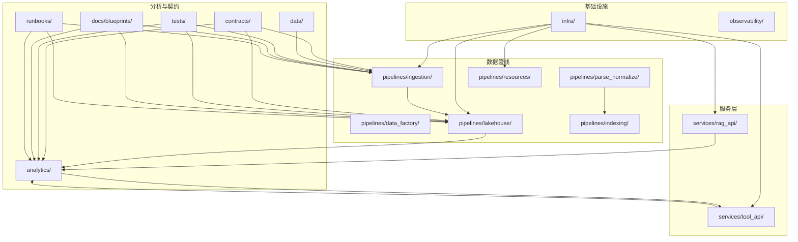
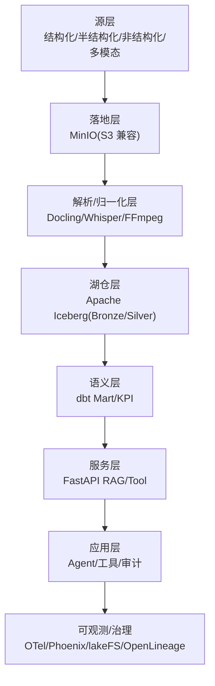
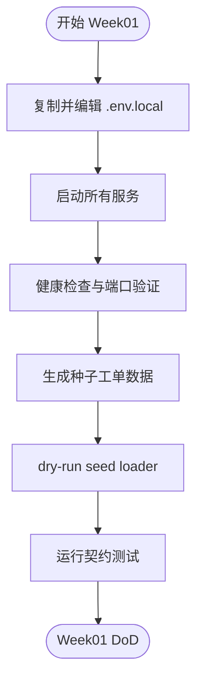
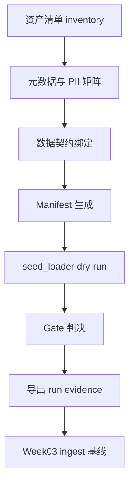
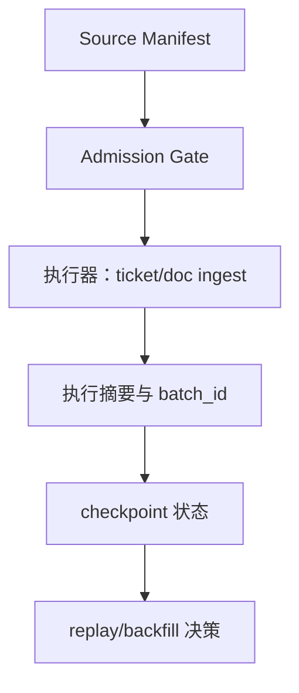
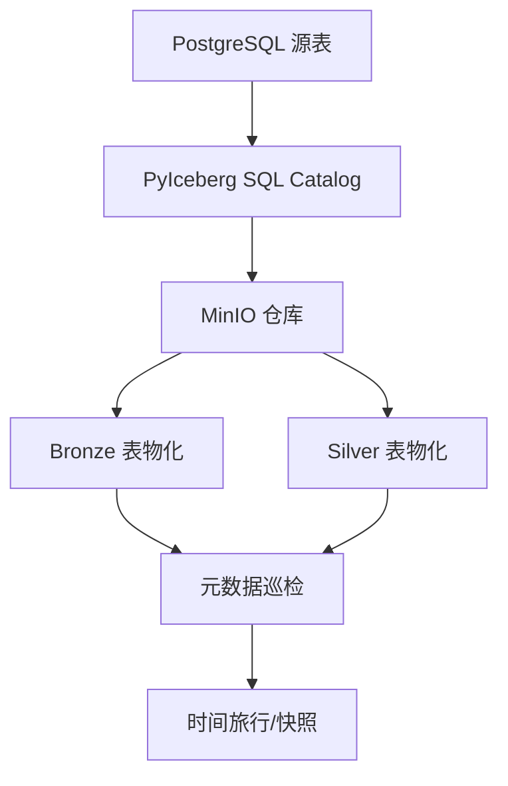
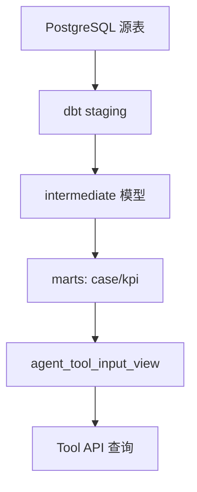
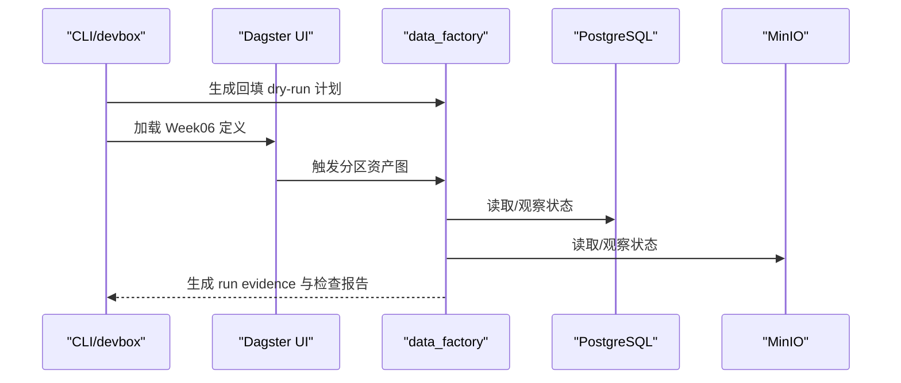
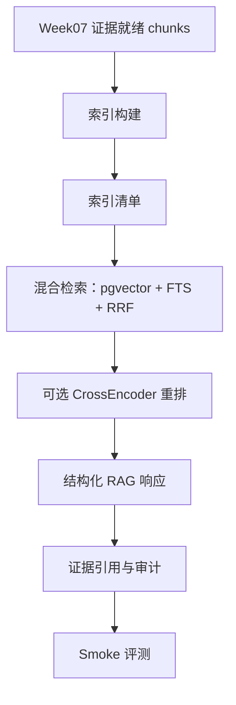
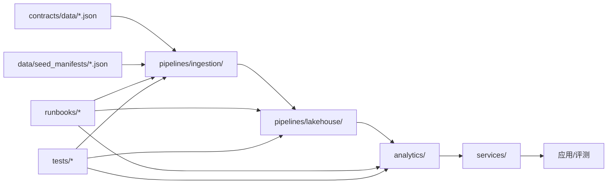

# 课程交付与进度规划

<cite>
**本文引用的文件**
- [README.md](file://README.md)
- [project-blueprint.md](file://docs/blueprints/project-blueprint.md)
- [dbt_project.yml](file://analytics/dbt_project.yml)
- [ticket_contract.json](file://contracts/data/ticket_contract.json)
- [source_manifest_schema.json](file://data/seed_manifests/source_manifest_schema.json)
- [ingest_strategy_v1.md](file://docs/blueprints/week02/ingest_strategy_v1.md)
- [batch_ingestion_design_v1.md](file://docs/blueprints/week03/batch_ingestion_design_v1.md)
- [lakehouse_foundation_v1.md](file://docs/blueprints/week04/lakehouse_foundation_v1.md)
- [analytics_path_v1.md](file://docs/blueprints/week05/analytics_path_v1.md)
- [week06-data-factory-blueprint.md](file://docs/blueprints/week06/week06-data-factory-blueprint.md)
- [week08-rag-blueprint.md](file://docs/blueprints/week08/week08-rag-blueprint.md)
- [week01-startup.md](file://runbooks/week01-startup.md)
- [week06-data-factory.md](file://runbooks/week06-data-factory.md)
- [pyproject.toml](file://pyproject.toml)
</cite>

## 目录
1. [简介](#简介)
2. [项目结构](#项目结构)
3. [核心组件](#核心组件)
4. [架构总览](#架构总览)
5. [详细组件分析](#详细组件分析)
6. [依赖分析](#依赖分析)
7. [性能考虑](#性能考虑)
8. [故障排除指南](#故障排除指南)
9. [结论](#结论)
10. [附录](#附录)

## 简介
本文件面向 OmniSupport Copilot 课程的教学团队与学员，系统化梳理从 Week01 到 Week08 的渐进式交付路径，明确每周学习目标、技术重点与可交付成果。课程采用“单仓代码与组件总览”的组织方式，将数据工程流水线从源数据到应用交付完整串联：从 Week01 的工程基线与契约，到 Week02-03 的数据契约与摄取管道，再到 Week04 的湖仓基础、Week05 的分析建模、Week06 的资产化编排，最终在 Week07-08 形成多模态解析与混合检索的 RAG 闭环。同时，课程站点与主仓库通过“Repo 逻辑图”对齐，横切能力（契约、测试、运行手册、可观测、治理）在各周复用。

## 项目结构
仓库采用“单仓多层”组织方式，围绕数据工程主干路径划分目录与职责：
- infra：Docker Compose、数据库迁移、环境变量
- services：RAG API 与 Tool API（端口 8000/8001）
- pipelines：Dagster 资产化编排、摄取、湖仓、解析/归一化、索引
- analytics：dbt Core 项目、KPI Mart、指标注册表
- contracts：数据契约、工具契约、发布契约
- data：种子清单、合成生成器、规范化资产
- observability：OTel 配置与 Phoenix 可观测
- evals：评测集与回归评测
- tests：契约测试、集成测试、回归测试
- docs/blueprints：课程蓝图与每周实验设计
- runbooks：课程运行手册与排障指南
- pyproject.toml：项目打包与开发依赖

图表来源
- [README.md:183-216](file://README.md#L183-L216)
- [project-blueprint.md:132-148](file://docs/blueprints/project-blueprint.md#L132-L148)

章节来源
- [README.md:169-216](file://README.md#L169-L216)
- [project-blueprint.md:132-148](file://docs/blueprints/project-blueprint.md#L132-L148)

## 核心组件
- 工程基线与契约：Week01 完成 Docker-only 启动、健康检查、种子数据生成与契约测试，形成课程工程基线。
- 摄取与契约：Week02-03 完成四类数据契约、Manifest 清单、Admission Gate 与执行基线，形成可复用的批处理摄取闭环。
- 湖仓基础：Week04 将 PostgreSQL 作为 SQL Catalog，结合 MinIO 与 PyIceberg，物化 Bronze/Silver 四表，演示快照/时间旅行/模式演进。
- 分析建模：Week05 将结构化工单数据转换为 KPI Mart 与受控工具查询入口，建立安全的语义层。
- 资产化编排：Week06 引入 Dagster 资产图、分区、回填计划、资产检查与运行证据，形成可审计的交付闭环。
- RAG 闭环：Week07-08 将证据链与索引资产化，实现混合检索、可解释排序与结构化响应，配套审计与回归评测。

章节来源
- [README.md:220-231](file://README.md#L220-L231)
- [project-blueprint.md:132-148](file://docs/blueprints/project-blueprint.md#L132-L148)

## 架构总览
课程采用“七层”架构，强调“数据优先、工作流优先、证据优先、发布感知”。从源层到应用层，数据按模态与来源分层流转，最终通过 RAG API 与工具 API 服务于 Agent 与用户。

图表来源
- [project-blueprint.md:35-67](file://docs/blueprints/project-blueprint.md#L35-L67)

章节来源
- [project-blueprint.md:35-67](file://docs/blueprints/project-blueprint.md#L35-L67)

## 详细组件分析

### Week01：工程基线与契约
- 学习目标
  - 熟悉 Docker-only 启动流程，掌握健康检查与服务端口
  - 理解课程蓝图与技术选型，建立对“单仓代码与组件总览”的整体认知
  - 掌握种子数据生成与契约测试，形成工程基线
- 技术重点
  - Docker Compose 服务编排与环境变量配置
  - 契约层 JSON Schema 的定义与验证
  - 契约测试驱动的“先契约、后实现”工程实践
- 交付成果
  - 健康检查通过（RAG API/Tool API/Dagster/MinIO/Phoenix）
  - 种子清单与合成数据生成
  - 契约测试全部通过
  - Release Manifest 可查询

图表来源
- [week01-startup.md:19-101](file://runbooks/week01-startup.md#L19-L101)

章节来源
- [week01-startup.md:19-101](file://runbooks/week01-startup.md#L19-L101)
- [README.md:54-90](file://README.md#L54-L90)

### Week02：数据契约与摄取策略
- 学习目标
  - 理解资产清单（Manifest）与契约绑定机制
  - 掌握 Admission Gate 的四种处置：accept/warn/quarantine/reject
  - 明确 load_mode 的运行语义，为增量/回放/重放预留
- 技术重点
  - 四类数据契约（工单/文档/音频/视频）与清单模式
  - Manifest inventory 与 gate policy 的实战演练
  - 从清单到运行证据（run evidence）的最小闭环
- 交付成果
  - 三份 Week01 baseline 清单通过 dry-run
  - 运行证据 JSON 生成，支撑 Week03 基线
  - 课程站点与仓库对齐的“契约-清单-门禁”闭环

图表来源
- [ingest_strategy_v1.md:6-17](file://docs/blueprints/week02/ingest_strategy_v1.md#L6-L17)

章节来源
- [ingest_strategy_v1.md:6-17](file://docs/blueprints/week02/ingest_strategy_v1.md#L6-L17)
- [source_manifest_schema.json:1-181](file://data/seed_manifests/source_manifest_schema.json#L1-L181)
- [ticket_contract.json:1-125](file://contracts/data/ticket_contract.json#L1-L125)

### Week03：批处理摄取基线与状态管理
- 学习目标
  - 明确批处理最小对象：Source Manifest、Admission Result、Execution Result、Checkpoint State
  - 掌握增量/回放/重放/全量快照的 load_mode 语义
  - 建立可恢复的摄取状态（ingest_state），支持 replay/backfill 决策
- 技术重点
  - 批处理对象的责任边界与字段约定
  - checkpoint 与 batch_id 的一致性保障
  - smoke report 与执行摘要的标准化
- 交付成果
  - 批处理摄取基线通过（seed_loader + ticket/doc ingest）
  - ingest_state.json 记录成功处理位置
  - 用于 Week04 的最小运行证据

图表来源
- [batch_ingestion_design_v1.md:7-51](file://docs/blueprints/week03/batch_ingestion_design_v1.md#L7-L51)

章节来源
- [batch_ingestion_design_v1.md:7-51](file://docs/blueprints/week03/batch_ingestion_design_v1.md#L7-L51)

### Week04：湖仓基础（Bronze/Silver）
- 学习目标
  - 将 Week03 摄取结果升级为可复现的湖仓状态
  - 掌握 PyIceberg + PostgreSQL SQL Catalog + MinIO 的组合
  - 演示快照、时间旅行、模式演进与基线报告
- 技术重点
  - 四张核心表物化：bronze.raw_ticket_event、bronze.raw_doc_asset、silver.ticket_fact、silver.knowledge_doc
  - 写入模式保守化：deduped/full refresh，避免盲 append
  - 元数据巡检与性能基线
- 交付成果
  - Lakehouse 基础闭环通过（catalog + materialize + inspect）
  - 时间旅行与模式演进演示
  - Week04 报告与基线

图表来源
- [lakehouse_foundation_v1.md:1-58](file://docs/blueprints/week04/lakehouse_foundation_v1.md#L1-L58)

章节来源
- [lakehouse_foundation_v1.md:1-58](file://docs/blueprints/week04/lakehouse_foundation_v1.md#L1-L58)

### Week05：分析建模与受控工具查询
- 学习目标
  - 将结构化工单数据转换为可被 Agent 安全查询的 KPI 语义层
  - 建立受控工具查询边界，禁止直连原始表与 PII 字段
- 技术重点
  - dbt Core 项目结构：staging/intermediate/marts
  - 支持案例 Mart 与 KPI Mart 的构建
  - 指标注册表与工具契约的协同
- 交付成果
  - dbt build 通过，生成 support_case_mart/support_kpi_mart
  - 受控 KPI 查询工具（query_support_kpis_v1）可调用
  - agent_tool_input_view 作为查询边界

图表来源
- [analytics_path_v1.md:27-42](file://docs/blueprints/week05/analytics_path_v1.md#L27-L42)

章节来源
- [analytics_path_v1.md:27-42](file://docs/blueprints/week05/analytics_path_v1.md#L27-L42)
- [dbt_project.yml:18-32](file://analytics/dbt_project.yml#L18-L32)

### Week06：资产化编排与运行证据
- 学习目标
  - 将 Week03-05 的可运行路径升级为资产化编排
  - 掌握分区、回填计划、资产检查与运行证据
  - 在 Dagster UI 中观察资产血缘与状态
- 技术重点
  - Dagster 资产图：manifest_gate、raw_ticket_events_partitioned、ticket_fact_partitioned、external 观察点
  - 回填 dry-run 计划生成与证据归档
  - 五项资产检查与下游决策（dry_run_only/proceed_to_week07）
- 交付成果
  - Week06 资产图 smoke 通过
  - 回填计划、资产检查、运行证据 JSON 与 Markdown
  - Delivery Summary 与课程同步笔记

图表来源
- [week06-data-factory.md:63-98](file://runbooks/week06-data-factory.md#L63-L98)
- [week06-data-factory-blueprint.md:26-48](file://docs/blueprints/week06/week06-data-factory-blueprint.md#L26-L48)

章节来源
- [week06-data-factory.md:63-98](file://runbooks/week06-data-factory.md#L63-L98)
- [week06-data-factory-blueprint.md:26-48](file://docs/blueprints/week06/week06-data-factory-blueprint.md#L26-L48)

### Week07-08：多模态解析与混合检索 RAG
- 学习目标
  - 将证据链与索引资产化，实现可版本化的检索与生成
  - 混合检索（向量 + FTS + RRF）与可选重排
  - 结构化 RAG 响应、Prompt 版本化、审计与回归评测
- 技术重点
  - 索引构建与索引清单（index manifest）
  - 检索结果与证据字段的可解释性
  - 生成链路的证据引用与审计日志
- 交付成果
  - 索引构建报告、检索 smoke 报告、RAG API smoke 报告、回归评测报告
  - Prompt Manifest 与审计日志样本
  - 课程演示脚本与作业规范

图表来源
- [week08-rag-blueprint.md:18-30](file://docs/blueprints/week08/week08-rag-blueprint.md#L18-L30)

章节来源
- [week08-rag-blueprint.md:18-30](file://docs/blueprints/week08/week08-rag-blueprint.md#L18-L30)

### 横切能力与课程站点对齐
- 横切能力
  - 契约层：JSON Schema 机读校验，贯穿 Week02-08
  - 测试层：契约测试、集成测试、回归评测，贯穿各周
  - 运行手册：Week01/06 启动与排障，Week08 工程化手册
  - 可观测：OTel/Phoenix，贯穿 Week01-08
  - 治理：lakeFS、OpenLineage（Week14+），课程中预埋 trace_id/release_id
- 课程站点与主仓库对齐
  - Repo 逻辑图展示课程站点如何展开到周页/课时页/实验页/Live 演示页
  - 主仓库按周推进：数据契约、采集、湖仓、解析、检索、工具、评测与治理
  - 横切能力在 docs/tests/runbooks/observability/contracts/governance 间复用

章节来源
- [README.md:151-166](file://README.md#L151-L166)
- [README.md:325-341](file://README.md#L325-L341)

## 依赖分析
- 组件耦合
  - pipelines/ingestion 依赖 contracts/data 与 data/seed_manifests
  - pipelines/lakehouse 依赖 PostgreSQL 与 MinIO
  - analytics 依赖 PostgreSQL 源表并通过 dbt 构建
  - services 依赖 analytics 的受控视图与 contracts 的工具契约
  - runbooks 与 tests 为横切能力，贯穿各周
- 外部依赖
  - Docker/Podman Compose、Python 依赖（pytest、pyiceberg、dbt、dagster 等）通过 pyproject.toml 管理
- 循环依赖
  - 课程采用单向数据流：源 → 摄取 → 湖仓 → 语义层 → 服务 → 应用，无循环依赖

图表来源
- [pyproject.toml:17-31](file://pyproject.toml#L17-L31)
- [README.md:183-216](file://README.md#L183-L216)

章节来源
- [pyproject.toml:17-31](file://pyproject.toml#L17-L31)
- [README.md:183-216](file://README.md#L183-L216)

## 性能考虑
- Student Core Pack 与 Instructor Scale Pack 的双规模设计，兼顾本地可跑与演示规模
- Lakehouse 写入保守化（deduped/full refresh），降低维护成本
- 检索策略采用混合检索与可选重排，平衡性能与准确性
- 可观测与回归评测确保性能退化可发现、可回滚

## 故障排除指南
- Week01 常见问题
  - minio_init 非 0 退出：等待后重试初始化
  - rag_api 健康检查报 database: down：等待初始化 SQL 完成
  - devbox 首次构建失败：先构建 devbox 镜像
  - 契约测试失败：检查 contracts 目录结构
- Week06 运行问题
  - 合同 schema 测试失败：修正 run_evidence schema 或生成负载
  - 定义无法加载：检查 dagster 安装与导入路径
  - Dagster UI 无法看到 docs/contracts：检查 compose 挂载
  - 回填计划零输入：选择包含种子数据的分区
  - 证据为 dry_run_only：默认行为，按需调整开关

章节来源
- [week01-startup.md:128-147](file://runbooks/week01-startup.md#L128-L147)
- [week06-data-factory.md:157-189](file://runbooks/week06-data-factory.md#L157-L189)

## 结论
本课程通过“单仓代码与组件总览”的组织方式，将数据工程从源数据到应用交付的完整流水线清晰呈现。Week01-08 逐步递进：从工程基线与契约，到摄取与湖仓，再到分析建模与资产化编排，最终形成多模态 RAG 闭环。课程站点与主仓库对齐，横切能力贯穿各周，既保证了教学的系统性，也确保了工程实践的可复用与可审计。

## 附录
- 逐周进度与主要产出参考：Week01 基线、Week02-03 契约与摄取、Week04 湖仓、Week05 分析建模、Week06 资产化编排、Week07-08 RAG 闭环
- 课程站点与 Repo 逻辑图：展示课程站点如何展开到周页、课时页、实验页、Live 演示页，以及主仓库按周推进的路径

章节来源
- [README.md:220-231](file://README.md#L220-L231)
- [README.md:151-166](file://README.md#L151-L166)