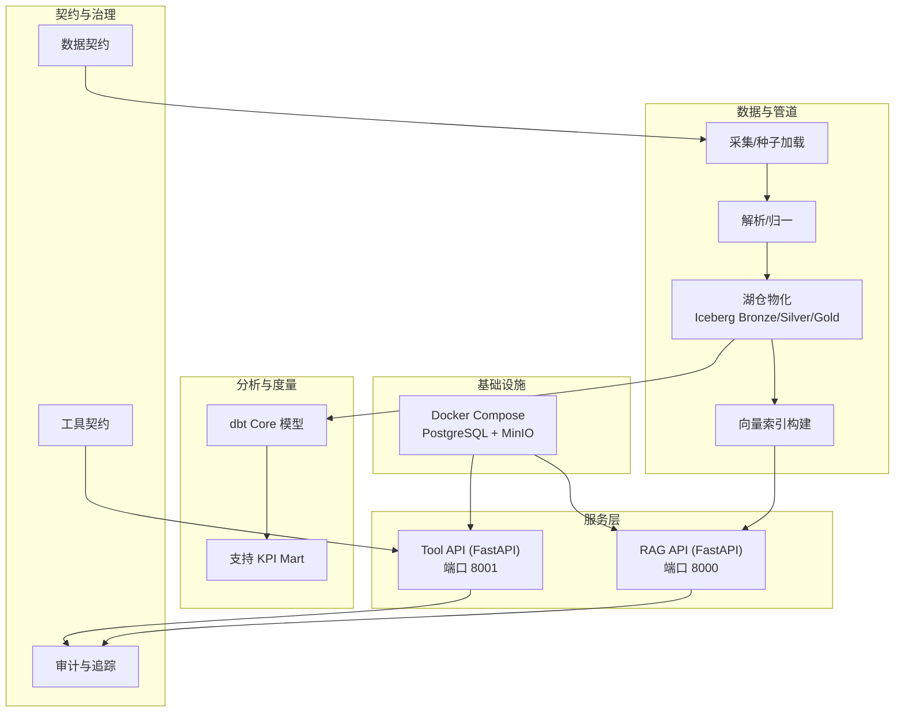
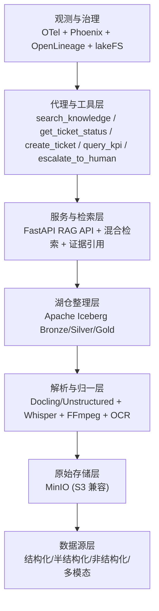
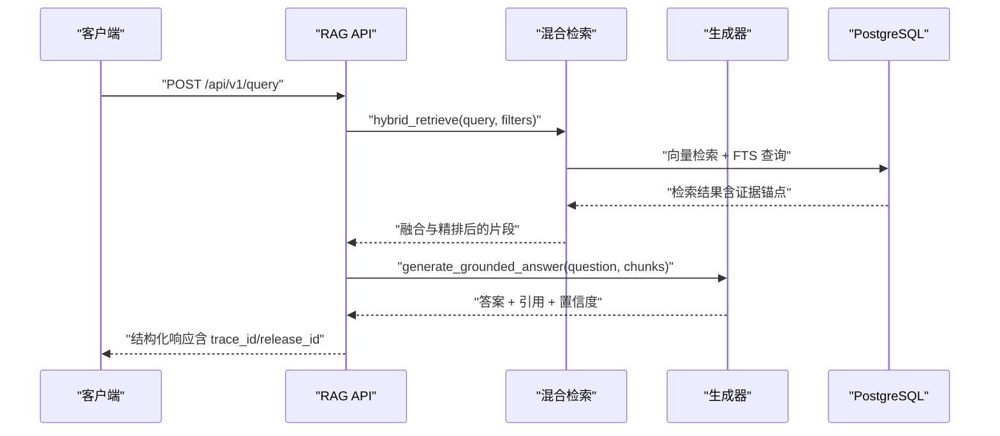
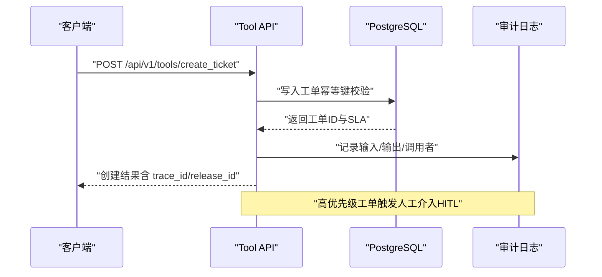
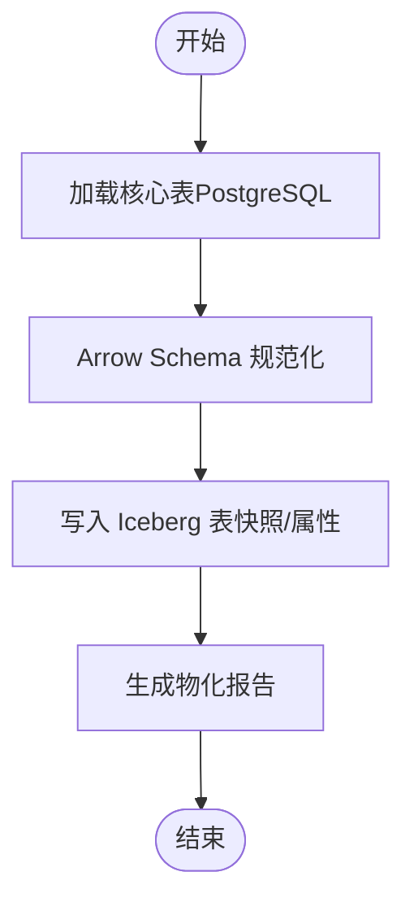
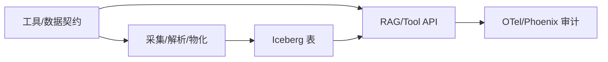

# 项目介绍与业务价值

<cite>
**本文引用的文件**
- [README.md](file://README.md)
- [project-blueprint.md](file://docs/blueprints/project-blueprint.md)
- [main.py（RAG API）](file://services/rag_api/app/main.py)
- [main.py（Tool API）](file://services/tool_api/app/main.py)
- [retrieval.py](file://services/rag_api/app/retrieval.py)
- [generator.py](file://services/rag_api/app/generator.py)
- [create_ticket.json](file://contracts/tools/tools/create_ticket.json)
- [get_ticket_status.json](file://contracts/tools/tools/get_ticket_status.json)
- [query_support_kpis_v1.json](file://contracts/tools/tools/query_support_kpis_v1.json)
- [search_knowledge.json](file://contracts/tools/tools/search_knowledge.json)
- [doc_asset_contract.json](file://contracts/data/doc_asset_contract.json)
- [materialize.py](file://pipelines/lakehouse/materialize.py)
- [assets.py（索引）](file://pipelines/indexing/assets.py)
- [dbt_project.yml](file://analytics/dbt_project.yml)
</cite>

## 目录
1. [引言](#引言)
2. [项目结构](#项目结构)
3. [核心组件](#核心组件)
4. [架构总览](#架构总览)
5. [详细组件分析](#详细组件分析)
6. [依赖分析](#依赖分析)
7. [性能考虑](#性能考虑)
8. [故障排除指南](#故障排除指南)
9. [结论](#结论)
10. [附录](#附录)

## 引言
OmniSupport Copilot 是一个面向虚构企业 Northstar Systems 的准生产级多模态 AI 支持系统，旨在以真实工程化方式交付企业支持场景的智能体验。系统围绕“证据驱动”的检索增强生成（RAG）与“工具化”的工单与指标查询能力，提供文档问答、证据引用、工单查询/创建/更新、指标查询、人工介入（HITL）、审计追踪、回归评测与版本回滚等能力，帮助支持团队在真实业务压力下稳定、可追溯地交付高质量服务。

本项目的核心目标是通过一个完整的工程化闭环，展示现代 AI 数据工程的最佳实践：从数据契约、采集与湖仓物化，到检索与生成、工具编排与可观测，再到治理与回滚。它既适合作为课程项目，也具备向准生产环境演进的基础能力。

章节来源
- [README.md:7-11](file://README.md#L7-L11)
- [project-blueprint.md:8-12](file://docs/blueprints/project-blueprint.md#L8-L12)

## 项目结构
项目采用“单仓多模块”的组织方式，围绕“基础设施、服务、管道、分析、契约、评测、文档与运维”七大横切面协同推进。核心目录与职责如下：
- infra：Docker Compose、数据库迁移与环境配置
- services：RAG API（端口 8000）与 Tool API（端口 8001）
- pipelines：采集、解析归一、湖仓物化、索引与资产化编排
- analytics：dbt Core 模型、KPI Mart 与度量注册表
- contracts：数据契约、工具契约与发布契约
- data：种子清单、合成生成器与规范化资产
- observability：OTel 配置与 Phoenix 可观测
- evals/tests：评测集与回归测试
- docs/runbooks：蓝图、课程站点与运维手册

图表来源
- [README.md:183-216](file://README.md#L183-L216)
- [project-blueprint.md:35-68](file://docs/blueprints/project-blueprint.md#L35-L68)

章节来源
- [README.md:183-216](file://README.md#L183-L216)
- [project-blueprint.md:35-68](file://docs/blueprints/project-blueprint.md#L35-L68)

## 核心组件
- RAG API（端口 8000）：提供健康检查与查询端点，承载混合检索、生成与审计能力；支持证据引用、置信度评估与降级响应。
- Tool API（端口 8001）：提供工单查询、创建、更新与 KPI 查询工具，内置人工介入（HITL）与审计字段。
- 湖仓层（Iceberg）：Week04 完成 Bronze/Silver 核心表物化，支撑检索与分析消费。
- 检索与生成：Week08 引入混合检索（向量 + FTS + RRF + Cross-Encoder）与结构化提示模板，确保“证据优先”。
- 工具契约：以 JSON Schema 定义工具输入输出、角色授权、幂等键、审计字段与失败码，保障可审计与可回滚。
- 分析与度量：Week05 dbt 模型与 KPI Mart，结合度量注册表实现受控 KPI 查询。

章节来源
- [main.py（RAG API）:26-73](file://services/rag_api/app/main.py#L26-L73)
- [main.py（Tool API）:24-64](file://services/tool_api/app/main.py#L24-L64)
- [materialize.py:17-99](file://pipelines/lakehouse/materialize.py#L17-L99)
- [retrieval.py:386-445](file://services/rag_api/app/retrieval.py#L386-L445)
- [generator.py:65-222](file://services/rag_api/app/generator.py#L65-L222)
- [query_support_kpis_v1.json:1-135](file://contracts/tools/tools/query_support_kpis_v1.json#L1-L135)

## 架构总览
系统采用“七层”架构，自下而上覆盖数据源、原始存储、解析归一、湖仓物化、检索生成、工具与代理、可观测与治理。该架构在 Week01-Week08 逐步落地，最终形成可扩展、可治理、可回滚的准生产能力。

图表来源
- [project-blueprint.md:35-68](file://docs/blueprints/project-blueprint.md#L35-L68)

章节来源
- [project-blueprint.md:35-68](file://docs/blueprints/project-blueprint.md#L35-L68)

## 详细组件分析

### RAG API：检索增强生成与证据引用
- 混合检索链路：向量检索（pgvector）、全文检索（PostgreSQL FTS）、RRF 融合与 Cross-Encoder 精排，支持按产品线、可见性范围、质量状态等元数据过滤。
- 生成与引用：基于结构化提示模板与证据优先约束，生成带引用标记的答案，并计算置信度；当 LLM 不可用时提供可审计的降级摘要。
- 审计与追踪：全局中间件注入 X-Request-ID，服务端记录 trace_id/release_id，异常统一处理并返回请求与发布标识。

图表来源
- [retrieval.py:386-445](file://services/rag_api/app/retrieval.py#L386-L445)
- [generator.py:184-222](file://services/rag_api/app/generator.py#L184-L222)
- [main.py（RAG API）:44-66](file://services/rag_api/app/main.py#L44-L66)

章节来源
- [retrieval.py:132-302](file://services/rag_api/app/retrieval.py#L132-L302)
- [retrieval.py:307-338](file://services/rag_api/app/retrieval.py#L307-L338)
- [retrieval.py:342-382](file://services/rag_api/app/retrieval.py#L342-L382)
- [retrieval.py:386-445](file://services/rag_api/app/retrieval.py#L386-L445)
- [generator.py:65-118](file://services/rag_api/app/generator.py#L65-L118)
- [generator.py:120-147](file://services/rag_api/app/generator.py#L120-L147)
- [generator.py:149-158](file://services/rag_api/app/generator.py#L149-L158)
- [generator.py:160-169](file://services/rag_api/app/generator.py#L160-L169)
- [generator.py:184-222](file://services/rag_api/app/generator.py#L184-L222)
- [main.py（RAG API）:44-66](file://services/rag_api/app/main.py#L44-L66)

### Tool API：工单与指标查询、人工介入与审计
- 工具契约：以 JSON Schema 明确输入输出、允许角色、幂等键、审计字段与失败码；支持 HITL 条件与速率限制。
- 工单工具：查询工单状态、创建新工单（高优先级自动触发人工介入）、更新工单；返回 trace_id 与 release_id，便于审计与追踪。
- 指标查询：受控 KPI 查询，仅允许注册表批准的指标、维度与过滤条件，拒绝原始 SQL，确保合规与可审计。

图表来源
- [create_ticket.json:1-95](file://contracts/tools/tools/create_ticket.json#L1-L95)
- [get_ticket_status.json:1-67](file://contracts/tools/tools/get_ticket_status.json#L1-L67)
- [query_support_kpis_v1.json:1-135](file://contracts/tools/tools/query_support_kpis_v1.json#L1-L135)
- [main.py（Tool API）:39-58](file://services/tool_api/app/main.py#L39-L58)

章节来源
- [create_ticket.json:1-95](file://contracts/tools/tools/create_ticket.json#L1-L95)
- [get_ticket_status.json:1-67](file://contracts/tools/tools/get_ticket_status.json#L1-L67)
- [query_support_kpis_v1.json:1-135](file://contracts/tools/tools/query_support_kpis_v1.json#L1-L135)
- [main.py（Tool API）:39-58](file://services/tool_api/app/main.py#L39-L58)

### 湖仓物化与索引：Week04 至 Week08 的数据工程闭环
- Week04：将核心事实与维度表物化至 Iceberg，支持快照、时间旅行与模式演进。
- Week08：基于知识片段构建向量索引，配合检索与生成，形成可审计的证据链。

图表来源
- [materialize.py:131-184](file://pipelines/lakehouse/materialize.py#L131-L184)

章节来源
- [materialize.py:17-99](file://pipelines/lakehouse/materialize.py#L17-L99)
- [materialize.py:131-184](file://pipelines/lakehouse/materialize.py#L131-L184)
- [assets.py（索引）:17-55](file://pipelines/indexing/assets.py#L17-L55)

### 数据契约与证据锚点
- 文档资产契约：定义文档资产的字段、枚举与校验规则，确保采集与物化的数据一致性。
- 证据锚点：检索结果与知识源建立一一对应关系，保证答案可溯源与可审计。

章节来源
- [doc_asset_contract.json:1-94](file://contracts/data/doc_asset_contract.json#L1-L94)

### 分析与度量：受控 KPI 查询
- dbt 模型：按周划分 staging/intermediate/marts，支持增量与视图物化。
- KPI Mart：提供受控查询入口，结合度量注册表，拒绝越权请求与原始 SQL。

章节来源
- [dbt_project.yml:18-32](file://analytics/dbt_project.yml#L18-L32)

## 依赖分析
- 服务依赖：RAG API 依赖 PostgreSQL 与检索索引；Tool API 依赖工单与指标数据；两者均依赖对象存储与可观测基础设施。
- 管道依赖：采集与解析依赖 MinIO 与解析工具；湖仓物化依赖 Iceberg；索引依赖知识片段与嵌入模型。
- 契约依赖：工具与数据契约决定 API 输入输出与权限边界，贯穿采集、物化与服务层。

图表来源
- [project-blueprint.md:113-130](file://docs/blueprints/project-blueprint.md#L113-L130)
- [README.md:183-216](file://README.md#L183-L216)

章节来源
- [project-blueprint.md:113-130](file://docs/blueprints/project-blueprint.md#L113-L130)
- [README.md:183-216](file://README.md#L183-L216)

## 性能考虑
- 检索性能：向量检索与 FTS 并行执行，RRF 融合减少冗余；Cross-Encoder 精排按需启用，避免不必要的重排开销。
- 写入与物化：Iceberg 支持确定性全量覆盖与去重全量刷新，结合快照属性记录写入上下文，便于回溯与治理。
- 可观测与回滚：trace_id/release_id 预埋，关键路径可追踪；30 分钟内可回滚到上一稳定发布版本。

章节来源
- [retrieval.py:404-430](file://services/rag_api/app/retrieval.py#L404-L430)
- [retrieval.py:342-382](file://services/rag_api/app/retrieval.py#L342-L382)
- [materialize.py:187-191](file://pipelines/lakehouse/materialize.py#L187-L191)
- [README.md:335-341](file://README.md#L335-L341)

## 故障排除指南
- 健康检查：通过端点确认服务可用性；RAG API 端口 8000，Tool API 端口 8001。
- 异常处理：全局异常处理器统一返回错误类型、消息与请求/发布标识，便于定位问题。
- 审计与追踪：所有请求携带 trace_id，关键 span 可查；工具调用记录输入/输出与调用者，支持回溯与合规审计。
- 降级策略：当 LLM 不可用时，RAG API 提供可审计的降级摘要；工具调用遵循幂等键与失败码，避免重复与误操作。

章节来源
- [main.py（RAG API）:55-66](file://services/rag_api/app/main.py#L55-L66)
- [main.py（Tool API）:48-58](file://services/tool_api/app/main.py#L48-L58)
- [generator.py:160-169](file://services/rag_api/app/generator.py#L160-L169)
- [create_ticket.json:74-89](file://contracts/tools/tools/create_ticket.json#L74-L89)
- [get_ticket_status.json:54-66](file://contracts/tools/tools/get_ticket_status.json#L54-L66)
- [query_support_kpis_v1.json:109-134](file://contracts/tools/tools/query_support_kpis_v1.json#L109-L134)

## 结论
OmniSupport Copilot 以“证据优先”的检索增强生成为核心，结合严格的工具契约、受控 KPI 查询与人工介入机制，构建了可审计、可观测、可回滚的企业支持智能系统。通过从数据契约到湖仓物化、从混合检索到结构化生成、从工具编排到治理与回滚的完整闭环，项目不仅展示了现代 AI 数据工程的最佳实践，也为课程教学与准生产演进提供了坚实基础。

## 附录
- 业务场景：Northstar Systems 的三类产品线（Workspace、Edge Gateway、Studio）构成支持场景的典型数据与工单来源。
- 课程交付：项目蓝图与周进度清晰标注各阶段产出，便于按周推进与验收。
- 技术承诺：数据优先、工作流优先、证据优先、发布感知与双规模支持（本地与演示规模）。

章节来源
- [project-blueprint.md:15-32](file://docs/blueprints/project-blueprint.md#L15-L32)
- [README.md:220-231](file://README.md#L220-L231)
- [README.md:325-332](file://README.md#L325-L332)