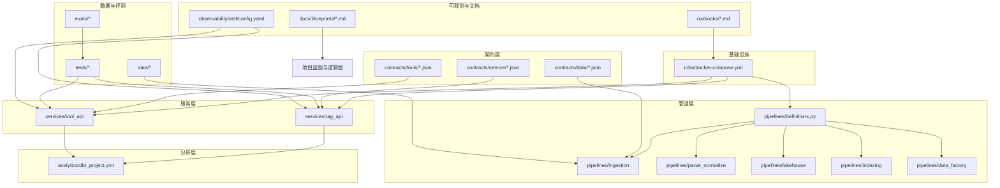
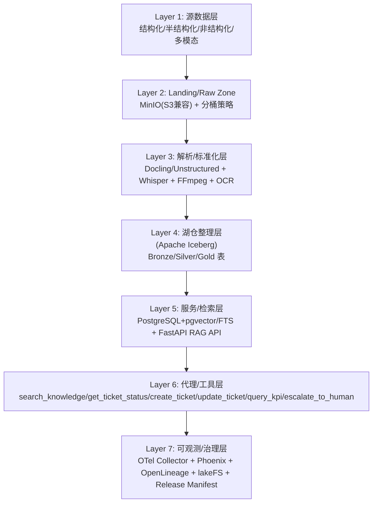
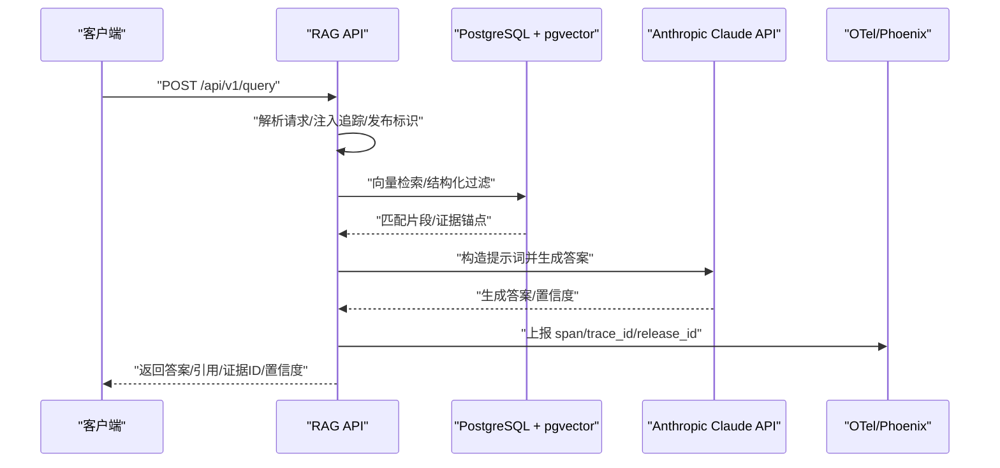
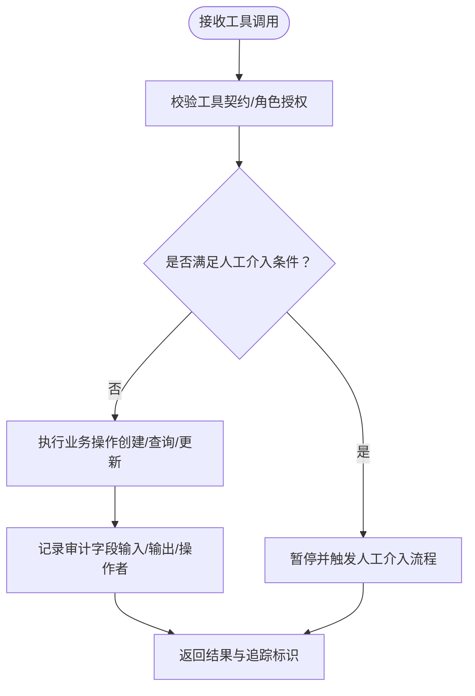
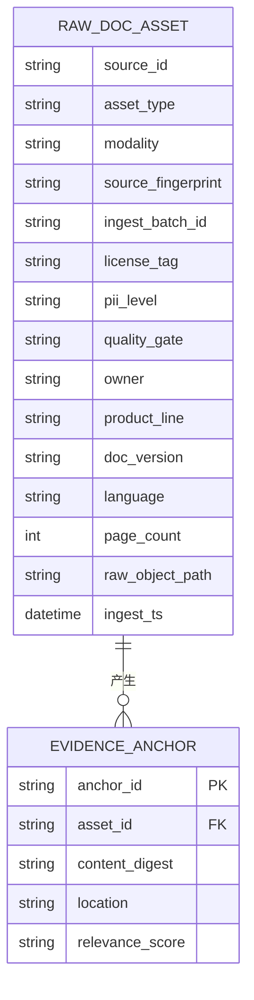
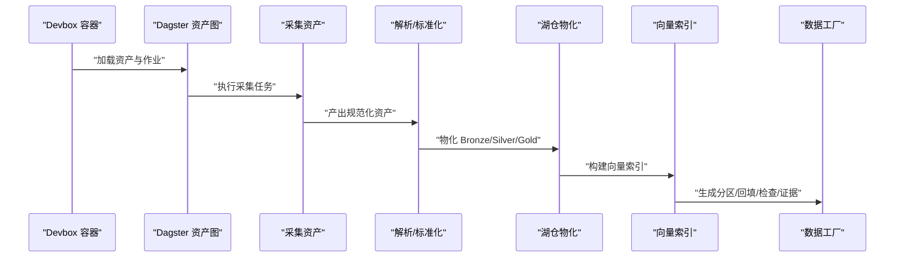
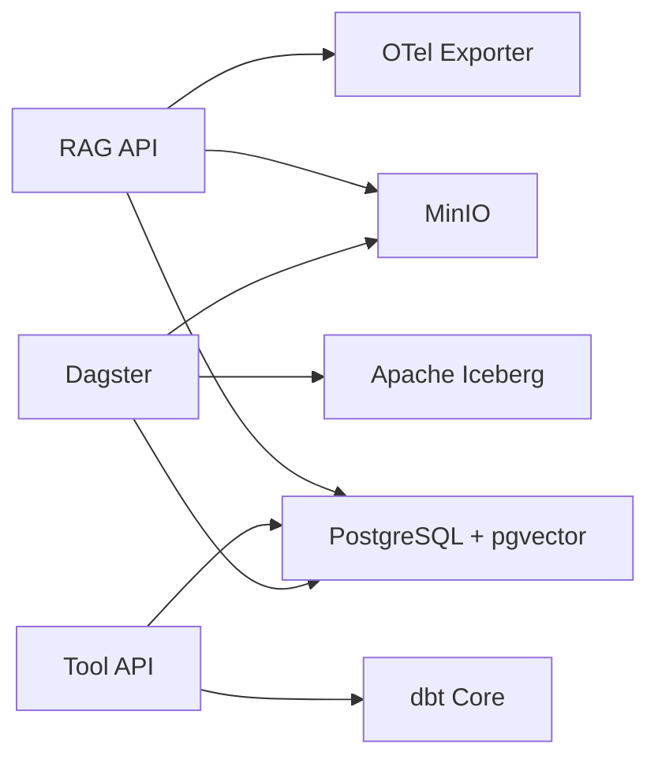

# 项目概述

<cite>
**本文引用的文件**
- [README.md](file://README.md)
- [docs/blueprints/project-blueprint.md](file://docs/blueprints/project-blueprint.md)
- [runbooks/week01-startup.md](file://runbooks/week01-startup.md)
- [pyproject.toml](file://pyproject.toml)
- [infra/docker-compose.yml](file://infra/docker-compose.yml)
- [services/rag_api/Dockerfile](file://services/rag_api/Dockerfile)
- [services/tool_api/Dockerfile](file://services/tool_api/Dockerfile)
- [services/rag_api/requirements.txt](file://services/rag_api/requirements.txt)
- [services/tool_api/requirements.txt](file://services/tool_api/requirements.txt)
- [pipelines/definitions.py](file://pipelines/definitions.py)
- [analytics/dbt_project.yml](file://analytics/dbt_project.yml)
- [contracts/data/doc_asset_contract.json](file://contracts/data/doc_asset_contract.json)
- [contracts/tools/tools/create_ticket.json](file://contracts/tools/tools/create_ticket.json)
- [contracts/service/rag_request.schema.json](file://contracts/service/rag_request.schema.json)
- [contracts/service/rag_response.schema.json](file://contracts/service/rag_response.schema.json)
</cite>

## 目录
1. [简介](#简介)
2. [项目结构](#项目结构)
3. [核心组件](#核心组件)
4. [架构总览](#架构总览)
5. [详细组件分析](#详细组件分析)
6. [依赖分析](#依赖分析)
7. [性能考虑](#性能考虑)
8. [故障排除指南](#故障排除指南)
9. [结论](#结论)
10. [附录](#附录)

## 简介
OmniSupport Copilot 是面向虚构企业 Northstar Systems 的准生产级多模态 AI 支持系统，具备文档问答、证据引用、工单查询/创建/更新、指标查询、人工介入（HITL）、审计追踪、回归评测与版本回滚等能力。项目采用七层架构设计，覆盖从数据层到应用层的完整技术栈，强调数据优先、工作流优先、证据优先与发布感知，既满足本地开发（Student Core Pack），又支持更大规模演示（Instructor Scale Pack）。课程交付采用单仓多周推进模式，结合蓝图、运行手册、契约与评测，形成可重复、可观测、可回滚、可审计的工程化路径。

- 业务价值
  - 提升支持效率：通过多模态知识检索与生成，快速定位文档与证据，减少人工排查时间。
  - 强化合规与可追溯：所有回答带证据锚点与引用，支持审计追踪与回归评测。
  - 降低集成成本：统一的工具契约与服务接口，便于与现有工单系统与指标平台对接。
  - 可扩展的湖仓与治理：基于 Iceberg 的湖仓分层与时间旅行，支撑后续 GraphRAG 与治理能力。

- 技术特色
  - 七层架构：从源数据到可观测与治理的完整链路，确保工程化落地。
  - 多模态处理：文档、音频、视频的解析与证据链构建，支撑跨模态检索。
  - 工具化能力：工单创建/查询/更新、KPI 查询、人工介入与审计日志一体化。
  - 可观测与回滚：OTel + Phoenix 追踪，Release Manifest 与 lakeFS 支撑版本与回滚。

**章节来源**
- [README.md:7-11](file://README.md#L7-L11)
- [README.md:96-103](file://README.md#L96-L103)
- [docs/blueprints/project-blueprint.md:8-11](file://docs/blueprints/project-blueprint.md#L8-L11)
- [docs/blueprints/project-blueprint.md:15-32](file://docs/blueprints/project-blueprint.md#L15-L32)

## 项目结构
仓库采用按功能域划分的目录组织，围绕“基础设施、服务、管道、分析、契约、数据、可观测、评测与运行手册”等横切能力构建，形成从源数据到应用交付的完整流水线。

- 关键目录与职责
  - infra：Compose 编排、数据库迁移、环境变量与本地部署拓扑
  - services：RAG API 与 Tool API 服务，FastAPI + Uvicorn
  - pipelines：Dagster 资产化编排（采集、解析、湖仓、索引、数据工厂）
  - analytics：dbt Core 项目与 KPI Mart、度量注册表
  - contracts：数据契约、工具契约、发布契约与运行证据契约
  - data：种子清单、合成生成器、规范化资产
  - observability：OTel Collector 与 Phoenix 配置
  - evals/tests：评测集、回归门禁与集成测试
  - docs：蓝图、课程站点与逻辑图
  - runbooks：Week01 启动手册与各阶段运维手册

**图表来源**
- [infra/docker-compose.yml:15-340](file://infra/docker-compose.yml#L15-L340)
- [pipelines/definitions.py:1-38](file://pipelines/definitions.py#L1-L38)
- [analytics/dbt_project.yml:1-32](file://analytics/dbt_project.yml#L1-L32)
- [contracts/data/doc_asset_contract.json:1-94](file://contracts/data/doc_asset_contract.json#L1-L94)
- [contracts/tools/tools/create_ticket.json:1-95](file://contracts/tools/tools/create_ticket.json#L1-L95)
- [contracts/service/rag_request.schema.json:1-23](file://contracts/service/rag_request.schema.json#L1-L23)
- [contracts/service/rag_response.schema.json:1-58](file://contracts/service/rag_response.schema.json#L1-L58)

**章节来源**
- [README.md:183-216](file://README.md#L183-L216)
- [README.md:169-181](file://README.md#L169-L181)

## 核心组件
- 基础设施与运行时
  - PostgreSQL + pgvector：结构化数据与向量检索，支持全文搜索与相似度检索
  - MinIO（S3 兼容）：原始资产与中间制品存储，按模态/来源/日期分桶
  - OpenTelemetry Collector + Phoenix：统一采集与可视化 AI 请求级追踪
  - Dagster：资产化编排，覆盖采集、解析、湖仓、索引与数据工厂
  - Docker Compose：一键启动与端口映射，支持 Week01 Docker-only 路线

- 服务组件
  - RAG API（FastAPI + Uvicorn）：检索增强生成，返回答案、证据与追踪标识
  - Tool API（FastAPI + Uvicorn）：工单工具、KPI 查询、人工介入与审计

- 管道与分析
  - Pipelines：Dagster 资产图、分区回填、资产检查与运行证据
  - Analytics：dbt Core 模型、KPI Mart 与度量注册表，受控 KPI 查询

- 契约与质量
  - 数据契约：文档/工单/音频/视频资产的结构化约束
  - 工具契约：工具名称、输入输出模式、角色授权、幂等键、审计字段与失败码
  - 服务契约：RAG 请求/响应结构，包含证据、置信度与调试上下文

**章节来源**
- [infra/docker-compose.yml:17-340](file://infra/docker-compose.yml#L17-L340)
- [services/rag_api/Dockerfile:1-20](file://services/rag_api/Dockerfile#L1-L20)
- [services/tool_api/Dockerfile:1-16](file://services/tool_api/Dockerfile#L1-L16)
- [pipelines/definitions.py:1-38](file://pipelines/definitions.py#L1-L38)
- [analytics/dbt_project.yml:1-32](file://analytics/dbt_project.yml#L1-L32)
- [contracts/data/doc_asset_contract.json:1-94](file://contracts/data/doc_asset_contract.json#L1-L94)
- [contracts/tools/tools/create_ticket.json:1-95](file://contracts/tools/tools/create_ticket.json#L1-L95)
- [contracts/service/rag_request.schema.json:1-23](file://contracts/service/rag_request.schema.json#L1-L23)
- [contracts/service/rag_response.schema.json:1-58](file://contracts/service/rag_response.schema.json#L1-L58)

## 架构总览
七层架构从底层数据与对象存储，向上覆盖解析与湖仓、服务与检索、代理与工具、可观测与治理，形成数据驱动、工作流优先、证据可溯源的工程体系。

**图表来源**
- [docs/blueprints/project-blueprint.md:35-87](file://docs/blueprints/project-blueprint.md#L35-L87)

**章节来源**
- [docs/blueprints/project-blueprint.md:35-87](file://docs/blueprints/project-blueprint.md#L35-L87)

## 详细组件分析

### RAG API（检索增强生成）
- 能力边界
  - 接收查询，结合向量检索与结构化过滤，生成带证据引用的答案
  - 输出包含答案、引用列表、证据 ID、置信度与追踪/发布标识
- 技术要点
  - FastAPI + Uvicorn 提供服务；异步数据库访问与 OpenTelemetry 追踪
  - 依赖 LLM（Anthropic Claude API）与对象存储（MinIO）进行检索与证据读取
  - 支持调试模式输出检索上下文与重排调试信息
- 服务契约
  - 请求/响应结构遵循服务契约，确保字段一致性与可验证性

**图表来源**
- [services/rag_api/requirements.txt:1-29](file://services/rag_api/requirements.txt#L1-L29)
- [contracts/service/rag_request.schema.json:1-23](file://contracts/service/rag_request.schema.json#L1-L23)
- [contracts/service/rag_response.schema.json:1-58](file://contracts/service/rag_response.schema.json#L1-L58)

**章节来源**
- [services/rag_api/Dockerfile:1-20](file://services/rag_api/Dockerfile#L1-L20)
- [services/rag_api/requirements.txt:1-29](file://services/rag_api/requirements.txt#L1-L29)
- [contracts/service/rag_request.schema.json:1-23](file://contracts/service/rag_request.schema.json#L1-L23)
- [contracts/service/rag_response.schema.json:1-58](file://contracts/service/rag_response.schema.json#L1-L58)

### Tool API（工单与指标工具）
- 能力边界
  - 工单工具：创建、查询状态、更新工单，支持幂等键与人工介入条件
  - 指标工具：受控 KPI 查询，仅允许通过指定视图访问，避免直连原始表
  - 审计与可观测：记录输入/输出/操作者，支持审计字段保留策略
- 技术要点
  - FastAPI + Uvicorn；与 dbt 模型与度量注册表集成
  - 通过工具契约约束输入输出与失败码，保障调用一致性

**图表来源**
- [contracts/tools/tools/create_ticket.json:1-95](file://contracts/tools/tools/create_ticket.json#L1-L95)
- [services/tool_api/requirements.txt:1-14](file://services/tool_api/requirements.txt#L1-L14)

**章节来源**
- [contracts/tools/tools/create_ticket.json:1-95](file://contracts/tools/tools/create_ticket.json#L1-L95)
- [services/tool_api/requirements.txt:1-14](file://services/tool_api/requirements.txt#L1-L14)

### 数据契约与证据链
- 数据契约
  - 文档资产契约定义了字段、枚举、正则与必填项，确保数据质量与一致性
  - 工单/音频/视频资产契约类似，覆盖来源指纹、批次、许可证标签、PII 等关键属性
- 证据链
  - 每条答案必须附带证据锚点与引用，支持回溯到知识源与证据 ID

**图表来源**
- [contracts/data/doc_asset_contract.json:1-94](file://contracts/data/doc_asset_contract.json#L1-L94)

**章节来源**
- [contracts/data/doc_asset_contract.json:1-94](file://contracts/data/doc_asset_contract.json#L1-L94)

### 管道与资产化（Dagster）
- 资产化编排
  - 采集、解析、湖仓、索引与数据工厂资产统一注册与调度
  - 支持分区回填、资产检查与运行证据生成
- 运行手册
  - Week01 启动手册指导环境准备、服务启动、健康检查与契约测试

**图表来源**
- [pipelines/definitions.py:1-38](file://pipelines/definitions.py#L1-L38)
- [runbooks/week01-startup.md:19-101](file://runbooks/week01-startup.md#L19-L101)

**章节来源**
- [pipelines/definitions.py:1-38](file://pipelines/definitions.py#L1-L38)
- [runbooks/week01-startup.md:19-101](file://runbooks/week01-startup.md#L19-L101)

### 分析与度量（dbt Core + KPI Mart）
- dbt 项目
  - 模型按阶段组织（staging/intermediate/marts），支持标签化构建与测试
  - 变量注入支持不同数据发布版本
- KPI Mart
  - 将工单事实表转换为可治理的 KPI 视图，受控查询避免 PII 泄露

**章节来源**
- [analytics/dbt_project.yml:1-32](file://analytics/dbt_project.yml#L1-L32)

## 依赖分析
- 组件耦合
  - RAG API 依赖 PostgreSQL（向量检索）、MinIO（证据读取）、OTel/Phoenix（可观测）
  - Tool API 依赖 PostgreSQL、dbt 模型与度量注册表，工具调用受契约约束
  - Dagster 资产图串联采集、解析、湖仓、索引与数据工厂，形成闭环
- 外部依赖
  - Anthropic Claude API（可选，Week01 可留空验证基线）
  - OpenTelemetry 生态（Collector、Phoenix、Inference Instrumentation）

**图表来源**
- [services/rag_api/requirements.txt:1-29](file://services/rag_api/requirements.txt#L1-L29)
- [services/tool_api/requirements.txt:1-14](file://services/tool_api/requirements.txt#L1-L14)
- [infra/docker-compose.yml:15-340](file://infra/docker-compose.yml#L15-L340)

**章节来源**
- [services/rag_api/requirements.txt:1-29](file://services/rag_api/requirements.txt#L1-L29)
- [services/tool_api/requirements.txt:1-14](file://services/tool_api/requirements.txt#L1-L14)
- [infra/docker-compose.yml:15-340](file://infra/docker-compose.yml#L15-L340)

## 性能考虑
- 学生本地优先
  - Week01-Week08 以单机 Docker Compose 为主，避免 Spark/Hive/Nessie 等重型组件
  - 建议使用 Student Core Pack 配置起步，逐步过渡到 Instructor Scale Pack
- 检索与索引
  - 向量检索与 FTS 结合，合理设置 top_k 与过滤条件，平衡召回与延迟
  - 分区与回填策略在 Week06 已纳入数据工厂，建议按日分区并定期回填
- 可观测与追踪
  - 所有请求携带 trace_id，关键 span 可查，便于定位热点与异常

[本节为通用指导，无需列出章节来源]

## 故障排除指南
- Week01 常见问题
  - MinIO 初始化失败：等待服务就绪后重试初始化容器
  - 数据库未初始化：等待初始化脚本执行完成
  - devbox 首次构建失败：先构建 devbox 镜像
  - 契约测试失败：检查 contracts 目录结构与 JSON Schema 文件
- 停止与清理
  - 停止服务（保留数据卷）或完全清理（删除数据卷）

**章节来源**
- [runbooks/week01-startup.md:128-147](file://runbooks/week01-startup.md#L128-L147)

## 结论
OmniSupport Copilot 以“数据优先、工作流优先、证据优先、发布感知”为核心理念，构建了从源数据到可观测与治理的七层架构。通过契约化、工具化与工程化手段，项目在保证本地可跑的同时，预留了后续扩展路径，能够支撑多模态检索、人工介入、审计追踪与版本回滚等关键能力，为课程交付与实战演练提供了坚实基础。

[本节为总结性内容，无需列出章节来源]

## 附录

### 前置条件与系统要求
- 前置条件
  - Docker Desktop / Docker Engine 24+，Docker Compose V2，现代浏览器
  - 可选：ANTHROPIC_API_KEY（Week01 可留空）
- 支持环境
  - macOS Apple Silicon/Intel、Linux x86_64/arm64、Windows 11 + Docker Desktop/WSL2
  - Podman 兼容（best-effort），参考运行手册

**章节来源**
- [README.md:14-36](file://README.md#L14-L36)

### 快速启动（Week01 基线）
- 步骤
  - 复制环境变量模板并编辑
  - 启动所有服务并验证健康
  - 生成种子工单数据与 dry-run 种子加载
  - 运行契约测试与冒烟测试
- 默认端口
  - RAG API: 8000、Tool API: 8001、Dagster: 3000、MinIO: 9000/9001、Phoenix: 6006

**章节来源**
- [README.md:54-90](file://README.md#L54-L90)
- [runbooks/week01-startup.md:19-101](file://runbooks/week01-startup.md#L19-L101)

### 本地部署拓扑
- 默认对宿主机开放端口与网络
  - PostgreSQL 仅在 Docker 网络内可见，避免与本机数据库冲突
- 服务依赖顺序
  - postgres → minio → rag_api/tool_api → dagster → otel_collector → phoenix

**章节来源**
- [README.md:134-148](file://README.md#L134-L148)
- [infra/docker-compose.yml:1-4](file://infra/docker-compose.yml#L1-L4)

### 技术选型原则与课程交付
- 选型原则
  - 先保证 Student Core Pack 本地可跑，再保证后续章节可自然扩展
  - 不为“演示规模”单独写另一套代码路径
- 课程交付
  - 单仓推进：Week01 基线 → 周周递进（契约、采集、湖仓、解析、检索、工具、评测、治理）
  - 横切能力：docs/tests/runbooks/observability/contracts/governance 贯穿全链路

**章节来源**
- [README.md:114-131](file://README.md#L114-L131)
- [README.md:151-166](file://README.md#L151-L166)